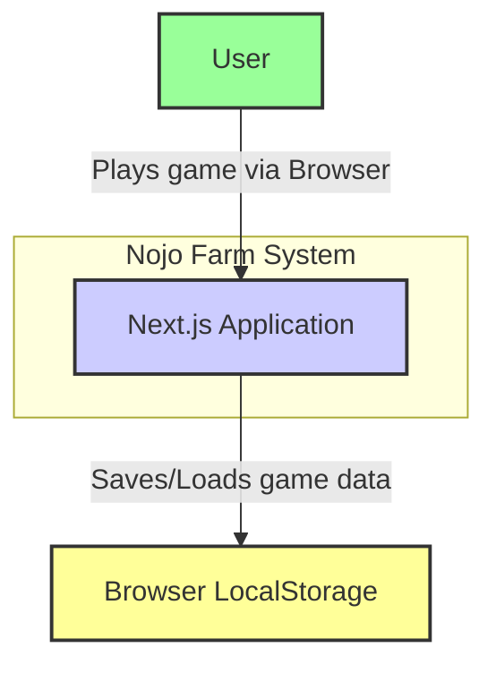
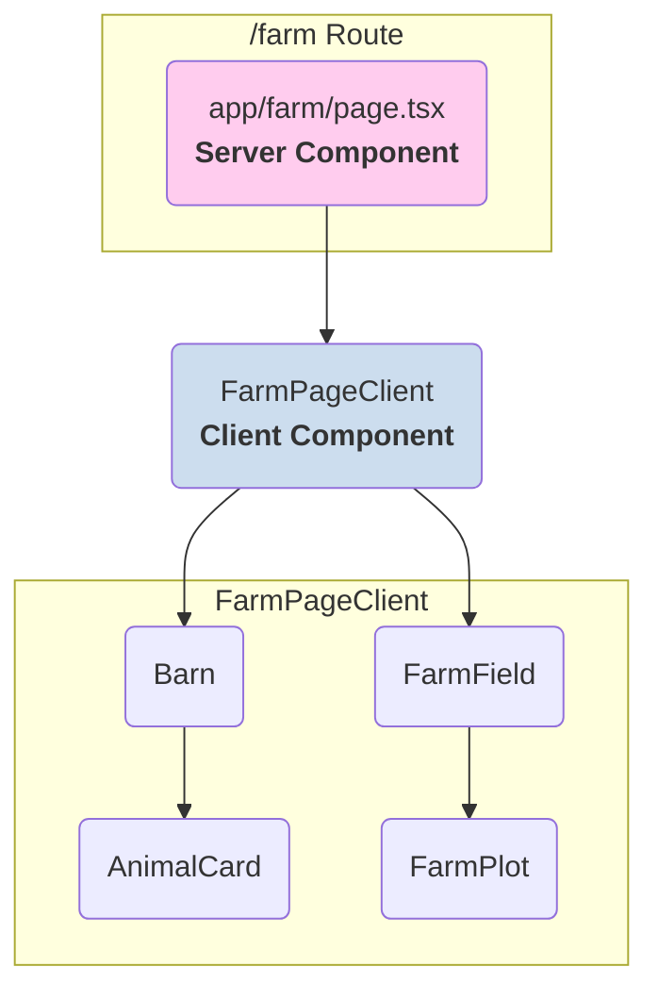
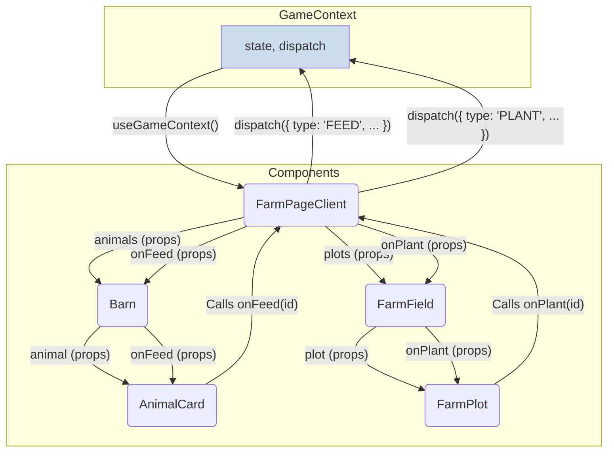
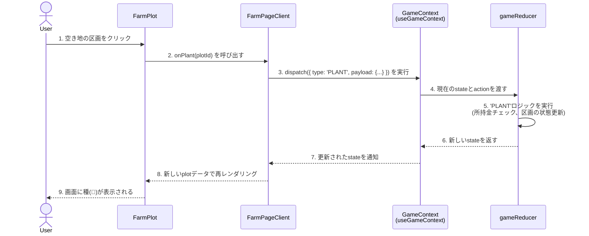
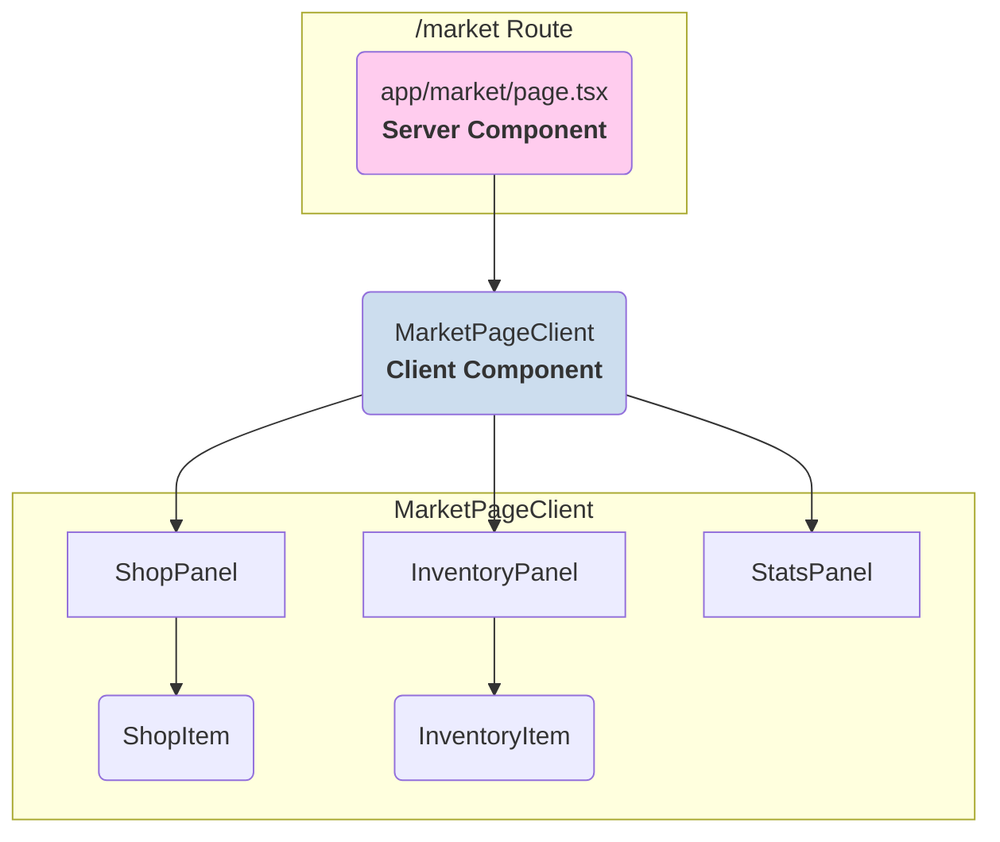
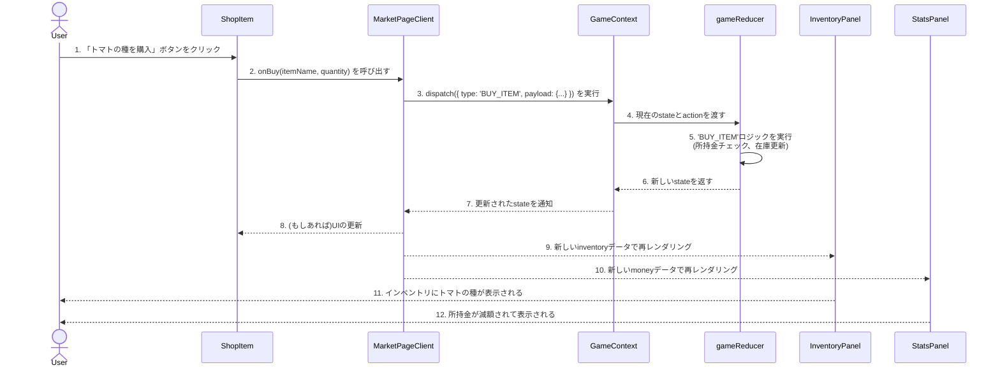
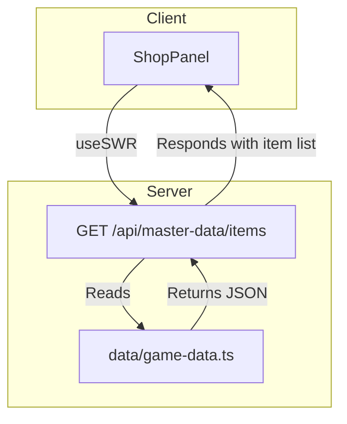
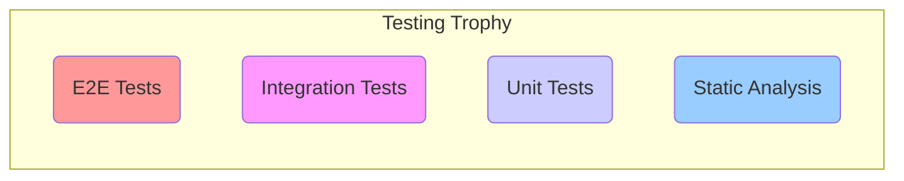

# Nojo Farm - アプリケーション設計解説書

## 第1章: 序論

### 1.1 本書の目的

本書は、Next.jsで構築された農場シミュレーションゲーム「Nojo Farm」の技術的な仕様、設計思想、および実装の詳細を包括的に解説することを目的とします。

本書の対象読者は以下の通りです。

*   **新規に参加する開発者:** 本書を読むことで、アプリケーションの全体像と技術的背景を迅速に理解し、開発にスムーズに参加できるようになります。
*   **既存の開発者:** 機能追加やリファクタリングを行う際の、アーキテクチャの判断基準や設計の一貫性を保つための参照資料として利用します。
*   **将来の自分:** プロジェクトの規模が拡大し、複雑化した際に、なぜそのような設計にしたのかという「意図」を思い出すための備忘録として機能します。

### 1.2 アプリケーション概要

Nojo Farmは、ユーザーがブラウザ上で手軽に農場経営を体験できる、シングルプレイヤーのシミュレーションゲームです。プレイヤーは作物を育て、動物の世話をし、収穫物を市場で売ってお金を稼ぎ、自分の農場を拡大していくことができます。

**主な機能:**
*   **農場:** 作物の育成（種まき、水やり、収穫）、動物の飼育（餌やり）。
*   **市場:** 収穫物の売却、新しい種や動物の購入。
*   **実績:** ゲーム内での特定の行動を達成すると得られる称号や報酬。
*   **永続化:** ゲームの進行状況はブラウザの`localStorage`に保存され、いつでも中断・再開が可能です。

### 1.3 システムコンテキスト図

アプリケーションが、ユーザーや外部システムとどのように関わるかを示します。


*図1-1: システムコンテキスト図*

Nojo Farmは、現時点では外部のサーバーやデータベースに依存せず、ユーザーのブラウザ内で完結するクライアントサイドのアプリケーションです。すべてのゲームデータは、ブラウザの`localStorage`に保存されます。

### 1.4 技術スタックと選定理由

本アプリケーションは、モダンなフロントエンド開発のベストプラクティスを体現する、以下の技術スタックで構築されています。

| カテゴリ | 技術 | 選定理由 |
| :--- | :--- | :--- |
| **フレームワーク** | **Next.js (App Router)** | Reactの能力を最大限に引き出すための統合開発環境。ファイルベースルーティング、多様なレンダリング戦略（SSG, SSR, ISR）、サーバーコンポーネントによるパフォーマンス最適化など、本番品質のアプリケーションに必要な機能が標準で提供されているため。 |
| **UIライブラリ** | **React** | コンポーネントベースのUI構築における業界標準。宣言的な記述により、複雑なUIの状態管理を容易にするため。 |
| **言語** | **TypeScript** | 静的型付けを導入することで、開発時のエラー検出、コードの可読性向上、強力なエディタ補完を実現し、大規模開発におけるコードの堅牢性を担保するため。 |
| **スタイリング** | **Tailwind CSS** | ユーティリティファーストのアプローチにより、CSSの命名やファイル管理から解放され、HTML(JSX)内で迅速かつ一貫性のあるスタイリングを可能にするため。 |
| **UIコンポーネント**| **shadcn/ui** | デザイン性とカスタマイズ性に優れた、再利用可能なUIコンポーネント群。Tailwind CSSとの親和性が非常に高く、デザインシステム構築の基盤となるため。 |
| **状態管理** | **React Context API + `useReducer`** | Reactに標準で備わっている機能であり、外部ライブラリを追加することなく、アプリケーション全体のグローバルな状態を型安全かつ予測可能に管理できるため。 |
| **データ取得(Client)**| **SWR** | Vercelが開発した、クライアントサイドでのデータ取得ライブラリ。キャッシュ、自動再検証、ローディング/エラー状態の管理などを抽象化し、堅牢なデータ取得ロジックを簡潔に記述できるため。 |
| **テスト** | **Jest + React Testing Library** | Jestの高速なテスト実行環境と、RTLの「ユーザー視点でのテスト」という哲学を組み合わせることで、リファクタリングに強く、信頼性の高いテストを効率的に記述できるため。 |

---
---

## 第2章: アプリケーションアーキテクチャ

この章では、Nojo Farmアプリケーションがどのような設計思想と構造で成り立っているのか、その全体像を解説します。

### 2.1 アーキテクチャ概要

本アプリケーションは、Next.jsの**App Router**を全面的に採用した、モダンなアーキテクチャに基づいています。その核心は、**サーバーコンポーネント(RSC)を主軸とし、インタラクティブ性が必要な部分のみをクライアントコンポーネントとして分離する**ハイブリッドアプローチです。

```mermaid
graph TD
    subgraph Browser (Client)
        direction TB
        B1[Client Components<br>e.g., Button, FarmPlot]
        B2[SWR<br>Client-side Data Fetching]
        B3[GameContext (State & Dispatch)<br>Global State Access]
        B1 -- "Dispatches actions" --> B3
        B1 -- "Fetches data" --> B2
        B2 -- "Updates UI" --> B1
    end

    subgraph Server (Vercel / Node.js)
        direction TB
        S1[Next.js App Router]
        S2[Server Components<br>e.g., Page Layouts]
        S3[API Routes<br>e.g., /api/items]
        S4[Rendering Strategies<br>SSG, SSR, ISR]
        S1 -- "Renders" --> S2
        S2 -- "Fetches data during render" --> S3
        S1 -- "Determines strategy" --> S4
    end

    Browser -- "HTTP Request" --> Server
    Server -- "HTML / JS Bundles" --> Browser

    style Browser fill:#cde,stroke:#333
    style Server fill:#fce,stroke:#333
```
*図2-1: ハイレベルアーキテクチャ図*

**処理の流れ:**
1.  ユーザーがページにアクセスすると、まずサーバーサイドでリクエストが処理されます。
2.  Next.jsのApp RouterがURLに対応するルートセグメントを特定します。
3.  サーバーコンポーネントがレンダリングされます。この際、必要に応じてAPIルートやデータベースから直接データを取得します。
4.  レンダリング戦略（SSG, SSR, ISR）に基づき、HTMLが生成されます。
5.  生成されたHTMLと、クライアントコンポーネントに必要な最小限のJavaScriptがブラウザに送信されます。
6.  ブラウザはHTMLを即座に表示し（高速な初期表示）、その後JavaScriptを読み込んでクライアントコンポーネントを「ハイドレーション」し、インタラクティブな状態にします。
7.  クライアントコンポーネント内でのユーザー操作（ボタンクリックなど）は、`GameContext`の`dispatch`を呼び出してグローバルな状態を更新したり、`SWR`を使ってクライアントサイドで追加のデータを取得したりします。

### 2.2 サーバーコンポーネント vs クライアントコンポーネント設計戦略

本アプリケーションにおけるコンポーネントの設計は、以下の原則に基づきます。

**原則：デフォルトは常にサーバーコンポーネント。クライアントコンポーネントは必要最小限に。**

| | サーバーコンポーネント (RSC) | クライアントコンポーネント |
| :--- | :--- | :--- |
| **実行場所** | サーバー | サーバー（初期HTML生成） + **クライアント** |
| **主な責務** | データの取得、静的なUIのレイアウト、クライアントコンポーネントの組み立て | ユーザーインタラクション、状態管理、ブラウザAPIの利用 |
| **フックの使用**| ❌ `useState`, `useEffect` | ✅ `useState`, `useEffect`, `useReducer` etc. |
| **データアクセス**| ✅ DBやファイルシステムに直接アクセス可能 | ❌ 直接アクセス不可。API経由でのみ可能。 |
| **選定基準** | 上記のクライアント機能が**不要**なすべてのコンポーネント。 | `useState`や`onClick`などが必要になったコンポーネント。 |
| **宣言方法** | デフォルト | ファイルの先頭に`"use client";`を記述 |

この戦略により、クライアントに送信されるJavaScriptの量を最小限に抑え、Core Web Vitals、特にLCPとINPを劇的に改善します。

### 2.3 ディレクトリ構造

プロジェクトのルートディレクトリは、責務に応じて明確に分割されています。

```
nojo/
├── app/                  # App Routerのルートディレクトリ
│   ├── api/              # APIルート
│   ├── farm/             # /farmページのルートセグメント
│   │   └── page.tsx
│   ├── layout.tsx        # ルートレイアウト
│   └── page.tsx          # ホームページ
├── components/           # 再利用可能なReactコンポーネント
│   ├── common/           # アプリケーション全体で使われる共通コンポーネント
│   ├── farm/             # farm機能に特化したコンポーネント
│   ├── market/           # market機能に特化したコンポーネント
│   └── ui/               # shadcn/uiベースの汎用UI部品 (Button, Card, etc.)
├── contexts/             # React Contextの定義
│   ├── game-context.tsx
│   └── game-reducer.ts
├── data/                 # 静的なゲームデータ
├── hooks/                # カスタムフック
├── lib/                  # ヘルパー関数、ユーティリティ
├── public/               # 静的アセット (画像など)
├── styles/               # グローバルCSS
├── textbook/             # 本教科書
├── explanation/          # 本設計解説書
└── types/                # TypeScriptの型定義
```

この構造により、開発者は目的のファイルを迅速に見つけることができ、機能ごとの関心事が物理的に分離されるため、メンテナンス性が向上します。

### 2.4 データフローと状態管理戦略

本アプリケーションの状態は、その影響範囲に応じて3つのレベルで管理されます。

```mermaid
graph TD
    subgraph Global State [レベル1: グローバル状態]
        direction LR
        A[GameContext<br>(useReducer)]
    end

    subgraph Feature State [レベル2: 機能レベルの状態]
        direction LR
        B[カスタムフック<br>(e.g., useFarm)]
    end

    subgraph Local State [レベル3: コンポーネントローカル状態]
        direction LR
        C[useState]
    end

    A -- "所持金、インベントリ、実績など<br>アプリ全体で共有" --> App
    B -- "特定のページや機能に閉じた複雑な状態<br>(e.g., 農場の区画の状態)" --> FeaturePage
    C -- "UIの一時的な状態<br>(e.g., モーダルの開閉、入力値)" --> SingleComponent

    style Global State fill:#f99
    style Feature State fill:#f9f
    style Local State fill:#ccf
```
*図2-2: 状態管理の3つのレベル*

1.  **グローバル状態 (Global State):**
    *   **責務:** アプリケーションの複数のページや機能にまたがって共有される、最も重要な状態。
    *   **技術:** `GameContext` (`useContext` + `useReducer`)。
    *   **例:** プレイヤーの所持金、インベントリ、実績、ゲーム内時間。

2.  **機能レベルの状態 (Feature-level State):**
    *   **責務:** 特定の機能（ページ）内でのみ使われるが、ロジックが複雑で複数のコンポーネントにまたがる状態。
    *   **技術:** カスタムフック (`use...`)。
    *   **例:** 漁獲のミニゲームの状態を管理する`useFishing`フック。

3.  **ローカル状態 (Local State):**
    *   **責務:** 単一のコンポーネント内でのみ完結する、UIの一時的な状態。
    *   **技術:** `useState`。
    *   **例:** 検索フォームの入力値、アコーディオンの開閉状態、モーダルの表示/非表示。

...
この階層的な状態管理戦略により、各状態が持つ影響範囲を明確にし、不要な再レンダリングを防ぎ、アプリケーション全体の見通しを良くしています。

---
---

## 第3章: グローバルな状態管理とロジック (GameContext)

この章では、アプリケーションの「頭脳」であり「記憶」である、グローバルな状態管理システム`GameContext`の内部構造を徹底的に解剖します。

### 3.1 GameContextの責務と設計

`GameContext`は、`useContext`と`useReducer`を組み合わせたパターンで実装されており、以下の責務を担います。

*   **状態の一元管理:** アプリケーション全体に関わる状態（所持金、アイテム、実績など）を、単一の`state`オブジェクトで管理します。これにより、「単一の情報源（Single Source of Truth）」が保証されます。
*   **状態更新ロジックの集約:** 状態を変更するためのすべてのロジックを、単一の`gameReducer`関数に集約します。これにより、状態変更の予測可能性とテストの容易性が向上します。
*   **状態と更新関数の配信:** 管理している`state`と、状態更新を依頼するための`dispatch`関数を、アプリケーション内のどのコンポーネントにでも直接配信します。

この設計により、コンポーネントは状態管理の具体的な実装を知ることなく、ただ「アクションを`dispatch`する」だけで、アプリケーションの状態を安全に変更できます。

```mermaid
graph TD
    subgraph GameContext
        A[GameState]
        B[GameReducer]
        C[Dispatch Function]
        A -- "Current State" --> B
        C -- "Action" --> B
        B -- "Returns New State" --> A
    end

    subgraph React Components
        D[Any Component]
        E[useGameContext()]
        F[UI / User Event]
        D -- "Calls" --> E
        E -- "Provides" --> D
        F -- "Triggers" --> D
    end
    
    D -- "Dispatches Action" --> C
    A -- "Provides State" --> E

    style GameContext fill:#cde
```
*図3-1: GameContextの概念図*

### 3.2 GameStateの型定義

`GameState`は、このアプリケーションのすべての永続的な状態を定義する、巨大なオブジェクトの型です。

**ファイル:** `types/game.types.ts`

```typescript
// types/game.types.ts

// 基本となる型
export type Crop = {
  name: string;
  stage: 'seed' | 'growth' | 'harvest';
  plantedAt: number; // 植えられた時刻 (タイムスタンプ)
};

export type Plot = {
  id: number;
  crop: Crop | null;
};

export type Animal = {
  id: string;
  name: string;
  fed: boolean;
  lastFedAt: number | null;
};

export type InventoryItem = {
  name: string;
  quantity: number;
};

// 実績の型
export type Achievement = {
  id: string;
  name: string;
  description: string;
  unlocked: boolean;
};

// GameStateの全体像
export type GameState = {
  username: string;
  money: number;
  gameTime: number; // ゲーム内時間の経過（秒）
  plots: Plot[];
  animals: Animal[];
  inventory: InventoryItem[];
  achievements: Achievement[];
};
```
各プロパティは、アプリケーションの各機能に対応しており、すべてのデータがこの単一のオブジェクトに集約されています。

### 3.3 GameActionの型定義

`GameAction`は、`GameState`を変更するために発行されるすべての「命令」を定義する型です。TypeScriptの**判別可能な共用体 (Discriminated Unions)** を使うことで、`type`プロパティに基づいて`payload`の型が静的に決定され、型安全なReducerの実装を可能にします。

**ファイル:** `types/game.types.ts`

```typescript
// types/game.types.ts (追記)

export type GameAction =
  // 時間経過
  | { type: 'TICK'; payload: { seconds: number } }
  // 農場関連
  | { type: 'PLANT'; payload: { plotId: number; cropName: string } }
  | { type: 'HARVEST'; payload: { plotId: number } }
  | { type: 'FEED'; payload: { animalId: string } }
  // 市場関連
  | { type: 'BUY_ITEM'; payload: { itemName: string; quantity: number; price: number } }
  | { type: 'SELL_ITEM'; payload: { itemName: string; quantity: number; price: number } }
  // 実績関連
  | { type: 'UNLOCK_ACHIEVEMENT'; payload: { achievementId: string } }
  // ユーザー関連
  | { type: 'SET_USERNAME'; payload: { username: string } }
  // ロード処理
  | { type: 'LOAD_GAME_STATE'; payload: { state: GameState } };
```
`payload`は、そのアクションを実行するために必要な追加情報（データ）を格納します。

### 3.4 gameReducerのロジックフロー

`gameReducer`は、現在の`state`と発行された`action`を受け取り、新しい`state`を返す純粋関数です。アプリケーションのすべてのビジネスロジックがここに集約されています。

**ファイル:** `contexts/game-reducer.ts`

#### `PLANT`アクションのフロー

```mermaid
graph TD
    A[Start: PLANT Action] --> B{対象の区画(plot)は存在するか？};
    B -- No --> X[Stateを変更せずに終了];
    B -- Yes --> C{その区画は空き地か？};
    C -- No --> X;
    C -- Yes --> D{プレイヤーは種の代金を持っているか？};
    D -- No --> X;
    D -- Yes --> E[新しいCropオブジェクトを作成<br>{ name, stage: 'seed', plantedAt }];
    E --> F[対象区画のcropプロパティを更新];
    F --> G[種の代金をmoneyから引く];
    G --> H[新しいStateオブジェクトを返す];
    H --> Z[End];

    style X fill:#f99
```
*図3-2: `PLANT`アクションの処理フロー*

**実装コード:**
```typescript
// contexts/game-reducer.ts (一部抜粋)
case 'PLANT': {
  const { plotId, cropName } = action.payload;
  const cropData = CROP_DATA[cropName]; // data/game-data.ts から作物の情報を取得
  if (!cropData) return state; // 存在しない作物

  const targetPlot = state.plots.find(p => p.id === plotId);
  if (!targetPlot || targetPlot.crop) return state; // 区画が存在しないか、空き地でない

  if (state.money < cropData.seedPrice) return state; // お金が足りない

  return {
    ...state,
    money: state.money - cropData.seedPrice,
    plots: state.plots.map(p =>
      p.id === plotId
        ? { ...p, crop: { name: cropName, stage: 'seed', plantedAt: state.gameTime } }
        : p
    ),
  };
}
```

#### `TICK`アクションのフロー

`TICK`アクションは、ゲーム内時間の経過を処理し、作物の成長や動物の状態を更新する、非常に重要なアクションです。

```mermaid
graph TD
    A[Start: TICK Action] --> B[gameTimeを更新<br>state.gameTime + payload.seconds];
    B --> C{作物の成長判定};
    C --> D[各区画(plot)をループ];
    D --> E{plotに作物があり、'seed'段階か？};
    E -- Yes --> F{植えられてからの経過時間は<br>成長時間を超えたか？};
    F -- Yes --> G[作物のstageを'growth'に更新];
    F -- No --> H[何もしない];
    E -- No --> I{plotに作物があり、'growth'段階か？};
    I -- Yes --> J{植えられてからの経過時間は<br>収穫可能時間を超えたか？};
    J -- Yes --> K[作物のstageを'harvest'に更新];
    J -- No --> H;
    I -- No --> H;
    G & K & H --> L[次の区画へ];
    L -- 全区画終了 --> M{動物の状態判定};
    M --> N[各動物(animal)をループ];
    N --> O{最後に餌をやってからの<br>経過時間は一定時間を超えたか？};
    O -- Yes --> P[animalのfedをfalseに更新];
    O -- No --> Q[何もしない];
    P & Q --> R[次の動物へ];
    R -- 全動物終了 --> S[新しいStateオブジェクトを返す];
    S --> Z[End];
```
*図3-3: `TICK`アクションの処理フロー*

この`TICK`アクションは、`useGameTime`のようなカスタムフック内で`setInterval`を使って定期的に`dispatch`されることで、ゲームの世界に時間の流れを生み出します。

### 3.5 Providerとカスタムフックの実装

`GameProvider`は、`gameReducer`を使って生成した`state`と`dispatch`を、Contextの`value`として子孫コンポーネントに提供します。

**ファイル:** `contexts/game-context.tsx`

```tsx
"use client";

import { createContext, useContext, useReducer, Dispatch, useEffect } from 'react';
import type { GameState, GameAction } from '@/types/game.types';
import { gameReducer } from './game-reducer';
import { useLocalStorage } from '@/hooks/use-local-storage';

// ... (initialStateの定義) ...

const GameContext = createContext<{
  state: GameState;
  dispatch: Dispatch<GameAction>;
} | undefined>(undefined);

export const GameProvider = ({ children }: { children: React.ReactNode }) => {
  // useLocalStorageフックで状態の永続化を行う
  const [savedState, setSavedState] = useLocalStorage<GameState>('nojo-game-state', initialState);

  const [state, dispatch] = useReducer(gameReducer, savedState);

  // stateが変更されるたびに、localStorageに保存する
  useEffect(() => {
    setSavedState(state);
  }, [state, setSavedState]);

  return (
    <GameContext.Provider value={{ state, dispatch }}>
      {children}
    </GameContext.Provider>
  );
};

export const useGameContext = () => {
  const context = useContext(GameContext);
  if (context === undefined) {
    throw new Error('useGameContext must be used within a GameProvider');
  }
  return context;
};
```
**永続化の仕組み:**
この`GameProvider`は、`useLocalStorage`というカスタムフック（第8章で解説）と連携しています。
1.  `useReducer`の初期状態として、`localStorage`から読み込んだ`savedState`を使います。
2.  `useEffect`を使い、`state`が（Reducerによって）変更されるたびに、新しい`state`を`localStorage`に保存します。

...
これにより、ユーザーがブラウザを閉じても、ゲームの進行状況が失われることなく、次回アクセス時に続きからプレイできる仕組みを実現しています。

---
---

## 第4章: 主要機能コンポーネント詳解

この章では、アプリケーションの主要な機能を構成するコンポーネント群について、その設計、責務、データフロー、および内部ロジックを詳細に解説します。各コンポーネントがどのように連携し、一つの機能として成り立っているのかを明らかにします。

---

### 4.1 農場ページ (`/farm`)

農場ページは、プレイヤーが作物の育成や動物の世話を行う、このゲームの中心的な機能です。

#### 4.1.1 コンポーネント階層

農場ページは、単一の巨大なコンポーネントではなく、責務に応じて複数の小さなコンポーネントに分割されています。


*図4-1: 農場ページのコンポーネント階層*

| コンポーネント | ファイルパス | 責務 |
| :--- | :--- | :--- |
| `page.tsx` | `app/farm/page.tsx` | サーバーサイドでの初期データ準備。`FarmPageClient`のレンダリング。 |
| `FarmPageClient` | `components/pages/farm-page.tsx` | 農場ページ全体のクライアントサイドの状態とロジックを統括。`GameContext`との連携。 |
| `Barn` | `components/farm/Barn.tsx` | 動物の一覧（`AnimalCard`）を表示するコンテナ。 |
| `AnimalCard` | `components/farm/AnimalCard.tsx` | 個々の動物の情報表示と、「餌をやる」アクションのトリガー。 |
| `FarmField` | `components/farm/FarmField.tsx` | 畑の区画の一覧（`FarmPlot`）を表示するコンテナ。 |
| `FarmPlot` | `components/farm/FarmPlot.tsx` | 個々の畑の区画の表示と、「植える」などのアクションのトリガー。 |

#### 4.1.2 データフローと状態管理

農場ページの状態は、グローバルな`GameContext`によって一元管理されます。各コンポーネントは`useGameContext`フックを通じて`state`を購読し、`dispatch`を通じて状態の更新を依頼します。


*図4-2: 農場ページのデータフロー*

1.  **トップダウンのデータフロー:** `FarmPageClient`が`useGameContext`から`state`を取得し、その中から必要なデータ（`animals`, `plots`）を子コンポーネントにPropsとして渡していきます。
2.  **ボトムアップのイベント通知:** 末端のコンポーネント（`AnimalCard`, `FarmPlot`）でユーザーイベントが発生すると、Propsで渡されたコールバック関数（`onFeed`, `onPlant`）が呼び出されます。
3.  **状態更新の一元化:** `FarmPageClient`で定義されたコールバック関数は、最終的に`useGameContext`から取得した`dispatch`関数を呼び出し、適切な`action`を発行します。状態の更新ロジックは`gameReducer`に集約されているため、コンポーネント自身は状態がどう変わるかを知る必要がありません。

#### 4.1.3 シーケンス図：作物を植える

ユーザーが空き地の区画をクリックして作物を植える際の、コンポーネント、フック、Context間の相互作用をシーケンス図で示します。


*図4-3: 「作物を植える」アクションのシーケンス*

このシーケンスは、Reactの「単一方向データフロー」と、Reducerパターンの予測可能な状態更新の仕組みを明確に示しています。

#### 4.1.4 各コンポーネントのインターフェースと責務

##### `FarmPageClient`
*   **責務:** 農場ページ全体のクライアントサイドのロジックを統括する。`GameContext`と各機能コンポーネント（`Barn`, `FarmField`）の間の仲介役。
*   **Props:**
    ```typescript
    type FarmPageClientProps = {
      initialData: { // サーバーコンポーネントから受け取る初期データ
        animals: Animal[];
        plots: Plot[];
      };
    };
    ```
*   **内部ロジック:**
    *   `useGameContext`を呼び出し、グローバルな`state`と`dispatch`を取得。
    *   子コンポーネントに渡すためのイベントハンドラ（`handleFeedAnimal`, `handlePlantCrop`など）を定義。これらのハンドラは、内部で`dispatch`を呼び出す。

##### `Barn` / `FarmField`
*   **責務:** 関連するアイテムのリストを表示するためのレイアウトコンテナ。自身では状態を持たず、親から受け取ったデータを子に流し、子のイベントを親に中継する。
*   **Props (`FarmField`の例):**
    ```typescript
    type FarmFieldProps = {
      plots: Plot[];
      onPlant: (plotId: number) => void;
    };
    ```
*   **内部ロジック:**
    *   受け取った`plots`配列を`.map()`でループし、`FarmPlot`コンポーネントをレンダリングする。
    *   各`FarmPlot`に、`key`, `plot`データ、そして親から受け取った`onPlant`関数をそのまま渡す。

##### `AnimalCard` / `FarmPlot`
*   **責務:** 最小単位の情報を視覚的に表現するプレゼンテーショナルコンポーネント。ユーザーのアクションを検知し、親に通知する。
*   **Props (`FarmPlot`の例):**
    ```typescript
    type FarmPlotProps = {
      plot: Plot;
      onPlant: (plotId: number) => void;
    };
    ```
*   **内部ロジック:**
    *   受け取った`plot`データに基づき、条件付きレンダリングで表示を切り替える（例: 空き地か、種か、収穫可能か）。
    *   `div`要素の`onClick`イベントで、Propsとして受け取った`onPlant`関数を、自身の`plot.id`を引数にして呼び出す。

---

### 4.2 市場ページ (`/market`)

市場ページは、プレイヤーがアイテムを売買する機能を提供します。このページは、「ショップ（商品一覧）」と「プレイヤーのインベントリ」という2つの主要な関心事を扱います。

#### 4.2.1 コンポーネント階層


*図4-4: 市場ページのコンポーネント階層*

| コンポーネント | ファイルパス | 責務 |
| :--- | :--- | :--- |
| `MarketPageClient` | `components/pages/market-page.tsx` | 市場ページ全体のクライアントロジックを統括。 |
| `ShopPanel` | `components/market/ShopPanel.tsx` | 購入可能な商品の一覧を表示。 |
| `ShopItem` | `components/market/ShopItem.tsx` | 個々の商品の情報表示と「購入」アクションのトリガー。 |
| `InventoryPanel` | `components/market/InventoryPanel.tsx`| プレイヤーの所持品一覧を表示。 |
| `InventoryItem` | `components/market/InventoryItem.tsx`| 個々の所持品の情報表示と「売却」アクションのトリガー。 |
| `StatsPanel` | `components/market/StatsPanel.tsx` | プレイヤーの所持金などのステータスを表示。 |

#### 4.2.2 シーケンス図：アイテムを購入する


*図4-5: 「アイテムを購入する」アクションのシーケンス*

農場ページと同様に、ユーザーのアクションが末端のコンポーネントから始まり、中央のクライアントページコンポーネントを経由して`GameContext`に`dispatch`され、その結果として更新された`state`がトップダウンでUIに反映される、という一貫したデータフローがここでも見て取れます。...
この一貫性が、アプリケーション全体の予測可能性とメンテナンス性を高めています。

---
---

## 第5章: 共通UIコンポーネントシステム

この章では、アプリケーション全体のルック＆フィールを統一し、開発効率を向上させるための基盤となる、共通UIコンポーネントシステムについて解説します。本プロジェクトでは、`components/ui`ディレクトリに配置されたコンポーネント群がその役割を担っています。

### 5.1 設計思想：`shadcn/ui`の哲学

`components/ui`内のコンポーネントは、`shadcn/ui`というアプローチに基づいて構築されています。これは、従来のコンポーネントライブラリ（例: Material-UI, Ant Design）とは一線を画す、以下の哲学に基づいています。

*   **これはライブラリではない:** `shadcn/ui`は、npmでインストールして使う「ブラックボックス」なライブラリではありません。代わりに、高品質に設計・実装されたコンポーネントの**ソースコードそのもの**を、自分のプロジェクトに直接コピー＆ペースト（またはCLI経由で追加）します。
*   **所有権はあなたにある:** コードが自分のプロジェクト内に存在するため、あなたはコンポーネントのスタイル、構造、ロジックを**100%自由にカスタマイズ**できます。ライブラリの制約に縛られることはありません。
*   **依存関係の最小化:** あなたは、アプリケーションに不要なコンポーネントのコードをバンドルに含めることがありません。必要なものだけを追加し、プロジェクトを軽量に保つことができます。

このアプローチにより、デザインの一貫性と、個別の要求に応えるための柔軟性を高いレベルで両立させています。

### 5.2 スタイリング戦略：Tailwind CSS + CVA

本UIシステムは、スタイリングの心臓部として**Tailwind CSS**と**CVA (Class Variance Authority)**という2つの技術を組み合わせています。

1.  **Tailwind CSS:**
    *   すべてのスタイリングは、ユーティリティクラスによって行われます。
    *   アプリケーションのデザインシステム（色、スペーシング、フォントなど）は、`tailwind.config.ts`に集約されており、UIコンポーネントはこれらのデザイントークンを参照します。
    *   **例:** `bg-primary`クラスは、`tailwind.config.ts`で定義された`primary`カラーを参照します。

2.  **CVA (Class Variance Authority):**
    *   コンポーネントが持つ複数の**バリアント（見た目の種類）**を、宣言的かつ型安全に管理するためのライブラリです。
    *   例えば、`Button`コンポーネントには、「通常」「破壊的」「アウトライン」といった`variant`や、「S」「M」「L」といった`size`があります。CVAは、これらのPropsの組み合わせに応じたTailwindクラスの文字列を生成する役割を担います。

### 5.3 ケーススタディ：`Button`コンポーネントの解剖

`Button`コンポーネントは、このUIシステムの設計思想を理解するための最も良い例です。

**ファイル:** `components/ui/button.tsx`

#### 5.3.1 バリアントの定義 (`buttonVariants`)

コンポーネント本体の前に、まず`cva`関数を使ってボタンのすべてのスタイルバリアントを定義します。

```typescript
// components/ui/button.tsx (一部抜粋)
import { cva, type VariantProps } from "class-variance-authority";

const buttonVariants = cva(
  // 1. ベーススタイル: 全てのバリアントに共通で適用されるクラス
  "inline-flex items-center justify-center whitespace-nowrap rounded-md text-sm font-medium ring-offset-background transition-colors focus-visible:outline-none focus-visible:ring-2 focus-visible:ring-ring focus-visible:ring-offset-2 disabled:pointer-events-none disabled:opacity-50",
  {
    // 2. バリアントの定義
    variants: {
      // "variant" Propに対するスタイル
      variant: {
        default: "bg-primary text-primary-foreground hover:bg-primary/90",
        destructive: "bg-destructive text-destructive-foreground hover:bg-destructive/90",
        outline: "border border-input bg-background hover:bg-accent hover:text-accent-foreground",
        secondary: "bg-secondary text-secondary-foreground hover:bg-secondary/80",
        ghost: "hover:bg-accent hover:text-accent-foreground",
        link: "text-primary underline-offset-4 hover:underline",
      },
      // "size" Propに対するスタイル
      size: {
        default: "h-10 px-4 py-2",
        sm: "h-9 rounded-md px-3",
        lg: "h-11 rounded-md px-8",
        icon: "h-10 w-10",
      },
    },
    // 3. デフォルトバリアントの指定
    defaultVariants: {
      variant: "default",
      size: "default",
    },
  }
);
```

`cva`関数は3つの引数を取ります。
1.  **ベーススタイル:** すべてのボタンに共通するスタイル。ここでは、フレックスレイアウト、角丸、フォント、フォーカス時のリング表示、無効化時のスタイルなどが定義されています。
2.  **`variants`オブジェクト:** コンポーネントが受け取るProps（`variant`と`size`）と、それぞれの値に対応するTailwindクラスをマッピングします。
3.  **`defaultVariants`オブジェクト:** Propsが指定されなかった場合に適用されるデフォルトのバリアントを定義します。

#### 5.3.2 Propsの型定義

次に、コンポーネントが受け取るPropsの型を定義します。`VariantProps<typeof buttonVariants>`を使うことで、CVAで定義した`variant`と`size`を、自動的にコンポーネントのPropsの型として取り込むことができます。

```typescript
// components/ui/button.tsx (一部抜粋)

// CVAのバリアント定義から型を抽出し、標準のButton要素が持つ属性とマージする
export interface ButtonProps
  extends React.ButtonHTMLAttributes<HTMLButtonElement>,
    VariantProps<typeof buttonVariants> {
  asChild?: boolean;
}
```
これにより、`Button`コンポーネントは`variant`や`size`といったPropsを型安全に受け取ることができます。

#### 5.3.3 コンポーネントの実装

最後に、コンポーネント本体の実装です。

```typescript
// components/ui/button.tsx (一部抜粋)
import { cn } from "@/lib/utils";

const Button = React.forwardRef<HTMLButtonElement, ButtonProps>(
  ({ className, variant, size, asChild = false, ...props }, ref) => {
    const Comp = asChild ? Slot : "button";
    return (
      <Comp
        className={cn(buttonVariants({ variant, size, className }))}
        ref={ref}
        {...props}
      />
    );
  }
);
Button.displayName = "Button";
```

**重要なポイント:**
*   `buttonVariants({ variant, size, className })`: CVAが生成した`buttonVariants`関数を呼び出しています。引数としてコンポーネントが受け取った`variant`と`size`を渡すと、CVAは定義に基づいて適切なクラス文字列（例: `"bg-primary text-primary-foreground h-10 px-4 py-2"`）を返します。
*   `cn(...)`: 第4章で解説した`cn`ユーティリティ関数が、`buttonVariants`から返されたクラス文字列と、コンポーネントの呼び出し元から渡された追加の`className`を安全にマージします。これにより、`Button`コンポーネントの利用者は、`<Button className="mt-4">`のように、外側からスタイルを上書き・追加することが可能になります。

#### 5.3.4 使用例

この設計により、`Button`コンポーネントは非常に宣言的に利用できます。

```tsx
// あるコンポーネント内での使用例
import { Button } from "@/components/ui/button";

function Example() {
  return (
    <div className="space-x-2">
      {/* デフォルトのボタン */}
      <Button>Default</Button>

      {/* 破壊的アクション用のボタン */}
      <Button variant="destructive">Destructive</Button>

      {/* 小さいサイズのゴーストボタン */}
      <Button variant="ghost" size="sm">Ghost SM</Button>

      {/* 外部リンク用のスタイルで、かつマージンを追加 */}
      <Button variant="link" className="mt-4">
        Learn More
      </Button>
    </div>
  );
}
```

### 5.4 その他の主要UIコンポーネント

`Button`と同様の設計思想が、`components/ui`内の他のすべてのコンポーネントにも適用されています。

*   **`Card` (`CardHeader`, `CardContent`, `CardFooter`):**
    *   コンテンツをまとめるためのコンテナ。
    *   複数のコンポーネントを組み合わせて使用することで、構造的なマークアップを実現します。
    *   **責務:** 関連する情報のグループ化と視覚的な境界の提供。

*   **`Dialog` (`DialogTrigger`, `DialogContent`, `DialogHeader`):**
    *   モーダルダイアログを実装するためのコンポーネント群。
    *   アクセシビリティ（キーボード操作、フォーカストラップなど）が考慮されています。
    *   **責務:** メインコンテンツの上にオーバーレイ表示される一時的なUIの提供。

*   **`Input`, `Label`:**
    *   標準のフォーム要素を、プロジェクトのデザインシステムに沿ったスタイルで提供します。
    *   **責務:** ユーザーからのテキスト入力を受け付ける。

...
これらのコンポーネントを組み合わせることで、開発者は車輪の再発明をすることなく、アプリケーション全体で一貫性のある、高品質なUIを迅速に構築することができます。

---
---

## 第6章: API設計とデータ永続化

この章では、アプリケーションのデータをどのように保存（永続化）し、またサーバーとクライアント間でどのようにデータをやり取りするかの設計について解説します。

### 6.1 データ永続化戦略

本アプリケーションは、ユーザー体験を手軽でシンプルなものに保つため、現時点ではサーバーサイドのデータベースを持ちません。すべてのゲームデータは、ユーザーのブラウザに内蔵されている**`localStorage`**に保存されます。

#### 6.1.1 `localStorage`による永続化

**仕組み:**
*   **保存:** `GameContext`内の`state`オブジェクトが変更されるたびに、`useEffect`フックがトリガーされ、現在の`state`全体がJSON文字列に変換されて`localStorage`に書き込まれます。
*   **読み込み:** ユーザーがアプリケーションを起動すると、`GameProvider`はまず`localStorage`に保存されたデータがないかを確認します。データが存在すれば、それをパースして`useReducer`の初期状態として復元します。存在しなければ、定義済みの`initialState`を使用します。
*   **実装:** このロジックは、`hooks/use-local-storage.ts`カスタムフックにカプセル化されており、`GameProvider`から利用されています。

**利点:**
*   サーバーコストが不要。
*   オフラインでも動作可能。
*   実装がシンプルで高速。

**欠点:**
*   データは単一のブラウザにのみ保存されるため、デバイス間でのデータ共有はできない。
*   ユーザーがブラウザのデータを消去すると、ゲームデータも失われる。

#### 6.1.2 将来的な拡張性

将来的にユーザーアカウント機能を導入し、データをサーバーサイドのデータベース（例: PostgreSQL, MongoDB）に保存する拡張も可能です。その際は、`GameProvider`内の永続化ロジックを、`localStorage`へのアクセスから、サーバーのAPIを呼び出す処理に置き換えることで対応します。

### 6.2 APIルート (Route Handlers) の設計

本アプリケーションは、クライアントサイドで完結する部分が多いですが、将来的な拡張や、サーバーサイドでしか実行できない処理のために、Next.jsのAPIルート機能を活用します。APIルートはすべて`app/api/`ディレクトリ以下に配置されます。

以下に、主要なAPIエンドポイントの設計仕様を記述します。

#### 6.2.1 ゲームデータ (`/api/game`)

##### `GET /api/game`
*   **責務:** サーバーに保存されている現在のユーザーのゲームデータを取得する。（※将来的な機能）
*   **リクエスト:** 認証情報（例: Cookie内のセッショントークン）を含む。
*   **レスポンス (200 OK):**
    ```json
    {
      "username": "string",
      "money": "number",
      "gameTime": "number",
      "plots": "Plot[]",
      "animals": "Animal[]",
      "inventory": "InventoryItem[]",
      "achievements": "Achievement[]"
    }
    ```
*   **レスポンス (401 Unauthorized):** 認証されていないユーザーからのリクエスト。

##### `POST /api/game`
*   **責務:** 現在のゲームの状態をサーバーに保存する。（※将来的な機能）
*   **リクエストボディ:**
    ```json
    {
      "gameState": "GameState" // GameStateオブジェクト全体
    }
    ```
*   **レスポンス (200 OK):**
    ```json
    { "status": "success", "savedAt": "timestamp" }
    ```
*   **レスポンス (400 Bad Request):** リクエストボディの形式が不正。

#### 6.2.2 静的ゲームデータ (`/api/master-data`)

ショップで販売されるアイテムや、作物の成長時間など、ゲームの基本設定となる静的なマスターデータを配信するためのエンドポイントです。


*図6-1: マスターデータ取得フロー*

##### `GET /api/master-data/items`
*   **責務:** ショップで販売されるすべてのアイテムのマスターデータを返す。
*   **リクエスト:** なし。
*   **レスポンス (200 OK):**
    ```json
    [
      {
        "id": "tomato-seed",
        "name": "トマトの種",
        "type": "seed",
        "buyPrice": 50,
        "sellPrice": 0
      },
      {
        "id": "tomato",
        "name": "トマト",
        "type": "crop",
        "buyPrice": 0,
        "sellPrice": 80
      }
    ]
    ```
このAPIは、サーバーコンポーネントから直接、あるいはクライアントコンポーネントから`SWR`を通じて呼び出されます。データが静的であるため、Next.jsのキャッシュ機構と非常に相性が良く、`fetch`時に`revalidate`オプションを設定することで、ISR（インクリメンタル静的再生成）の対象とすることができます。

### 6.3 クライアントからのAPI利用パターン

クライアントコンポーネントからAPIを呼び出す際は、原則として`SWR`を利用します。

#### 6.3.1 データ取得 (`GET`)

`useSWR`フックを用いて、宣言的にデータを取得します。

```typescript
// components/market/ShopPanel.tsx (抜粋)
import useSWR from 'swr';

const fetcher = (url: string) => fetch(url).then(res => res.json());

function ShopPanel() {
  const { data: items, error, isLoading } = useSWR('/api/master-data/items', fetcher);

  if (isLoading) return <p>商品を読み込み中...</p>;
  if (error) return <p>エラーが発生しました。</p>;

  // ... itemsを使ったリストのレンダリング ...
}
```
`SWR`がローディング状態、エラー状態、そして成功時のデータを管理してくれるため、コンポーネントのロジックが非常にシンプルになります。

#### 6.3.2 データ更新 (`POST`, `PUT`, `DELETE`)

データの更新（Mutation）は、通常の`fetch`関数で行い、その結果を`SWR`のキャッシュに反映させるために`mutate`関数を呼び出します。

```typescript
// 将来的に、ゲームデータをサーバーに保存する場合の実装例
import useSWR, { useSWRConfig } from 'swr';

function SaveButton() {
  const { state } = useGameContext();
  const { mutate } = useSWRConfig();

  const handleSave = async () => {
    try {
      // 1. サーバーに現在のゲーム状態をPOST
      await fetch('/api/game', {
        method: 'POST',
        headers: { 'Content-Type': 'application/json' },
        body: JSON.stringify({ gameState: state }),
      });

      // 2. 関連するSWRキャッシュを再検証（任意）
      // 例えば、プロフィール情報を更新した場合など
      // mutate('/api/profile');

      alert('ゲームを保存しました！');
    } catch (error) {
      alert('保存に失敗しました。');
    }
  };

  return <button onClick={handleSave}>ゲームを保存</button>;
}
```
...
このパターンにより、クライアントはサーバーの状態を変更し、UIを最新の状態に効率的に同期させることができます。

---
---

## 第7章: テスト戦略

この章では、Nojo Farmアプリケーションの品質、堅牢性、および保守性を継続的に保証するためのテスト戦略について詳述します。

### 7.1 テストの基本方針と哲学

本プロジェクトでは、**「テストのトロフィー」**モデルをテスト戦略の基本方針として採用します。これは、従来の「テストのピラミッド」を発展させ、現代のフロントエンド開発、特にコンポーネントベースのアプリケーションにおいて、より費用対効果の高いテストの内訳を示したものです。


*図7-1: テストのトロフィー*

*   **静的解析 (Static Analysis):**
    *   **役割:** コードを実行する前に、最も基本的なエラーを検出する。
    *   **技術:** **TypeScript**による型チェック、**ESLint**によるコード規約チェック。
    *   **方針:** これが品質保証の最大の土台となります。型エラーや規約違反は、バグの最も一般的な原因であり、これらを開発段階で即座に発見することが最もコストが低い。

*   **ユニットテスト (Unit Tests):**
    *   **役割:** 単一の関数、カスタムフック、あるいは非常にシンプルなコンポーネントなど、最小単位のロジックが正しく動作することを保証する。
    *   **技術:** **Jest**。
    *   **方針:** 複雑なビジネスロジックを持つユーティリティ関数やカスタムフックを中心に記述します。UIコンポーネントのユニットテストは、ロジックが複雑な場合に限定し、基本的にはインテグレーションテストに委ねます。

*   **インテグレーションテスト (Integration Tests):**
    *   **役割:** 複数のコンポーネントが連携して、一つの機能として正しく動作することを検証する。**本プロジェクトのテスト戦略の核となります。**
    *   **技術:** **Jest** + **React Testing Library (RTL)**。
    *   **方針:** ユーザーの視点からテストを記述します。例えば、「フォームに入力して送信ボタンを押すと、リストに項目が追加される」といった一連のインタラクションをシミュレートし、その結果としてUIが期待通りに変化したことを確認します。実装の詳細（stateの値など）はテストしません。

*   **エンドツーエンドテスト (E2E Tests):**
    *   **役割:** 実際のブラウザを自動操作し、ユーザー登録から商品購入までといった、アプリケーション全体のクリティカルなユーザーフローが正常に完了することを保証する。
    *   **技術:** **Cypress** や **Playwright** (将来的な導入を想定)。
    *   **方針:** 実行コストとメンテナンスコストが高いため、最も重要ないくつかのシナリオ（例: ゲームの開始とセーブ・ロード）に限定して導入します。

### 7.2 テスト環境

本プロジェクトのテスト環境は、以下のツールで構成されています。

*   **テストランナー:** Jest
*   **テストライブラリ:** React Testing Library (RTL)
*   **JestとDOMの連携:** `@testing-library/jest-dom`
*   **ユーザー操作シミュレーション:** `@testing-library/user-event`
*   **TypeScriptサポート:** `ts-jest`
*   **Next.js連携:** `next/jest`

設定ファイル`jest.config.ts`と`jest.setup.ts`によって、Next.jsのパスエイリアスや、テスト実行前のグローバルなセットアップが構成されています。

### 7.3 テストパターンの実装例

#### 7.3.1 ユニットテスト (カスタムフック)

複雑なロジックを持つカスタムフックは、ユニットテストの絶好の対象です。RTLの`renderHook`ユーティリティを使い、フックの振る舞いを検証します。

**テスト対象:** `hooks/use-farm.ts`

```typescript
// hooks/use-farm.test.ts
import { renderHook, act } from '@testing-library/react';
import { useFarm } from './use-farm';
import type { Plot } from '@/types/game.types';

const initialPlots: Plot[] = [
  { id: 1, crop: null },
  { id: 2, crop: { name: 'トマト', stage: 'harvest', plantedAt: 0 } },
];

describe('useFarm フックのテスト', () => {
  it('plantCropを呼び出すと、指定した区画に作物が植えられる', () => {
    // Arrange: フックをレンダリング
    const { result } = renderHook(() => useFarm(initialPlots));

    // Act: 状態を更新する関数を`act`でラップして実行
    act(() => {
      result.current.plantCrop(1); // 1番の区画に植える
    });

    // Assert: フックの戻り値(result.current)を検証
    const updatedPlot = result.current.plots.find(p => p.id === 1);
    expect(updatedPlot?.crop).not.toBeNull();
    expect(updatedPlot?.crop?.name).toBe('にんじん'); // デフォルトで植えられる作物
    expect(updatedPlot?.crop?.stage).toBe('seed');
  });

  it('空き地でない区画には作物を植えられない', () => {
    // Arrange
    const { result } = renderHook(() => useFarm(initialPlots));

    // Act
    act(() => {
      result.current.plantCrop(2); // すでにトマトが植えられている区画
    });

    // Assert: 状態が変化していないことを確認
    expect(result.current.plots).toEqual(initialPlots);
  });
});
```

#### 7.3.2 コンポーネント/インテグレーションテスト (RTL)

ユーザーの視点から、コンポーネントのインタラクションをテストします。

**テスト対象:** `components/farm/AnimalCard.tsx`

```mermaid
graph TD
    subgraph Test: AnimalCard
        A[1. Arrange<br>コンポーネントをレンダリング<br>jest.fn()でモック関数を渡す] --> B[2. Act<br>userEvent.click()で<br>ボタンをクリック]
        B --> C[3. Assert<br>モック関数が<br>期待通りに呼ばれたか検証]
    end
```
*図7-2: コンポーネントテストのフロー*

```typescript
// components/farm/AnimalCard.test.tsx
import { render, screen } from '@testing-library/react';
import userEvent from '@testing-library/user-event';
import { AnimalCard } from './AnimalCard';
import type { Animal } from '@/types/game.types';

describe('AnimalCard コンポーネントのテスト', () => {
  const mockAnimal: Animal = { id: 'a1', name: '牛', fed: false, lastFedAt: null };
  
  it('満腹でない場合、ボタンをクリックするとonFeedが呼ばれる', async () => {
    const user = userEvent.setup();
    const handleFeed = jest.fn(); // モック関数

    // Arrange
    render(<AnimalCard animal={mockAnimal} onFeed={handleFeed} />);

    // Act
    const button = screen.getByRole('button', { name: '餌をやる' });
    await user.click(button);

    // Assert
    expect(handleFeed).toHaveBeenCalledTimes(1);
    expect(handleFeed).toHaveBeenCalledWith('a1');
  });

  it('満腹の場合、ボタンは無効化されている', () => {
    const fedAnimal = { ...mockAnimal, fed: true };
    const handleFeed = jest.fn();

    // Arrange
    render(<AnimalCard animal={fedAnimal} onFeed={handleFeed} />);

    // Assert
    const button = screen.getByRole('button', { name: '餌をやる' });
    expect(button).toBeDisabled();
  });
});
```

#### 7.3.3 Contextを利用するコンポーネントのテスト

`useGameContext`を呼び出すコンポーネントは、テスト時に`GameProvider`でラップする必要があります。この定型作業を簡略化するため、テスト用のカスタム`render`関数を用意します。

**テストユーティリティ:** `utils/test-utils.tsx`
```typescript
// utils/test-utils.tsx
import React, { ReactElement } from 'react';
import { render, RenderOptions } from '@testing-library/react';
import { GameProvider } from '@/contexts/game-context';

const AllTheProviders = ({ children }: { children: React.ReactNode }) => {
  return <GameProvider>{children}</GameProvider>;
};

const customRender = (
  ui: ReactElement,
  options?: Omit<RenderOptions, 'wrapper'>
) => render(ui, { wrapper: AllTheProviders, ...options });

export * from '@testing-library/react';
export { customRender as render };
```

**テスト対象:** `StatsPanel`と`ShopPanel`の連携

このテストは、ショップでアイテムを購入（`BUY_ITEM`アクションを`dispatch`）した結果、`StatsPanel`に表示されている所持金が正しく減少するかを検証する、高度なインテグレーションテストです。

```typescript
// components/market/Market.test.tsx
import { render, screen } from '@/utils/test-utils'; // カスタムrenderをインポート
import userEvent from '@testing-library/user-event';
import MarketPageClient from '@/components/pages/market-page';
import { MASTER_ITEMS } from '@/data/game-data'; // マスターデータ

// APIのモック
jest.mock('swr', () => ({
  __esModule: true,
  default: () => ({
    data: MASTER_ITEMS,
    error: null,
    isLoading: false,
  }),
}));

describe('市場ページのインテグレーションテスト', () => {
  it('ショップでアイテムを購入すると、ステータスパネルの所持金が減少する', async () => {
    const user = userEvent.setup();
    
    // Arrange
    render(<MarketPageClient />);

    // Assert (初期状態の確認)
    // GameContextの初期値である1000円が表示されていることを確認
    expect(screen.getByText(/所持金: 1000 G/)).toBeInTheDocument();

    // Act
    // "トマトの種"に対応する購入ボタンを探してクリック
    const buyButton = screen.getByRole('button', { name: /トマトの種.*購入/ });
    await user.click(buyButton);

    // Assert (状態変更後の確認)
    // トマトの種の価格(50G)が引かれた950円が表示されていることを確認
    expect(screen.getByText(/所持金: 950 G/)).toBeInTheDocument();
  });
});
```
このテストでは、`SWR`のフックを`jest.mock`でモック化し、APIからの応答をシミュレートしています。そして、ユーザーの購入アクションが`GameContext`の状態を正しく更新し、その結果が別のコンポーネントにまで反映される、という一連の流れを検証しています。これは、アプリケーションのコアな振る舞いを保証する、非常に価値の高いテストです。


