# Flutter教科書 - 初級編 - 1. Dart言語の基礎 (農場たとえ話・増量版)

プログラミングの世界へようこそ！この章では、Flutterアプリ開発の基盤となるプログラミング言語「Dart」の文法を、**大きな農場を経営する**という視点から、楽しく、そして深く学んでいきましょう。

---

## 1.1 変数、データ型、演算子

### 変数とは？ ～農場の区画整理～

あなたの農場には、作物を植えたり、家畜を育てたりするための区画がたくさんあります。プログラミングにおける**変数**とは、この**「区画」**のようなものです。データを保存しておくための名前付きの場所です。

Dartでは、それぞれの区画に「この区画にはトマトしか植えられません」「ここには牛しか入れません」といった**看板（型）**を立てて、管理を厳格に行います。

```dart
// `String`という看板を立てた区画`farmName`を用意し、「My Farm」という作物を植える。
String farmName = 'My Farm';

// `int`という看板を立てた区画`sheepCount`を用意し、羊が30頭いることを記録する。
int sheepCount = 30;

// `var`を使うと、賢い農場管理人が自動で看板を立ててくれる。
// 'Tomato'という作物を見たので、自動的に`String`の看板を立てる。
var crop = 'Tomato'; 
// 50という数値を見たので、自動的に`int`の看板を立てる。
var cowCount = 50;

// 一度「牛用の区画」と決めた場所に、作物を植えることはできません。
// cowCount = 'たくさん'; // エラー！
```

#### `final` と `const`: 植え替え禁止の区画

- `final`: **「今シーズンはこれしか植えない」**と決めた区画。一度植えたら（値が決まったら）、シーズン中は植え替えできません。農場の設立日など、後から変わらない情報にピッタリです。
- `const`: **「未来永劫ずっとこれ」**と決まっている、いわば石碑のようなもの。アプリが作られる前（コンパイル時）から値が確定しています。円周率など、普遍的な定数に使います。

```dart
// final: 農場の設立日は一度決めたら変わらない。
final DateTime foundingDate = DateTime(2024, 1, 1);

// const: 円周率は不変の真理。
const double PI = 3.14159;
```

### データ型の深掘り ～農場の生産物～

農場で扱うものには色々な種類があります。それらがDartの**データ型**です。

| データ型 | 農場の例え | 説明 |
| :--- | :--- | :--- |
| `String` | 作物や家畜の名前 | `'トマト'`, `"牛のベッシー"` のような文字列。 |
| `int` | 家畜の頭数 | `50` (匹), `100` (羽) のような整数。 |
| `double` | 収穫物の重さ、畑の面積 | `120.5` (kg), `2.5` (ヘクタール) のような小数。 |
| `bool` | 農作業のチェックリスト | `isGateOpen = true;` (門は開いているか？ -> はい) |
| `List` | 収穫カゴ、家畜の群れ | 同じ種類のものを順番に入れる。`['トマト', 'きゅうり']` |
| `Map` | 農産物直売所の価格表 | 品名(`キー`)と価格(`値`)がペアになっている。 |

#### `List`: 収穫カゴの使い方
`List`は、同じ種類の作物を入れるためのカゴです。

```dart
// 野菜を入れるためのカゴを用意
var vegetables = <String>['トマト', 'きゅうり', 'なす'];

// カゴの先頭の野菜を取り出す (番号は0から数える)
print(vegetables[0]); // トマト

// 新しく収穫した野菜をカゴに追加
vegetables.add('ピーマン');
print(vegetables); // [トマト, きゅうり, なす, ピーマン]

// カゴの中身の数を確認
print(vegetables.length); // 4
```

#### `Map`: 価格表の作り方
`Map`は、「品名」と「価格」のように、2つの情報をペアで記録するのに便利です。

```dart
var priceList = <String, int>{
  'トマト': 150,
  'きゅうり': 100,
};

// トマトの値段を調べる
print(priceList['トマト']); // 150

// 新しい品目を価格表に追加
priceList['なす'] = 120;
print(priceList); // {トマト: 150, きゅうり: 100, なす: 120}
```

### 演算子の深掘り ～農作業の道具と判断～

- **算術演算子 (`+`, `-`, `*`, `/`)**: 家畜の数を数えたり、収穫量を計算するのに使います。
- **比較演算子 (`==`, `>`, `<`)**: 2つの畑の収穫量を比べたりします。
- **論理演算子 (`&&`, `||`)**: 複数の条件を組み合わせて判断します。
  - `&&` (AND): 「種をまくには、晴れている **かつ** 風が弱い必要がある」
  - `||` (OR): 「家に入るのは、雨が降ってきた **または** 日が暮れた時だ」
- **Null Safety関連演算子 (`?`, `??`, `?.`)**: **不確実性への備え**です。
  - `String? farmerName;`: `?`は「農夫の名前は、まだ分からない**かもしれない**」という意味。
  - `??`: 「もし農夫の名前が分からなければ、'名無しの農夫'と呼んでおこう」
    `String name = farmerName ?? '名無しの農夫';`
  - `?.`: 「もし納屋が存在するなら、そのドアを閉めてくれ（納屋がなければ何もしなくていい）」
    `barn?.closeDoor();`

---

## 1.2 制御構文 ～農作業の計画書～

### `if`文: 天気に応じた作業計画
「もし〜ならAを、そうでなければBを」というように、状況に応じて作業内容を変えます。

```mermaid
graph TD
    A[作業開始] --> B{天気は晴れ?};
    B -- Yes --> C[畑に水をまく];
    B -- No --> D{雨が降ってる?};
    D -- Yes --> E[小屋の修理をする];
    D -- No --> F[家畜の世話をする];
    C --> G[作業終了];
    E --> G;
    F --> G;
```



### ループ処理: 決まった作業の繰り返し
**`for`ループ**: 「畑の1番から5番の区画まで、順番に水をやる」のように、決まった回数繰り返します。

```dart
for (int i = 1; i <= 5; i++) {
  print('$i番の区画に水をやりました。');
}
```

**`while`ループ**: 「井戸の水が空になるまで、バケツで水を汲み続ける」のように、ある条件が満たされている間ずっと繰り返します。

```dart
int waterLevel = 10;
while (waterLevel > 0) {
  print('水を汲みました。残り水量: $waterLevel');
  waterLevel--; // 水量が1減る
}
print('井戸が空になりました。');
```

---

## 1.3 関数と引数 ～作業マニュアルの作成～

農場では「水やり」「種まき」など、何度も行う作業があります。その作業手順を一つにまとめたものが**関数**です。

```dart
// 「水やり」という作業マニュアル(関数)を定義
// どの区画(plotNumber)に、どれくらいの量(amount)の水をやるか指定できる
void waterPlant(int plotNumber, double amount) {
  print('$plotNumber番の区画に、$amount Lの水をやりました。');
}

// マニュアルに従って作業を実行
waterPlant(3, 1.5); // 3番の区画に、1.5Lの水をやりました。
waterPlant(5, 2.0); // 5番の区画に、2.0Lの水をやりました。
```

### 無名関数: 名前のない一度きりの作業
わざわざマニュアルを作るまでもない、一度きりの簡単な作業です。

```dart
var animals = ['羊', '牛', '鶏'];

// 「それぞれの動物の小屋をチェックする」という一度きりの作業
animals.forEach((animal) {
  print('$animal の小屋をチェックしました。');
});
```

---

## 1.4 クラスとオブジェクト指向 ～家畜の設計図～

### クラスとオブジェクト: 設計図と実体
- **クラス**: 「牛とは何か」を定義した**設計図**です。牛には名前(`name`)と年齢(`age`)があり、「モーと鳴く(`moo()`)」という行動ができる、と決めます。
- **オブジェクト(インスタンス)**: その設計図から生まれた**実物の牛**です。


```dart
// 「牛」の設計図(クラス)
class Cow {
  String name;
  int age;

  // 設計図から実物の牛を作るための特別な処理(コンストラクタ)
  Cow(this.name, this.age);

  // 牛ができること(メソッド)
  void moo() {
    print('$nameは「モー」と鳴いた！');
  }
}

void main() {
  // 設計図から「ベッシー」という名前の牛を1頭作る
  var bessie = Cow('ベッシー', 4);
  
  // ベッシーが鳴く
  bessie.moo(); // ベッシーは「モー」と鳴いた！
  print(bessie.name); // ベッシー
}
```

### 継承: 親の性質を受け継ぐ
「牛」も「鶏」も、より大きな括りである「家畜」の一種です。**継承**を使うと、「家畜」の設計図を元にして、「牛」や「鶏」の詳しい設計図を作ることができます。

```dart
// 「家畜」の基本設計図
class Livestock {
  int age;
  Livestock(this.age);

  void eat() {
    print('もぐもぐ…');
  }
}

// 「家畜」の性質を受け継いで「牛」の設計図を作る
class Cow extends Livestock {
  String name;
  // 親の設計図にも情報を渡す
  Cow(this.name, int age) : super(age);

  void moo() {
    print('モー！');
  }
}

void main() {
  var bessie = Cow('ベッシー', 4);
  bessie.eat(); // 親である「家畜」の能力も使える！
  bessie.moo(); // 「牛」独自の能力も使える！
}
```

---

### まとめ

この章では、農場経営に例えながらDartの基礎を学びました。

- **変数とデータ型**: 農場の区画と生産物のように、データを管理します。
- **制御構文**: 天気や状況に応じて作業計画を立てるように、プログラムの流れを制御します。
- **関数**: 「水やり」のような繰り返し行う作業をマニュアル化します。
- **クラス**: 「牛の設計図」のように、モノの構造や振る舞いを定義します。

これらの道具と概念を使いこなせば、あなたの頭の中にある農場（アプリケーション）を自由に作り上げていくことができます。
