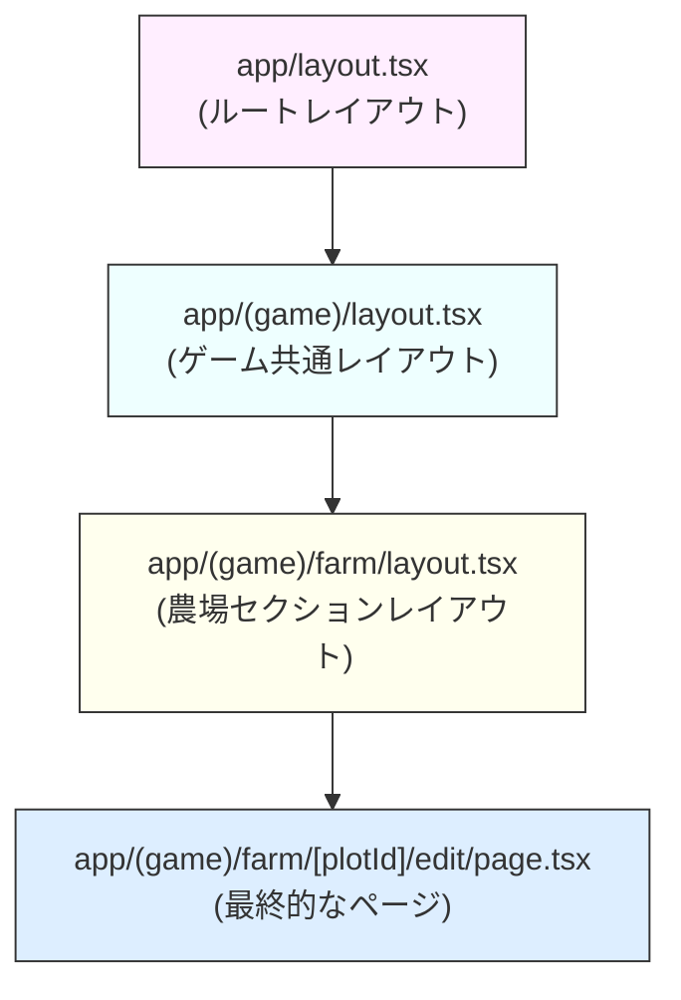
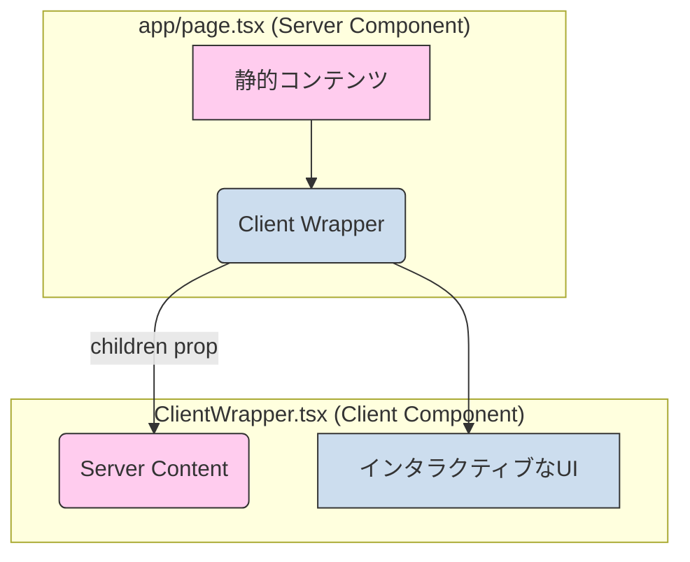

### **【改訂版 v5.0】第3章: Next.jsでアプリケーションを構築する 〜Reactの真価を引き出すフレームワーク〜**

#### **この章で到達するレベル**

この章を読み終えたあなたは、Next.jsを単なる「Reactの便利ツール」ではなく、「モダンなWebアプリケーションを構築するための包括的なソリューション」として理解し、その機能を最大限に活用できるようになります。あなたは以下の問いに、自信を持って答えられるようになるでしょう。

*   なぜReact単体ではなく、Next.jsのようなフレームワークが必要なのか？クライアントサイドレンダリングの限界と、Next.jsが提供する解決策とは？
*   App Routerのファイル規約は、どのようにしてUIの構造とルーティング、そしてローディングやエラーといった特殊なUIと結びついているのか？
*   サーバーコンポーネントとクライアントコンポーネントの根本的な違いは何か？それらがどのように連携し、パフォーマンスとインタラクティブ性を両立させるのか？
*   SSG, SSR, ISRの違いは何か？それぞれのレンダリング戦略の技術的詳細、メリット・デメリット、そしてあなたのアプリに最適な選択基準は？
*   Next.jsのキャッシュ機構は`fetch`とどう連携しているのか？`revalidatePath`や`revalidateTag`を使ったキャッシュの制御方法は？
*   `loading.tsx`や`error.tsx`といった規約ファイルが、どのようにして優れたユーザー体験と堅牢なエラーハンドリングに貢献するのか？
*   APIルートを使って、Next.jsアプリケーションをフルスタックに構築する方法は？

この章は、あなたがNext.jsの思想を深く理解し、パフォーマンス、開発者体験、ユーザー体験のすべてを高いレベルで満たす、本番品質のアプリケーションを設計・構築するための羅針盤となることを目的としています。

---

### **【第1部：Next.jsへようこそ 〜Reactを超えたフレームワーク〜】**

この部では、Reactという強力なライブラリがなぜNext.jsという「フレームワーク」を必要とするのか、その理由から探求します。そして、Next.js 13以降の標準となった「App Router」の基本的な仕組みと、そのファイルベースの規約がもたらす直感的な開発体験を学びます。

---

### **3.1 なぜNext.jsが必要なのか？クライアントサイドレンダリングの限界**

ReactとTypeScriptという強力な「部品」を作る技術は習得しました。しかし、家を建てるのに最高品質のレンガだけがあっても、それらをどう組み合わせるかの「設計図」や「工具」がなければ、立派な家は建ちません。Webアプリ開発でも同様に、React単体では解決が難しい多くの課題が存在します。

#### **3.1.1 React（ライブラリ）の限界とクライアントサイドレンダリング (CSR) の課題**

ReactはUIを構築するための「ライブラリ」です。つまり、UIの部品作りに特化しており、アプリ全体の構造や、Webアプリとして必要な多くの機能については関知しません。Reactだけで本格的なアプリを作ろうとすると、開発者は以下のような多くの決断と実装を自力で行う必要がありました。

*   **ルーティング:** ページ間の移動をどう管理するか？
*   **データフェッチ:** どこで、どのようにAPIからデータを取得するか？
*   **コード分割:** ページごとにJavaScriptを分割し、初期ロードを高速化するには？
*   **ビルド設定:** WebpackやBabelなどの複雑なビルドツールをどう設定するか？
*   **SEO (検索エンジン最適化) の課題:**
    *   クライアントサイドレンダリング (CSR) では、ブラウザがJavaScriptを実行して初めてコンテンツが生成されます。検索エンジンのクローラーはJavaScriptの実行を待てない場合があり、コンテンツがインデックスされない可能性があります。
*   **初期表示速度の課題 (Core Web Vitals):**
    *   CSRでは、ユーザーがページにアクセスしても、まず空のHTMLと大量のJavaScriptがダウンロードされ、ブラウザがそれを実行するまでコンテンツが表示されません。これは、**LCP (Largest Contentful Paint)** などのCore Web Vitalsのスコアを悪化させ、ユーザー体験を損ないます。

これらの課題は、開発者が自力で解決しなければならない「**JavaScript疲労 (JavaScript Fatigue)**」と呼ばれる問題を引き起こしていました。

#### **3.1.2 Next.js（フレームワーク）が提供する解決策**

Next.jsは、これらの課題に対するベストプラクティスを詰め込んだ「**フレームワーク**」です。フレームワークは、アプリの骨格となる「規約」を提供し、開発者が面倒な設定から解放され、アプリの本質的なロジック開発に集中できるようにしてくれます。

**たとえ話：エンジンと自動車**
*   **React:** 超高性能な「**エンジン**」。単体では走れないが、どんな乗り物にも搭載できる可能性を秘めている。
*   **Next.js:** エンジンが標準搭載され、ハンドル、タイヤ、ナビまで完備した「**すぐに走れる状態の自動車**」。開発者はこの車に乗って目的地（アプリ開発）に直行できます。

Next.jsは、ファイルベースルーティング、多様なレンダリング戦略（SSG, SSR, ISR）、サーバーコンポーネント、APIルートといった強力な機能を「標準装備」として提供することで、Reactの真価を最大限に引き出します。

**思考実験:**
「Nojo Farm」のマーケティングサイトを構築することを想像してください。純粋なReactのCSRアプローチでこのサイトを構築した場合、検索エンジンでの発見可能性や、ユーザーが最初にサイトにアクセスした際の体験（初期表示速度）は、Next.jsのアプローチと比較してどのように劣るでしょうか？

---

### **3.2 App Routerの基本：ファイルシステムがUIになる**

Next.js 13で導入されたApp Routerの中心的な思想は「**ファイルシステムの構造が、そのままアプリケーションのUI構造になる**」というものです。`app`ディレクトリが、すべてのルーティングの起点となります。

#### **3.2.1 特別なファイル規約とUIの構築**

App Routerでは、特定のファイル名が特別な意味を持ち、UIの特定の側面を定義します。

*   `layout.tsx`: 共有UI（ヘッダー、フッターなど）。セグメントとその子孫に適用されます。
*   `page.tsx`: そのページのユニークなUI。URLにアクセスしたときのメインコンテンツです。
*   `loading.tsx`: コンテンツ読み込み中のローディングUI。ReactのSuspenseと連携します。
*   `error.tsx`: エラー発生時の代替UI。ReactのError Boundaryとして機能します。
*   `not-found.tsx`: URLが存在しない場合に表示されるUI。
*   `template.tsx`: `layout.tsx`と似ていますが、ナビゲーションのたびに再マウントされます。

**たとえ話：マトリョーシカ人形のフルセット**
*   `layout.tsx`: 一番外側の大きな人形（共通の骨格）。
*   `page.tsx`: 中に入るメインの人形（本体）。
*   `loading.tsx`: メインの人形を取り出す間の「Now Loading...」と書かれた仮の人形。
*   `error.tsx`: メインの人形が壊れていた場合に代わりに出てくる「Sorry...」と書かれた人形。

#### **3.2.2 ルーティングの種類と動的なコンテンツ**

1.  **静的ルート:** `app/dashboard/settings/page.tsx` → `/dashboard/settings`
2.  **動的ルートセグメント `[folderName]`:**
    *   `app/blog/[slug]/page.tsx` → `/blog/post-1`
    *   コンポーネントは`params`プロパティで動的な値を受け取れます。
    ```tsx
    // app/farm/[plotId]/page.tsx
    export default function FarmPlotDetailPage({ params }: { params: { plotId: string } }) {
      return <h1>農場区画ID: {params.plotId} の詳細</h1>;
    }
    ```
3.  **キャッチオールルート `[...folderName]`:**
    *   `app/shop/[...filters]/page.tsx` → `/shop/category/tools`
    *   `params.filters`は文字列の配列 `['category', 'tools']` として受け取れます。
4.  **オプショナルキャッチオールルート `[[...folderName]]`:**
    *   `[[...]]`で囲むと、パスが存在しない場合（例: `/shop`）もマッチします。
5.  **ルートグループ `(folderName)`:**
    *   丸括弧`()`で囲まれたフォルダは、URLパスには影響を与えませんが、論理的なグループ化やレイアウトの適用に役立ちます。
    *   例: `app/(game)/farm/page.tsx` → `/farm`

#### **3.2.3 ネストされたレイアウトとUIの階層**

App Routerの強力な機能の一つが、レイアウトのネストです。各`layout.tsx`は、自身のセグメントにのみ適用され、マトリョーシカのように入れ子になります。

##### **【図解】ネストされたレイアウトの階層構造**
`/farm/1/edit`にアクセスした場合のUI構築の様子です。

この仕組みにより、特定のセクションにのみ共通のUIを適用することが非常に簡単になります。

**思考実験:**
「Nojo Farm」で、プレイヤーが自分の農場（`/farm`）、市場（`/market`）、実績（`/achievements`）のページ間を移動できるナビゲーションバーを実装するとします。このナビゲーションバーは、すべてのゲーム内ページで共通して表示されるべきですが、ログインページ（`/login`）では表示したくありません。App Routerのレイアウトとルートグループの規約を使って、この要件をどのように満たしますか？

---

### **【第2部：サーバーコンポーネントとクライアントコンポーネントの核心】**

この部は、現代のNext.jsを理解する上で最も重要です。App Routerでは、コンポーネントが「どこで」実行されるのかが根本的に変わりました。

---

### **3.3 パラダイムシフト：サーバーコンポーネント (RSC)**

App Routerでは、**すべてのコンポーネントはデフォルトでサーバーコンポーネント (React Server Components, RSC) です。** これは、従来のReact開発からの大きなパラダイムシフトです。

サーバーコンポーネントは、**サーバーサイドでのみ**レンダリングされます。そのコードがユーザーのブラウザに送られることはありません。

**たとえ話：レストランのシェフ**
サーバーコンポーネントは、厨房にいるシェフです。シェフは、客席（ブラウザ）からは見えません。シェフは厨房にある最高の食材（データベース、ファイルシステム）や調理器具（サーバーサイドのライブラリ）を自由に使って、料理（HTML）を完璧に仕上げます。そして、完成した料理だけが客席に運ばれます。

#### **3.3.1 サーバーコンポーネントの絶大なメリット**

1.  **ゼロバンドルサイズと高速な初期ロード:**
    *   JavaScriptコードがブラウザに送られないため、クライアント側のバンドルサイズを劇的に削減でき、初期ロードが高速化します。
2.  **ダイレクトなバックエンドアクセス:**
    *   サーバーサイドで実行されるため、データベースや外部APIに直接アクセスできます。
    ```tsx
    // app/farm/page.tsx (サーバーコンポーネント)
    import { getCropsFromDatabase } from '@/lib/server-db';

    export default async function FarmPage() {
      // サーバーで直接データベースにクエリを発行
      const crops = await getCropsFromDatabase();
      return (
        <ul>
          {crops.map(crop => <li key={crop.id}>{crop.name}</li>)}
        </ul>
      );
    }
    ```
3.  **セキュリティの向上:**
    *   APIキーやデータベース接続情報などの機密情報を、クライアントに漏らすことなくサーバーサイドに留めることができます。
4.  **大規模な依存関係の排除:**
    *   Markdownパーサーや日付操作ライブラリなど、サーバーサイドで一度処理すればよいライブラリをクライアントに送らずに済みます。
5.  **SEOの改善:**
    *   サーバーでHTMLが生成されるため、検索エンジンのクローラーは完全なコンテンツを直接取得できます。

#### **3.3.2 サーバーコンポーネントの制約**

サーバーコンポーネントは、ブラウザにJavaScriptコードを残さないため、インタラクティブな機能を持つことができません。

*   `useState`, `useEffect` などのReactフックは使えません。
*   `onClick`, `onChange` などのイベントハンドラは直接使えません。
*   ブラウザ専用のAPI（`window`, `localStorage`など）にはアクセスできません。

サーバーコンポーネントは、あくまで静的なUIを生成するためのものです。インタラクティブな機能が必要な場合は、クライアントコンポーネントと連携する必要があります。

**思考実験:**
「Nojo Farm」で、プレイヤーの作物リストを表示するページをサーバーコンポーネントとして実装するとします。このリストはデータベースから取得されます。この実装において、サーバーコンポーネントのどのようなメリットが最も顕著に現れるでしょうか？また、もしこのリストに「収穫」ボタンを追加したい場合、サーバーコンポーネントの制約によりどのような問題が発生しますか？

---

### **3.4 インタラクティブ性を追加する：クライアントコンポーネント**

ユーザーの操作に応答するインタラクティブなUIを作るには、クライアントコンポーネントが必要です。ファイルの先頭に`"use client";`というディレクティブを記述します。

```tsx
// components/FarmPlot.tsx
"use client"; // このファイルがクライアントコンポーネントであることを宣言

import { useState } from 'react';

export default function FarmPlot({ plotId }: { plotId: number }) {
  const [cropName, setCropName] = useState<string | null>(null);

  const handlePlantClick = () => {
    const newCrop = prompt('何を植えますか？');
    if (newCrop) setCropName(newCrop);
  };

  return (
    <div>
      <p>区画 {plotId}</p>
      {cropName ? <p>{cropName}</p> : <button onClick={handlePlantClick}>植える</button>}
    </div>
  );
}
```
`"use client"`は、そのファイルとそのファイルからインポートされるすべてのモジュールが、クライアントバンドルに含まれ、ブラウザで実行されることをNext.jsに伝えます。

#### **3.4.1 クライアントコンポーネントのユースケース**

*   **インタラクティブなイベント:** `onClick`, `onChange`など。
*   **Stateとライフサイクル:** `useState`, `useEffect`など。
*   **ブラウザ専用API:** `localStorage`, `window`など。
*   **Stateを管理するContext:** `useContext`を使ったグローバルな状態共有。
*   **ブラウザのDOMやイベントに依存するサードパーティライブラリ。**

---

### **3.5 ベストプラクティス：コンポーネントの最適な配置と境界**

**基本原則：サーバーコンポーネントをできるだけ維持し、クライアントコンポーネントはUIツリーのできるだけ「葉」の部分に配置する。**

これは「**アイランドアーキテクチャ (Islands Architecture)**」とも呼ばれ、静的なHTMLの海にインタラクティブな「島」（クライアントコンポーネント）が浮かんでいるようなイメージです。

**悪い例 ❌: ページ全体をクライアントコンポーネントにする**
ページ全体を`"use client";`にすると、インタラクティブである必要のない部分までクライアントに送られ、サーバーコンポーネントのメリットが失われます。

**良い例 ✅: インタラクティブな部分だけを切り出す**
状態を持つコンポーネントやイベントハンドラを持つコンポーネントだけをクライアントコンポーネントとして切り出し、それを親のサーバーコンポーネントに配置します。

##### **【図解】サーバー/クライアントコンポーネントの境界**

この図のように、クライアントコンポーネントの中に`children`としてサーバーコンポーネントを渡すことで、クライアントコンポーネントのツリーの中にサーバーコンポーネントを「スロットイン」できます。

**思考実験:**
「Nojo Farm」の農場ページには、プレイヤーの所持金を表示する`PlayerMoneyDisplay`（クライアント）、農地の区画を表示する`FarmPlotGrid`（サーバー）、そして各区画に作物を植える`PlantButton`（クライアント）があるとします。これらのコンポーネントをどのように配置し、サーバーとクライアントの境界をどこに設定するのが最も効率的でしょうか？

---

### **【第3部：データフェッチと多様なレンダリング戦略】**

Next.jsの真骨頂は、ページの性質に応じて最適なレンダリング方法を選択できる点にあります。App Routerでは、このレンダリング戦略が`fetch` APIのキャッシュオプションと密接に結びついています。

---

### **3.6 Next.jsにおけるデータフェッチとキャッシュ**

Next.jsは、標準の`fetch` APIを拡張し、各リクエストのキャッシュ動作を制御する機能を追加しました。

```tsx
// サーバーコンポーネントで直接データフェッチ
async function fetchAllCrops() {
  // Next.jsのfetch拡張機能により、自動的にキャッシュされる
  const res = await fetch('https://api.nojo-farm.com/crops');
  return res.json();
}

export default async function CropsPage() {
  const crops = await fetchAllCrops();
  return <ul>{crops.map(c => <li key={c.id}>{c.name}</li>)}</ul>;
}
```
`useEffect`や`useState`は不要で、非常にシンプルに記述できます。

---

### **3.7 レンダリング戦略の完全ガイド：最適な選択のために**

Next.jsの最も強力な機能の一つは、アプリケーションの各ページやデータに応じて、最適なレンダリング戦略を選択できることです。

##### **【図解】レンダリング戦略の選択フロー**
```mermaid
graph TD
    A{ページのデータは<br>頻繁に更新される？} -->|No| B{静的サイト生成 (SSG)};
    A -->|Yes| C{リクエストごとに<br>最新データが必要？};
    C -->|Yes| D{サーバーサイドレンダリング (SSR)};
    C -->|No| E{インクリメンタル静的再生成 (ISR)};

    B -- "ビルド時に生成<br>fetch() デフォルト" --> F[超高速表示<br>SEO ◎];
    D -- "リクエストごとに生成<br>fetch({ cache: 'no-store' })" --> G[常に最新<br>SEO ◎];
    E -- "一定時間ごとに再生成<br>fetch({ next: { revalidate: N } })" --> H[高速表示と鮮度を両立<br>SEO ◎];

    style F fill:#e6ffed,stroke:#333,stroke-width:2px
    style G fill:#e6f3ff,stroke:#333,stroke-width:2px
    style H fill:#fff0e6,stroke:#333,stroke-width:2px
```

#### **3.7.1 静的サイト生成 (SSG - Static Site Generation)**

*   **概要:** **ビルド時**にすべてのページのHTMLを事前に生成します。CDNから超高速で配信されます。
*   **Next.jsでの挙動:** **デフォルトの戦略**です。`fetch`は自動的にデータをキャッシュします (`cache: 'force-cache'`)。
*   **ユースケース:** ブログ記事、ドキュメント、マーケティングページなど、内容が頻繁に変わらないページ。

#### **3.7.2 サーバーサイドレンダリング (SSR - Server-Side Rendering)**

*   **概要:** ユーザーからの**リクエストがあるたび**に、サーバーでHTMLを動的に生成します。
*   **Next.jsでの挙動:** `fetch`のキャッシュを無効にします (`{ cache: 'no-store' }`)。
*   **ユースケース:** ユーザーダッシュボード、検索結果ページなど、常に最新でパーソナライズされた情報が必要なページ。

#### **3.7.3 インクリメンタル静的再生成 (ISR - Incremental Static Regeneration)**

*   **概要:** SSGとSSRのハイブリッド。ビルド時に生成された静的ページを、**一定時間ごと**にバックグラウンドで再生成します。
*   **Next.jsでの挙動:** `fetch`に`revalidate`オプションを指定します (`{ next: { revalidate: N } }`)。
*   **ユースケース:** شبهリアルタイムな更新が必要だが、リクエストごとのレンダリングは過剰なページ（例: ランキングページ）。

**キャッシュの再検証 (Revalidation):**
`revalidatePath(path)`や`revalidateTag(tag)`を使うことで、データが更新されたときに手動でキャッシュを無効化し、最新の状態に保つことができます。

**思考実験:**
「Nojo Farm」で、以下の3つのページがあるとします。
1.  **ゲームの遊び方ガイドページ (`/how-to-play`)**
2.  **プレイヤーの現在のインベントリページ (`/inventory`)**
3.  **市場の最新価格ランキングページ (`/market/ranking`)** (10分ごとに更新)
これらのページに最適なレンダリング戦略（SSG, SSR, ISR）をそれぞれ選択し、その理由と`fetch`オプションの記述方法を説明してください。

---

### **3.8 APIルート：Next.jsをフルスタックフレームワークにする**

Next.jsは、フロントエンドだけでなく、バックエンドAPIサーバーとしても機能します。`app/api`ディレクトリ内に`route.ts`ファイルを作成することで、APIエンドポイントを簡単に作成できます。

```typescript
// app/api/farm/crops/route.ts
import { NextResponse } from 'next/server';
import { getCropsFromDatabase } from '@/lib/server-db';

// GETリクエストハンドラ
export async function GET(request: Request) {
  const crops = await getCropsFromDatabase();
  return NextResponse.json(crops);
}

// POSTリクエストハンドラ
export async function POST(request: Request) {
  const { name, stage } = await request.json();
  // ... データベースに新しい作物を追加 ...
  const newCrop = { id: 'new-id', name, stage };
  return NextResponse.json(newCrop, { status: 201 });
}
```
このファイルは、`/api/farm/crops`というエンドポイントを作成します。`GET`, `POST`, `PUT`, `DELETE`などのHTTPメソッドに対応する関数をエクスポートすることで、それぞれのHTTPリクエストを処理できます。

**思考実験:**
「Nojo Farm」で、プレイヤーがゲーム内でアイテムを購入する際に、サーバーサイドで在庫チェックと所持金減算を行うAPIエンドポイントを実装するとします。このAPIは`POST /api/market/buy`として定義され、リクエストボディには`itemId`と`quantity`が含まれます。このAPIルートを`route.ts`ファイルとしてどのように実装しますか？

---
### **第3章のまとめ**

この章では、Reactを本格的なWebアプリへと昇華させるフレームワーク、Next.jsの強力な機能群を学びました。

*   **フレームワークの価値**: Reactという「エンジン」だけでは解決が難しいSEO、パフォーマンス、ルーティングなどを、Next.jsという「車体」がどう解決してくれるのかを理解しました。
*   **App Router**: ファイルシステムの構造がそのままUIの構造とURLになる、直感的でパワフルなルーティングとレイアウトの仕組みを学びました。
*   **サーバーコンポーネントとクライアントコンポーネント**: App Routerの核心である2種類のコンポーネントの役割分担（準備はサーバー、操作はクライアント）と、それらがどのように連携するのかを詳細に探求しました。
*   **多様なレンダリング戦略**: `fetch`のキャッシュオプションを通じて、SSG, SSR, ISRを自在に操り、ページの特性に応じてパフォーマンスを最適化する方法を探求しました。
*   **フルスタック開発**: APIルートを使い、Next.jsだけでフロントエンドからバックエンドまで一気通貫した開発が可能であることを学びました。

あなたはもはや、単にUI部品を作るだけでなく、アプリケーション全体のアーキテクチャを設計し、パフォーマンスと開発体験を両立させるための知識とツールを手に入れました。

次の章では、UIを美しく、かつ効率的に構築するためのCSSフレームワーク「**Tailwind CSS**」を学びます。ユーティリティファーストという新しいアプローチで、デザインシステムをコードに落とし込む方法を探求します。
