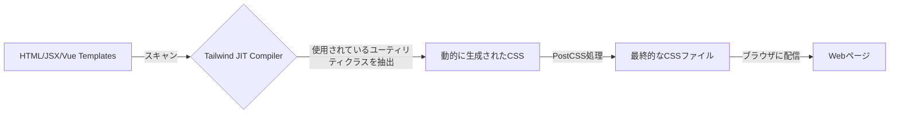

### **【改訂版 v4.0】第4章: Tailwind CSSによるスタイリング革命 〜ユーティリティファーストで描くUI〜**

#### **この章で到達するレベル**

この章を読破したあなたは、Tailwind CSSを単なる「CSSクラスの詰め合わせ」ではなく、「デザインシステムを構築するための強力な言語」として理解し、自在に操れるようになります。あなたは以下の問いに自信を持って答えられるようになるでしょう。

*   なぜTailwind CSSは「ユーティリティファースト」という思想を採用したのか？従来のCSS開発が抱えていた課題（命名、グローバルスコープ、肥大化）と、BEMやCSS-in-JSとの根本的な違いは何か？
*   TailwindのJITコンパイラはどのように機能し、本番環境でのCSSファイルサイズを最小限に抑えるのか？
*   モバイルファーストなレスポンシブデザインを、Tailwindのブレークポイントを使ってどう効率的に実装するか？ブレークポイントのカスタマイズ方法は？
*   `hover:`や`dark:`といった「バリアント」を組み合わせて、複雑な状態のスタイルをどう表現するか？`group-hover`や`peer-checked`といった高度なバリアントの活用方法は？
*   `tailwind.config.js`をカスタマイズして、プロジェクト固有のデザインシステム（カラーパレット、スペーシング、フォントなど）をどう構築するか？
*   クラス名が長くなりすぎる問題（通称：クラス地獄）にどう対処し、`@apply`やコンポーネント抽象化をどう使い分けるべきか？TailwindにおけるDRY原則の真の意味とは？
*   `cn` (clsx + tw-merge) や `cva` が、Reactコンポーネントのスタイリングにおいてどのような問題を解決し、型安全なバリアント管理をどう実現するのか？

この章は、あなたがCSSの命名やファイル管理の悩みから解放され、HTML（JSX）から離れることなく、迅速かつ一貫性のあるUIを構築するための、実践的なスキルと深い洞察を得ることを目的としています。

---

### **【第1部：ユーティリティファースト革命】**

この部では、Tailwind CSSの具体的な使い方を学ぶ前に、それがどのような問題を解決するために生まれたのか、その背景にある「思想」を探ります。従来のCSS開発が抱えていた課題を理解することで、Tailwind CSSの「ユーティリティファースト」というアプローチの真価が見えてきます。

---

### **4.1 従来のCSSが抱えていた課題と開発コスト**

長年、Web開発者はCSSの管理に頭を悩ませてきました。特にプロジェクトが大規模化、長期化するにつれて、いくつかの根深い問題が顕在化します。これらの問題は、開発速度の低下、バグの増加、メンテナンスコストの増大に直結していました。

1.  **命名の苦痛とクラス名の衝突:**
    *   **問題:** スタイルが衝突しないように、一意で分かりやすいクラス名を考え出すのは大変な作業です。特に大規模なチーム開発では、クラス名の重複や意図しない上書きが頻繁に発生します。
    *   **解決策の試み:** BEM (`.block__element--modifier`) や OOCSS (`.media-object`) のような命名規則は、この問題を解決しようとしましたが、クラス名が長大で複雑になるという新たな問題を生みました。例えば、`article-card__title--large-red`のようなクラス名は、HTMLを読みにくくし、CSSファイルも肥大化させます。
    *   **特異性戦争 (`Specificity Wars`):** 複数のCSSルールが同じ要素に適用される場合、どのルールが優先されるかを決定する「特異性」の計算は複雑で、しばしば`!important`の乱用につながり、CSSのメンテナンス性を著しく低下させます。

2.  **グローバルスコープの恐怖:**
    *   **問題:** CSSは基本的にグローバルです。あるコンポーネントのために書いたスタイルが、意図せずアプリケーションの全く別の場所の要素に影響を与えてしまう危険が常に伴います。これは「副作用」と呼ばれ、デバッグを非常に困難にします。
    *   **解決策の試み:** CSS ModulesやCSS-in-JS（例: styled-components, Emotion）は、CSSをコンポーネントスコープに限定することでこの問題を解決しようとしました。しかし、これらは新たな学習コストや、ランタイムでのスタイル生成によるパフォーマンスオーバーヘッドといったトレードオフがありました。

3.  **不要なCSSの増大とパフォーマンスの悪化:**
    *   **問題:** プロジェクトが進化するにつれ、どのスタイルがもう使われていないのかを判断するのは非常に困難になります。特に、コンポーネントの削除やリファクタリングが行われた後、関連するCSSルールが残されたままになることがよくあります。結果として、CSSファイルは肥大化し続け、ユーザーがダウンロードするデータ量が増え、ページのロード時間が長くなるというパフォーマンスの悪化を招きます。
    *   **解決策の試み:** PurgeCSSのようなツールは、未使用のCSSを削除するのに役立ちましたが、設定が複雑であったり、動的に生成されるクラス名を見逃したりする可能性がありました。

4.  **コンテキストスイッチのコスト:**
    *   **問題:** HTML（またはJSX）でマークアップを書き、次にCSSファイルに移動してスタイルを定義し、またHTMLに戻って確認する、という作業は、思考の集中を妨げ、開発の勢いを削ぎます。この頻繁なファイル間の移動は「コンテキストスイッチ」と呼ばれ、開発者の生産性を低下させます。

これらの問題は、Web開発者がより効率的で、保守しやすく、スケーラブルなUIを構築するための新しいアプローチを求めていた背景にあります。

**思考実験:**
「Nojo Farm」で、プレイヤーのインベントリに表示される各アイテムカードをスタイリングするとします。このカードは、アイテムの種類（作物、道具、動物の餌）によって背景色やボーダーの色を変えたいと考えています。従来のCSS（BEM命名規則など）でこの要件を満たそうとした場合、どのようなクラス名を定義し、どのようなCSSルールを書くことになりますか？また、そのアプローチが将来的に新しいアイテムタイプが追加されたり、デザインが変更されたりした場合に、どのようなメンテナンス上の課題を引き起こす可能性がありますか？

---

### **4.2 Tailwind CSSの思想：ユーティリティファースト**

Tailwind CSSは、従来のCSS開発が抱えていた問題に対して「**ユーティリティファースト**」という全く異なるアプローチを提案します。これは、意味論的なクラス名（例: `.article-card`）を考えるのをやめ、代わりに**単一の目的を持つ、再利用可能な小さなクラス（ユーティリティクラス）**を直接HTMLに適用するという考え方です。

**たとえ話：オーダーメイドスーツ vs 高品質な既製服の組み合わせ**
*   **従来のCSS:** プロジェクトの各要素（ボタン、カード、フォーム）のために、毎回テーラーに採寸を依頼して「**オーダーメイドのスーツ**」を作るようなもの。完璧にフィットするが、時間とコストがかかり、他の要素には使い回せない。
*   **Tailwind CSS:** 高品質なTシャツ、ジャケット、ジーンズ、スニーカーといった「**単機能の既製服**」が無限に揃った巨大なクローゼット。これらの服を自由に組み合わせることで、どんなスタイル（UI）でも即座に作り出すことができる。組み合わせのパターンは無限大。

```tsx
// 従来のCSS (意味論的クラス)
<button class="btn-primary">Click me</button>

// Tailwind CSS (ユーティリティクラス)
<button class="bg-blue-500 hover:bg-blue-700 text-white font-bold py-2 px-4 rounded">
  Click me
</button>
```

#### **ユーティリティファーストのメリット**

1.  **クラス名を考える必要がない:** 開発者はスタイリングに集中できます。意味論的な命名の苦痛から解放され、UIの見た目を直接記述することに集中できます。
2.  **CSSが肥大化しない:** ユーティリティクラスは再利用されるため、プロジェクトがどれだけ大きくなってもCSSファイルのサイズはほとんど変わりません。JITコンパイラが実際に使用されているクラスのみを抽出するため、本番環境のCSSは非常に軽量です。
3.  **変更に強い:** スタイルはHTMLに局所化されています。ある要素のスタイルを変更しても、他の要素に影響を与える心配がありません。これにより、リファクタリングが非常に安全になります。
4.  **制約による一貫性:** Tailwindは、あらかじめ定義されたデザインシステム（スペーシング、カラーパレット、タイポグラフィなど）の上で作業することを強制します。これにより、開発者間でUIの一貫性が保たれやすくなり、デザインのブレを防ぎます。
5.  **コンテキストスイッチの削減:** HTML（JSX）ファイルから離れることなくスタイリングが完結するため、開発者は思考の流れを中断することなく作業を進められます。

#### **仕組み：Just-in-Time (JIT) コンパイラとPostCSS**

Tailwind CSSは、開発中にあなたのソースコード（HTML, JSX, Vueテンプレートなど）を監視し、**実際に使用されているユーティリティクラスだけ**を抽出して、最終的なCSSファイルを動的に生成します。このプロセスは、Tailwind CLI、PostCSSプラグイン、またはNext.jsのようなフレームワークの内部ビルドプロセスによって行われます。


*図4-1: Tailwind JITコンパイルのプロセス*

**JITコンパイラの役割:**
*   **開発時:** 変更を保存するたびに、使用されているクラスを即座に検出し、CSSを再生成します。これにより、開発者はリアルタイムでスタイルの変更を確認できます。
*   **本番ビルド時:** プロジェクト全体をスキャンし、使用されていないユーティリティクラスをすべて削除（Purge）します。これにより、本番環境には本当に必要なスタイルのみが含まれ、CSSファイルサイズは最小限に抑えられます。

**PostCSSの役割:**
Tailwind CSSはPostCSSプラグインとして動作します。PostCSSは、CSSをJavaScriptのプラグインで変換するためのツールです。Tailwind CSS以外にも、`autoprefixer`（ベンダープレフィックスを自動付与）などのプラグインがPostCSSエコシステムで利用されており、これらが連携して最終的なCSSを生成します。

**思考実験:**
「Nojo Farm」の`FarmPlot`コンポーネントをスタイリングするとします。このコンポーネントは、ボーダー、背景色、パディング、シャドウを持つカード形式で表示されます。従来のCSSとTailwind CSSの両方でこのコンポーネントのスタイリングを記述し、それぞれのコードの量、可読性、将来的な変更の容易さを比較してください。特に、JITコンパイラがどのようにCSSの肥大化を防ぐのか、そのメカニズムを考慮に入れてください。

---

### **【第2部：Tailwindのコアコンセプトをマスターする】**

この部では、Tailwindの基本的なユーティリティクラスと、その強力なバリアントシステム（レスポンシブ、状態変化など）の使い方を学びます。これらの概念を習得することで、あらゆるUI要素をTailwindで効率的にスタイリングできるようになります。

---

### **4.3 基本的なスタイリングユーティリティの網羅**

Tailwindには何百ものユーティリティクラスがありますが、それらは論理的なカテゴリに分類されており、基本的なパターンを覚えれば、すぐに使いこなせるようになります。Tailwindのユーティリティは、CSSプロパティと値のペアを抽象化したものです。

*   **スペーシング (Margin, Padding):**
    *   `m-{size}`: `margin` (全方向)
    *   `p-{size}`: `padding` (全方向)
    *   `mx-{size}`, `my-{size}`: `margin-left`/`margin-right`, `margin-top`/`margin-bottom`
    *   `px-{size}`, `py-{size}`: `padding-left`/`padding-right`, `padding-top`/`padding-bottom`
    *   `mt-{size}`, `mr-{size}`, `mb-{size}`, `ml-{size}`: `margin-top`, `margin-right`, `margin-bottom`, `margin-left`
    *   `pt-{size}`, `pr-{size}`, `pb-{size}`, `pl-{size}`: `padding-top`, `padding-right`, `padding-bottom`, `padding-left`
    *   `mx-auto`: `margin-left: auto; margin-right: auto;` (ブロック要素を水平中央揃え)
    *   `space-x-{size}`, `space-y-{size}`: Flexbox/Gridアイテム間のスペースを均等に設定。
        *   例: `space-y-4` は、子要素の間に`margin-top: 1rem`を適用します。

*   **サイジング (Width, Height):**
    *   `w-{size}`, `h-{size}`: `width`, `height` (固定値、パーセンテージ、`rem`など)
    *   `w-full`, `h-full`: `width: 100%;`, `height: 100%;` (親要素に対する相対値)
    *   `min-w-{size}`, `max-w-{size}`: `min-width`, `max-width`
    *   `min-h-{size}`, `max-h-{size}`: `min-height`, `max-height`
    *   `min-h-screen`, `max-w-7xl`: 画面の高さの最小値、コンテンツの最大幅（コンテナの幅を制限）

*   **レイアウト (Display, Flexbox, Grid, Position):**
    *   `block`, `inline`, `inline-block`, `flex`, `inline-flex`, `grid`, `hidden`
    *   **Flexbox:**
        *   `flex-row`, `flex-col`: `flex-direction`
        *   `justify-start`, `justify-center`, `justify-end`, `justify-between`, `justify-around`, `justify-evenly`: `justify-content`
        *   `items-start`, `items-center`, `items-end`, `items-baseline`, `items-stretch`: `align-items`
        *   `flex-wrap`, `flex-nowrap`: `flex-wrap`
        *   `gap-{size}`, `gap-x-{size}`, `gap-y-{size}`: `gap` (Flexbox/Gridアイテム間の隙間)
    *   **Grid:**
        *   `grid-cols-{n}`, `grid-rows-{n}`: `grid-template-columns`, `grid-template-rows`
        *   `col-span-{n}`, `row-span-{n}`: `grid-column`, `grid-row`
    *   **Position:**
        *   `static`, `relative`, `absolute`, `fixed`, `sticky`
        *   `top-{size}`, `right-{size}`, `bottom-{size}`, `left-{size}`: `top`, `right`, `bottom`, `left`

*   **タイポグラフィ (Typography):**
    *   `font-sans`, `font-serif`, `font-mono`: `font-family`
    *   `text-{size}`: `font-size` (`text-xs`, `text-sm`, `text-base`, `text-lg`, `text-xl`, `text-2xl`...)
    *   `font-{weight}`: `font-weight` (`font-light`, `font-normal`, `font-medium`, `font-bold`...)
    *   `text-{color}-{shade}`: `color` (`text-gray-900`, `text-red-500`, `text-blue-500`...)
    *   `text-left`, `text-center`, `text-right`, `text-justify`: `text-align`
    *   `leading-{size}`: `line-height` (`leading-tight`, `leading-normal`, `leading-relaxed`...)
    *   `tracking-{size}`: `letter-spacing` (`tracking-tight`, `tracking-normal`, `tracking-wider`...)
    *   `uppercase`, `lowercase`, `capitalize`, `normal-case`: `text-transform`

*   **背景・ボーダー・シャドウ:**
    *   `bg-{color}-{shade}`: `background-color` (`bg-white`, `bg-gray-100`, `bg-blue-500`...)
    *   `bg-gradient-to-{direction} from-{color} to-{color}`: `background-image` (グラデーション)
    *   `border`, `border-{width}`, `border-{color}-{shade}`: `border-width`, `border-color`
    *   `border-t`, `border-r`, `border-b`, `border-l`: 特定の辺のボーダー
    *   `rounded`, `rounded-{size}`, `rounded-full`: `border-radius` (`rounded-md`, `rounded-lg`, `rounded-xl`...)
    *   `shadow`, `shadow-{size}`: `box-shadow` (`shadow-sm`, `shadow-md`, `shadow-lg`, `shadow-xl`, `shadow-2xl`...)

*   **フィルター (Filters):**
    *   `blur-{size}`, `brightness-{amount}`, `contrast-{amount}`, `grayscale`, `invert`, `sepia` など。
    *   例: `backdrop-blur-sm` (背景にぼかしを適用)

*   **トランスフォーム (Transforms):**
    *   `rotate-{angle}`, `scale-{amount}`, `translate-x-{amount}`, `skew-y-{angle}` など。

*   **トランジション (Transitions):**
    *   `transition`, `transition-colors`, `duration-{time}`, `ease-{timing}` など。
    *   例: `transition-colors duration-300 ease-in-out` (色の変化に300msのイーズインアウトトランジションを適用)

**Tailwindのデフォルト値とデザインシステム:**
Tailwindのユーティリティクラスの数値（例: `p-4`, `text-lg`, `w-64`）は、内部的に`rem`や`px`などの具体的な値にマッピングされています。これらの値は、Tailwindが提供するデフォルトのデザインシステムに基づいています。例えば、`p-4`は通常`padding: 1rem;`（または`16px`）に変換されます。この一貫したスケールは、デザインの統一感を保つのに役立ちます。

**思考実験:**
「Nojo Farm」のインベントリ画面で、アイテムをグリッド状に表示する`InventoryGrid`コンポーネントをスタイリングするとします。
*   アイテムは3列で表示され、モバイルでは1列、タブレットでは2列にしたい。
*   各アイテムの間には均等な隙間を設けたい。
*   各アイテムカードは、背景色、パディング、角の丸み、軽いシャドウを持つようにしたい。
これらの要件をTailwind CSSのユーティリティクラスを使ってどのように実装しますか？

---

### **4.4 レスポンシブデザイン：モバイルファーストで考える**

Tailwindのレスポンシブデザインは「**モバイルファースト**」のアプローチを採用しています。これは、まず最小の画面（スマートフォン）向けのスタイルを書き、次にブレークポイント修飾子を使って、より大きな画面向けのスタイルを**上書き**していく、という考え方です。

**デフォルトのブレークポイント:**
Tailwind CSSは、一般的なデバイスサイズに基づいたデフォルトのブレークポイントを提供します。

| 修飾子 | 最小幅 | CSS | ターゲットデバイス |
| :--- | :--- | :--- | :--- |
| `sm` | 640px | `@media (min-width: 640px)` | 小さなタブレット、大きなスマートフォン |
| `md` | 768px | `@media (min-width: 768px)` | タブレット、小さなラップトップ |
| `lg` | 1024px | `@media (min-width: 1024px)` | デスクトップ |
| `xl` | 1280px | `@media (min-width: 1280px)` | 大画面デスクトップ |
| `2xl` | 1536px | `@media (min-width: 1536px)` | 超大画面 |

**レスポンシブ修飾子のカスケード:**
モバイルファーストのアプローチでは、修飾子なしのクラスが最も小さい画面に適用され、より大きなブレークポイントの修飾子が付いたクラスが、そのブレークポイント以上でスタイルを上書きします。

```mermaid
graph TD
    A[Default (Mobile)] --> B[sm: (640px+)];
    B --> C[md: (768px+)];
    C --> D[lg: (1024px+)];
    D --> E[xl: (1280px+)];
    E --> F[2xl: (1536px+)];
```
*図4-2: レスポンシブ修飾子のカスケード*

**実践例：レスポンシブな農場ダッシュボード**
「Nojo Farm」のダッシュボードは、モバイルでは縦一列、タブレットでは2列、デスクトップでは3列のレイアウトにしたいとします。

```tsx
<div class="grid grid-cols-1 gap-4 md:grid-cols-2 lg:grid-cols-3 p-4">
  {/* ダッシュボードの各カード */}
  <div class="bg-white p-4 shadow rounded-lg">プレイヤー情報</div>
  <div class="bg-white p-4 shadow rounded-lg">作物状況</div>
  <div class="bg-white p-4 shadow rounded-lg">動物の健康状態</div>
  <div class="bg-white p-4 shadow rounded-lg">市場の最新情報</div>
</div>
```
**解説:**
*   `grid grid-cols-1 gap-4`: デフォルト（モバイル）では、1列のグリッドで、アイテム間に`gap-4`（16px）の隙間を設けます。
*   `md:grid-cols-2`: `md`ブレークポイント（768px）以上では、2列のグリッドに上書きされます。
*   `lg:grid-cols-3`: `lg`ブレークポイント（1024px）以上では、3列のグリッドに上書きされます。

このように、必要なブレークポイントでスタイルを上書きしていくだけで、複雑なレスポンシブレイアウトを直感的に構築できます。

**ブレークポイントのカスタマイズ:**
`tailwind.config.js`の`theme.extend.screens`プロパティを使って、デフォルトのブレークポイントをカスタマイズしたり、新しいブレークポイントを追加したりできます。

```js
// tailwind.config.js
module.exports = {
  theme: {
    extend: {
      screens: {
        'tablet': '640px',
        'laptop': '1024px',
        'desktop': '1280px',
        'ultrawide': '1920px', // 新しいブレークポイントを追加
      },
    },
  },
  plugins: [],
};
```
これで、`ultrawide:text-xl`のようにカスタムブレークポイントを使用できるようになります。

**思考実験:**
「Nojo Farm」の`FarmAnimalCard`コンポーネントは、動物の名前、種別、健康状態を表示します。モバイルではカードの幅を画面いっぱいに表示し、タブレットでは2列、デスクトップでは4列で表示したいと考えています。また、モバイルでは動物の名前を小さく、デスクトップでは大きく表示したいです。これらの要件をTailwind CSSのレスポンシブ修飾子を使ってどのように実装しますか？

---

### **4.5 状態のハンドリング：インタラクションに応答する**

ユーザーの操作（ホバー、フォーカスなど）や、要素の状態（無効、選択済みなど）に応じてスタイルを変更するには、状態修飾子を使います。これらの修飾子は、CSSの擬似クラスや擬似要素にマッピングされます。

*   **ユーザーインタラクション:**
    *   `hover:`: マウスカーソルが要素に乗ったとき (`:hover`)
    *   `focus:`: 要素がフォーカスされたとき (`:focus`)
    *   `active:`: 要素がアクティブなとき（例: ボタンのクリック中） (`:active`)
    *   `focus-within:`: 要素またはその子孫がフォーカスされたとき (`:focus-within`)
    *   `focus-visible:`: キーボードナビゲーションなどで要素がフォーカスされたとき (`:focus-visible`)
*   **フォームの状態:**
    *   `disabled:`: 要素が無効化されているとき (`:disabled`)
    *   `enabled:`: 要素が有効化されているとき (`:enabled`)
    *   `checked:`: チェックボックスやラジオボタンがチェックされているとき (`:checked`)
    *   `indeterminate:`: チェックボックスが部分的にチェックされているとき (`:indeterminate`)
    *   `placeholder-shown:`: プレースホルダーが表示されているとき (`:placeholder-shown`)
    *   `required:`, `optional:`, `valid:`, `invalid:`: フォームのバリデーション状態
*   **リストの状態:**
    *   `first:`, `last:`: リストの最初/最後の要素 (`:first-child`, `:last-child`)
    *   `odd:`, `even:`: リストの奇数/偶数番目の要素 (`:nth-child(odd)`, `:nth-child(even)`)
*   **その他:**
    *   `empty:`: 要素が空のとき (`:empty`)
    *   `visited:`: リンクが訪問済みであるとき (`:visited`)

**実践例：インタラクティブな収穫ボタン (Nojo Farm)**
「Nojo Farm」の収穫ボタンは、ホバー時に背景色を変え、フォーカス時にリングを表示し、無効化されている場合はグレーアウトしたいとします。

```tsx
interface HarvestButtonProps {
  isHarvestable: boolean;
  onClick: () => void;
}

function HarvestButton({ isHarvestable, onClick }: HarvestButtonProps) {
  return (
    <button
      onClick={onClick}
      disabled={!isHarvestable} // isHarvestableがfalseならボタンを無効化
      className="
        py-2 px-4
        font-semibold
        rounded-lg
        shadow-md
        text-white
        bg-green-500
        hover:bg-green-700                 /* ホバー時のスタイル */
        focus:outline-none focus:ring-2 focus:ring-green-400 focus:ring-opacity-75 /* フォーカス時のスタイル */
        disabled:bg-gray-300 disabled:cursor-not-allowed disabled:shadow-none /* 無効時のスタイル */
        transition-colors duration-200 ease-in-out /* スムーズなトランジション */
      "
    >
      {isHarvestable ? '収穫する' : '成長中...'}
    </button>
  );
}
```
**解説:**
*   `hover:bg-green-700`: ホバー時に背景色を濃い緑に変更。
*   `focus:ring-2 ...`: フォーカス時に緑色のリングを表示（アクセシビリティ向上）。
*   `disabled:bg-gray-300 ...`: `disabled`属性が付与されたときに、背景をグレーにし、カーソルを`not-allowed`に変更、シャドウを削除。
*   `transition-colors duration-200 ease-in-out`: 色の変化に200msのイーズインアウトトランジションを適用し、より滑らかなUIを実現。

これらの修飾子は、レスポンシブ修飾子と組み合わせることも可能です（例: `md:hover:bg-blue-500`）。

**高度なバリアント:**
*   **`group-hover` / `group-focus`:** 親要素に`group`クラスを付与し、子要素で`group-hover:`修飾子を使うことで、親がホバーされたときに子要素のスタイルを変更できます。
    ```tsx
    <div class="group p-4 hover:bg-gray-100">
      <h3 class="group-hover:text-blue-600">タイトル</h3>
      <p>コンテンツ</p>
    </div>
    ```
*   **`peer-checked` / `peer-focus`:** 同じ親を持つ要素間で、一方の状態に応じてもう一方のスタイルを変更できます。例えば、カスタムチェックボックスの実装などで非常に有用です。
    ```tsx
    <input type="checkbox" id="myCheckbox" class="peer hidden" />
    <label for="myCheckbox" class="peer-checked:bg-blue-500 peer-checked:text-white">
      カスタムチェックボックス
    </label>
    ```

**思考実験:**
「Nojo Farm」の農地マップで、各`FarmPlot`コンポーネントがクリック可能で、クリックすると「選択済み」の状態になるとします。選択された`FarmPlot`は、ボーダーの色が変わり、背景色が薄い黄色になるようにしたいです。また、マウスカーソルが乗ったとき（ホバー時）には、選択状態にかかわらず、わずかにスケールアップするアニメーションを適用したいです。これらの要件をTailwind CSSの状態修飾子とトランジションユーティリティを使ってどのように実装しますか？

---

### **4.6 ダークモードの実装**

Tailwind CSSは、ダークモードの実装を非常に簡単に行えるように設計されています。ユーザーのシステム設定に合わせる方法と、手動で切り替える方法の2種類があります。

1.  **設定:** `tailwind.config.js`で`darkMode`オプションを設定します。
    *   `darkMode: 'media'` (デフォルト): ユーザーのシステム設定（`prefers-color-scheme: dark`）に基づいてダークモードを適用します。
    *   `darkMode: 'class'` (推奨): `<html>`要素に`dark`クラスを付け外しすることで、手動でダークモードを切り替えます。この方法が、ユーザーがテーマを自由に選択できるUIを実装する際に推奨されます。

2.  **クラスの切り替え (class戦略の場合):**
    アプリケーションのルート要素（通常は`<html>`）に`dark`クラスを付け外しすることで、テーマを切り替えます。これは、ReactのStateと`localStorage`を組み合わせた`ThemeProvider`のようなコンポーネントが担当します。

    ```tsx
    // contexts/ThemeProvider.tsx (例)
    "use client";
    import React, { useState, useEffect, createContext, useContext } from 'react';

    type Theme = 'light' | 'dark';

    interface ThemeContextType {
      theme: Theme;
      toggleTheme: () => void;
    }

    const ThemeContext = createContext<ThemeContextType | undefined>(undefined);

    export function ThemeProvider({ children }: { children: React.ReactNode }) {
      const [theme, setTheme] = useState<Theme>(() => {
        // localStorageからテーマを読み込むか、システム設定をデフォルトにする
        if (typeof window !== 'undefined' && window.localStorage) {
          const savedTheme = localStorage.getItem('theme') as Theme;
          if (savedTheme) return savedTheme;
        }
        return window.matchMedia('(prefers-color-scheme: dark)').matches ? 'dark' : 'light';
      });

      useEffect(() => {
        const root = window.document.documentElement;
        root.classList.remove(theme === 'dark' ? 'light' : 'dark');
        root.classList.add(theme);
        localStorage.setItem('theme', theme);
      }, [theme]);

      const toggleTheme = () => {
        setTheme(prevTheme => (prevTheme === 'light' ? 'dark' : 'light'));
      };

      return (
        <ThemeContext.Provider value={{ theme, toggleTheme }}>
          {children}
        </ThemeContext.Provider>
      );
    }

    export function useTheme() {
      const context = useContext(ThemeContext);
      if (context === undefined) {
        throw new Error('useTheme must be used within a ThemeProvider');
      }
      return context;
    }
    ```

3.  **スタイリング:** `dark:`修飾子を使って、ダークモード時のスタイルを定義します。

    ```tsx
    // components/FarmHeader.tsx (Nojo Farmの例)
    import { useTheme } from '@/contexts/ThemeProvider';

    function FarmHeader() {
      const { theme, toggleTheme } = useTheme();
      return (
        <header className="bg-white dark:bg-gray-900 shadow p-4 flex justify-between items-center transition-colors duration-300">
          <h1 className="text-xl font-bold text-gray-900 dark:text-white">Nojo Farm</h1>
          <button
            onClick={toggleTheme}
            className="p-2 rounded-full bg-gray-200 dark:bg-gray-700 text-gray-800 dark:text-gray-200"
          >
            {theme === 'light' ? '🌙' : '☀️'}
          </button>
        </header>
      );
    }
    ```
    **解説:**
    *   `bg-white dark:bg-gray-900`: `<html>`に`dark`クラスがある場合、背景を濃いグレーにする。それ以外は白。
    *   `text-gray-900 dark:text-white`: `dark`クラスがある場合、文字色を白にする。それ以外は濃いグレー。
    *   `transition-colors duration-300`: テーマ切り替え時に色の変化が滑らかになるようにトランジションを適用。

**ダークモードカラーのカスタマイズ:**
`tailwind.config.js`の`theme.extend.colors`内で、`dark`修飾子で使用する色を定義できます。

```js
// tailwind.config.js
module.exports = {
  darkMode: 'class',
  theme: {
    extend: {
      colors: {
        // デフォルトのprimary色を定義
        primary: {
          DEFAULT: '#3b82f6', // light mode
          dark: '#60a5fa',    // dark mode
        },
        // または、dark:修飾子で直接指定する色を定義
        'dark-bg': '#1a202c',
        'dark-text': '#e2e8f0',
      },
    },
  },
  plugins: [],
};
```
これにより、`bg-primary`と書くだけで、ライトモードとダークモードで適切な色が自動的に適用されるようになります。

**思考実験:**
「Nojo Farm」の市場ページで、アイテムの価格を表示する`MarketItemCard`コンポーネントをスタイリングするとします。このカードは、ライトモードでは白い背景に黒い文字、ダークモードでは濃いグレーの背景に白い文字で表示されるようにしたいです。また、価格がセール中の場合は、ライトモードでは赤色、ダークモードでは薄い赤色で表示されるようにしたいです。これらの要件をTailwind CSSのダークモード修飾子と`tailwind.config.js`のカラーカスタマイズを使ってどのように実装しますか？

---

### **【第3部：高度なテクニックとベストプラクティス】**

この部では、Tailwindをより深く使いこなし、大規模で保守性の高いプロジェクトで活用するためのテクニックを学びます。Tailwindの柔軟性を最大限に引き出しつつ、コードの可読性とメンテナンス性を維持するための戦略を探ります。

---

### **4.7 デザインシステムの心臓部：`tailwind.config.js`**

`tailwind.config.js`は、あなたのプロジェクト専用のデザインシステムを定義する場所です。このファイルを通じて、Tailwindのデフォルト値を拡張したり、完全に上書きしたりすることで、ブランドガイドラインに沿った一貫性のあるUIを構築できます。

```js
// tailwind.config.js
const { fontFamily } = require('tailwindcss/defaultTheme');

/** @type {import('tailwindcss').Config} */
module.exports = {
  darkMode: ['class'], // ダークモード戦略
  content: [
    './pages/**/*.{js,ts,jsx,tsx,mdx}',
    './components/**/*.{js,ts,jsx,tsx,mdx}',
    './app/**/*.{js,ts,jsx,tsx,mdx}',
    './src/**/*.{js,ts,jsx,tsx,mdx}', // プロジェクトのソースファイルを指定
  ],
  theme: {
    // デフォルトのTailwindテーマを拡張
    extend: {
      // --- カラーパレットのカスタマイズ ---
      colors: {
        border: 'hsl(var(--border))', // shadcn/uiなどで使われるCSS変数からの色定義
        input: 'hsl(var(--input))',
        ring: 'hsl(var(--ring))',
        background: 'hsl(var(--background))',
        foreground: 'hsl(var(--foreground))',
        primary: {
          DEFAULT: 'hsl(var(--primary))',
          foreground: 'hsl(var(--primary-foreground))',
        },
        secondary: {
          DEFAULT: 'hsl(var(--secondary))',
          foreground: 'hsl(var(--secondary-foreground))',
        },
        destructive: {
          DEFAULT: 'hsl(var(--destructive))',
          foreground: 'hsl(var(--destructive-foreground))',
        },
        muted: {
          DEFAULT: 'hsl(var(--muted))',
          foreground: 'hsl(var(--muted-foreground))',
        },
        accent: {
          DEFAULT: 'hsl(var(--accent))',
          foreground: 'hsl(var(--accent-foreground))',
        },
        popover: {
          DEFAULT: 'hsl(var(--popover))',
          foreground: 'hsl(var(--popover-foreground))',
        },
        card: {
          DEFAULT: 'hsl(var(--card))',
          foreground: 'hsl(var(--card-foreground))',
        },
        // Nojo Farm独自のカラーパレット
        'farm-green': {
          100: '#dcfce7',
          500: '#22c55e',
          700: '#16a34a',
        },
        'soil-brown': {
          100: '#fef3c7',
          500: '#a16207',
          700: '#854d09',
        },
      },
      // --- フォントのカスタマイズ ---
      fontFamily: {
        // デフォルトのsansフォントにカスタムフォントを追加
        sans: ['var(--font-sans)', ...fontFamily.sans],
        // Nojo Farm独自のフォント
        display: ['"Press Start 2P"', 'cursive'], // ゲームタイトルなどに
        body: ['"Noto Sans JP"', 'sans-serif'], // 本文用
      },
      // --- スペーシングのカスタマイズ ---
      spacing: {
        '18': '4.5rem', // 72px
        '128': '32rem', // 512px
        '144': '36rem', // 576px
      },
      // --- アニメーションのカスタマイズ ---
      keyframes: {
        'accordion-down': {
          from: { height: '0' },
          to: { height: 'var(--radix-accordion-content-height)' },
        },
        'accordion-up': {
          from: { height: 'var(--radix-accordion-content-height)' },
          to: { height: '0' },
        },
      },
      animation: {
        'accordion-down': 'accordion-down 0.2s ease-out',
        'accordion-up': 'accordion-up 0.2s ease-out',
      },
    },
  },
  plugins: [require('tailwindcss-animate')], // プラグインの追加
};
```
**`theme` vs `extend`:**
*   `theme`直下に定義すると、Tailwindのデフォルト値を**完全に上書き**します。例えば、`colors`を`theme`直下に定義すると、Tailwindのデフォルトカラーパレット（`red-500`など）はすべて利用できなくなります。
*   `theme.extend`内に定義すると、デフォルト値はそのままに、新しい値を**追加**します。特別な理由がない限り、`extend`を使うのが安全で推奨されます。これにより、Tailwindの豊富なデフォルトユーティリティを維持しつつ、プロジェクト固有のニーズに対応できます。

**`content`オプション:**
JITコンパイラがCSSを生成する際にスキャンするファイルを指定します。`tailwind.config.js`の`content`配列に、プロジェクト内のHTML、JSX、TSXなどのテンプレートファイルのパスを正確に指定することが非常に重要です。これにより、未使用のCSSが適切にパージされ、本番ビルドのCSSファイルサイズが最小限に保たれます。

**任意のプロパティ値 `[...]` (Arbitrary Values):**
どうしてもデザインシステムにない値を使いたい場合は、角括弧`[]`を使ってその場で値を指定できます。
*   `w-[375px]` (固定幅)
*   `top-[117px]` (絶対配置のトップ位置)
*   `bg-[#bada55]` (カスタムHEXカラー)
*   `grid-cols-[1fr_2fr_1fr]` (カスタムグリッドテンプレート)

これは非常に便利ですが、多用するとデザインの一貫性が損なわれる可能性があります。何度も使う値であれば、`tailwind.config.js`に登録することを検討しましょう。デザインシステムにない値が頻繁に必要になる場合は、デザインシステム自体を見直す良い機会かもしれません。

**`plugins`オプション:**
Tailwind CSSはプラグインシステムをサポートしており、独自のユーティリティ、コンポーネント、ベーススタイルなどを追加できます。
*   `require('tailwindcss-animate')`: アニメーションユーティリティを追加するプラグイン。
*   カスタムプラグイン: 例えば、`tailwind-scrollbar`のようなスクロールバーのスタイリングを簡単にするプラグインなど。

**`prefix`オプション:**
Tailwindのクラス名が他のCSSフレームワークと衝突するのを避けたい場合、`prefix: 'tw-'`のように設定することで、すべてのTailwindクラスにプレフィックスを付与できます（例: `tw-bg-blue-500`）。

**思考実験:**
「Nojo Farm」のUIには、ゲームの進行状況を示すプログレスバーがあります。このプログレスバーは、背景色として`farm-green-500`を使用し、進捗度を示すバーの色として`farm-green-700`を使用したいです。また、プログレスバーの高さは`h-8`、角の丸みは`rounded-full`としたいです。これらのスタイルを`tailwind.config.js`でどのように定義し、`farm-green`というカスタムカラーパレットをどのように追加しますか？また、もしプログレスバーのテキストに`Press Start 2P`フォントを使いたい場合、`fontFamily`をどのように拡張しますか？

---

### **4.8 DRY原則とコンポーネント抽象化：Tailwindにおける再利用性**

ユーティリティクラスを多用すると、HTMLが長大で読みにくくなることがあります（通称「クラス地獄」）。これは、DRY (Don't Repeat Yourself) 原則に反するように見えるかもしれません。しかし、TailwindにおけるDRY原則の適用は、従来のCSSとは異なるアプローチを取ります。

#### **アプローチ1：`@apply`によるグルーピング（注意して使う）**

`@apply`ディレクティブを使うと、CSSファイル内で複数のユーティリティクラスを一つのカスタムクラスにまとめることができます。

```css
/* styles/globals.css */
@tailwind base;
@tailwind components;
@tailwind utilities;

@layer components {
  .btn-farm-primary {
    @apply bg-farm-green-500 text-white font-bold py-2 px-4 rounded-lg shadow-md;
  }
  .btn-farm-primary:hover {
    @apply bg-farm-green-700;
  }
  .btn-farm-primary:disabled {
    @apply bg-gray-300 text-gray-500 cursor-not-allowed;
  }
}
```
これにより、HTML側は`<button class="btn-farm-primary">`と書くだけで済みます。

**`@apply`の罠とベストプラクティス:**
`@apply`は便利ですが、多用すると**従来のCSS開発の問題（命名、ファイル管理、特異性など）に逆戻り**してしまいます。Tailwindの作者自身も、`@apply`はごく少数の、繰り返し現れる小さなパターン（例: ボタン、フォーム入力、カードのベーススタイル）に限定して使うことを推奨しています。
*   **メリット:** クラス名の短縮、従来のCSSに慣れた開発者への移行のしやすさ。
*   **デメリット:** CSSファイルへの依存、特異性の問題、JITコンパイラの恩恵の一部喪失。

#### **アプローチ2：Reactコンポーネントによる抽象化（推奨）**

**Tailwindにおける再利用性の基本は、CSSクラスを作ることではなく、Reactコンポーネントを作ることです。**
Reactコンポーネントは、ロジックとマークアップ、そしてスタイリングを一つのまとまりとしてカプセル化するのに最適な単位です。

```tsx
// components/ui/FarmButton.tsx (Nojo Farmの例)
import React from 'react';
import { cn } from '@/lib/utils'; // クラス結合ユーティリティ

interface FarmButtonProps extends React.ButtonHTMLAttributes<HTMLButtonElement> {
  variant?: 'primary' | 'secondary' | 'destructive';
  size?: 'sm' | 'md' | 'lg';
  children: React.ReactNode;
}

export function FarmButton({ variant = 'primary', size = 'md', children, className, ...props }: FarmButtonProps) {
  const baseClasses = 'font-semibold rounded-lg shadow-md transition-colors duration-200 ease-in-out';
  const variantClasses = {
    primary: 'bg-farm-green-500 hover:bg-farm-green-700 text-white',
    secondary: 'bg-soil-brown-500 hover:bg-soil-brown-700 text-white',
    destructive: 'bg-red-500 hover:bg-red-700 text-white',
  };
  const sizeClasses = {
    sm: 'py-1 px-3 text-sm',
    md: 'py-2 px-4 text-base',
    lg: 'py-3 px-6 text-lg',
  };

  return (
    <button
      className={cn(
        baseClasses,
        variantClasses[variant],
        sizeClasses[size],
        'disabled:bg-gray-300 disabled:text-gray-500 disabled:cursor-not-allowed disabled:shadow-none',
        className // 外部から渡された追加クラスをマージ
      )}
      {...props}
    >
      {children}
    </button>
  );
}

// 使う側 (FarmDashboard.tsxなど)
// <FarmButton onClick={handlePlant} variant="primary" size="lg">作物を植える</FarmButton>
// <FarmButton onClick={handleSell} variant="secondary">収穫物を売る</FarmButton>
```
この方法なら、スタイルの詳細（長いクラス名）は`FarmButton`コンポーネント内にカプセル化され、使う側はそれを意識する必要がありません。ロジックとスタイルが同じファイルにまとまり、真に再利用可能な部品となります。

**TailwindにおけるDRY原則の真の意味:**
Tailwind CSSにおけるDRY原則は、**「CSSのルールセットを繰り返さない」**ことを意味します。従来のCSSでは、`btn-primary`のようなクラスを定義し、その中に複数のCSSプロパティを記述していました。Tailwindでは、`bg-blue-500`のような単一目的のユーティリティクラスがDRYの単位となります。これらのユーティリティクラスは、アプリケーション全体で一貫して再利用されるため、CSSのルールセット自体は重複しません。

**CSS ModulesやCSS-in-JSとの併用:**
Tailwind CSSはほとんどのスタイリングニーズに対応できますが、特定のニッチなユースケースでは他のCSSソリューションと併用することも可能です。
*   **CSS Modules:** コンポーネントスコープのCSSが必要な場合や、複雑なアニメーションなど、Tailwindのユーティリティでは表現しにくいスタイルを記述する場合。
*   **CSS-in-JS:** JavaScriptで完全にスタイルを制御したい場合や、ランタイムでの動的なスタイル生成が必要な場合。
ただし、これらの併用はビルド設定を複雑にし、バンドルサイズを増やす可能性があるため、慎重に検討すべきです。

**思考実験:**
「Nojo Farm」で、プレイヤーのインベントリに表示される各アイテムカードのベーススタイルを定義するとします。このカードは、パディング、背景色、ボーダー、角の丸み、シャドウを持つべきです。
1.  このベーススタイルを`@apply`を使って`styles/globals.css`に`item-card-base`というカスタムクラスとして定義してください。
2.  次に、この`item-card-base`クラスを使用する`InventoryItemCard`というReactコンポーネントを作成してください。
3.  `@apply`を使用する際のメリットとデメリットを再考し、なぜReactコンポーネントによる抽象化がより推奨されるのかを説明してください。

---

### **4.9 動的クラスと`shadcn/ui`の哲学**

Reactコンポーネントでは、PropsやStateに応じてクラスを動的に変更したい場面が頻繁にあります。Tailwind CSSは、この動的なスタイリングを強力にサポートするためのエコシステムを提供しています。

#### **クラス名の安全な結合：`cn`ユーティリティ**
Reactでクラスを動的に結合する際、単純なテンプレートリテラルでは、複数の条件が絡むと複雑になりがちです。また、`p-2`と`p-4`のように競合するTailwindクラスが同時に適用されてしまう問題も起こり得ます。

そこで、このプロジェクトの`lib/utils.ts`にある`cn`関数が役立ちます。これは、`clsx`と`tailwind-merge`という2つのライブラリを組み合わせたものです。
*   **`clsx`**: 条件に応じてクラス名を柔軟に結合するユーティリティ。`{ 'bg-blue-500': isPrimary }`のようにオブジェクト形式で条件付きクラスを記述できます。
*   **`tailwind-merge`**: 競合するTailwindのクラスを賢く解決し、後から指定されたものを優先します。例えば、`cn('p-2', 'p-4')`は`p-4`を返します。

```ts
// lib/utils.ts
import { type ClassValue, clsx } from "clsx"
import { twMerge } from "tailwind-merge"

// cn関数は、clsxでクラスを結合し、twMergeで競合を解決する
export function cn(...inputs: ClassValue[]) {
  return twMerge(clsx(inputs))
}
```

**`cn`を使ったコンポーネントの例 (Nojo Farmの`FarmPlot`):**
`FarmPlot`コンポーネントは、作物の成長段階に応じて背景色を変えたいとします。

```tsx
import React from 'react';
import { cn } from '@/lib/utils';

type CropStage = 'seed' | 'growth' | 'harvest' | 'empty';

interface FarmPlotProps {
  plotId: number;
  stage: CropStage;
  isSelected: boolean;
  onClick: () => void;
}

function FarmPlot({ plotId, stage, isSelected, onClick }: FarmPlotProps) {
  return (
    <div
      onClick={onClick}
      className={cn(
        'relative w-24 h-24 border-2 rounded-md flex items-center justify-center cursor-pointer transition-all duration-200',
        'hover:scale-105', // ホバー時に少し拡大
        {
          'bg-gray-200 border-gray-300': stage === 'empty', // 空き地
          'bg-yellow-100 border-yellow-300': stage === 'seed', // 種
          'bg-green-100 border-green-300': stage === 'growth', // 成長中
          'bg-orange-100 border-orange-300': stage === 'harvest', // 収穫可能
        },
        isSelected && 'ring-4 ring-blue-500 ring-offset-2', // 選択時
      )}
    >
      <span className="text-xl font-bold">
        {stage === 'empty' && '＋'}
        {stage === 'seed' && '🌱'}
        {stage === 'growth' && '🌿'}
        {stage === 'harvest' && '🍎'}
      </span>
      <span className="absolute bottom-1 right-1 text-xs text-gray-500">#{plotId}</span>
    </div>
  );
}
```
`cn`関数を使うことで、動的なスタイルの適用が宣言的で安全になります。`isSelected`のような真偽値に基づいてクラスを適用したり、`stage`の値に応じて異なる背景色を適用したりすることが容易になります。

#### **`shadcn/ui`とCVA (Class Variance Authority) の哲学**
このプロジェクトで多用されている`components/ui`ディレクトリのコンポーネント群は、`shadcn/ui`というライブラリの哲学に基づいています。これは、従来のコンポーネントライブラリとは異なり、**完成されたコンポーネントをインストールするのではなく、高品質に設計・実装されたコンポーネントのソースコードそのものを、自分のプロジェクトに直接コピー＆ペースト（またはCLI経由で追加）して自由にカスタマイズできる**という特徴があります。

その内部では、`cva` (Class Variance Authority) というライブラリが使われています。これは、コンポーネントの**バリアント（種類）**を宣言的かつ型安全に管理するためのものです。

```ts
// components/ui/button.tsx (一部抜粋)
import { cva, type VariantProps } from "class-variance-authority";
import { cn } from "@/lib/utils";

// cva関数を使ってボタンのバリアントを定義
const buttonVariants = cva(
  // 1. ベーススタイル: 全てのバリアントに共通で適用されるクラス
  "inline-flex items-center justify-center whitespace-nowrap rounded-md text-sm font-medium ring-offset-background transition-colors focus-visible:outline-none focus-visible:ring-2 focus-visible:ring-ring focus-visible:ring-offset-2 disabled:pointer-events-none disabled:opacity-50",
  {
    // 2. バリアントの定義
    variants: {
      // "variant" Propに対するスタイル
      variant: {
        default: "bg-primary text-primary-foreground hover:bg-primary/90",
        destructive: "bg-destructive text-destructive-foreground hover:bg-destructive/90",
        outline: "border border-input bg-background hover:bg-accent hover:text-accent-foreground",
        // ...その他のバリアント
      },
      // "size" Propに対するスタイル
      size: {
        default: "h-10 px-4 py-2",
        sm: "h-9 rounded-md px-3",
        lg: "h-11 rounded-md px-8",
        icon: "h-10 w-10",
      },
    },
    // 3. デフォルトバリアントの指定
    defaultVariants: {
      variant: "default",
      size: "default",
    },
  }
);

// Buttonコンポーネントの実装
export interface ButtonProps
  extends React.ButtonHTMLAttributes<HTMLButtonElement>,
    VariantProps<typeof buttonVariants> {
  asChild?: boolean;
}

const Button = React.forwardRef<HTMLButtonElement, ButtonProps>(
  ({ className, variant, size, asChild = false, ...props }, ref) => {
    const Comp = asChild ? Slot : "button"; // asChildはRadix UIの機能
    return (
      <Comp
        className={cn(buttonVariants({ variant, size, className }))} // cvaとcnを組み合わせてクラスを生成
        ref={ref}
        {...props}
      />
    );
  }
);
Button.displayName = "Button";
```
`cva`は、`variant`や`size`といったPropsを受け取り、それに対応するTailwindクラスの文字列を返す関数を生成します。この関数を`cn`と組み合わせることで、`Button`コンポーネントは`<Button variant="destructive" size="sm">`のように宣言的に呼び出すだけで、適切なスタイルが適用されるのです。これにより、コンポーネントのAPIが非常にクリーンになり、スタイリングのロジックがコンポーネントの内部にカプセル化されます。

**`shadcn/ui`のメリット:**
*   **完全なカスタマイズ性:** コードがプロジェクト内にあるため、デザインシステムに合わせて自由に修正できます。
*   **依存関係の最小化:** 必要なコンポーネントだけを導入でき、不要なコードがバンドルに含まれません。
*   **学習コストの低減:** Tailwind CSSとReactの知識があれば、すぐに使いこなせます。

**思考実験:**
「Nojo Farm」で、プレイヤーのインベントリに表示されるアイテムのアイコンを囲む`ItemIconWrapper`コンポーネントを実装するとします。このコンポーネントは、`itemType`（`'crop'`, `'tool'`, `'animalFood'`）と`rarity`（`'common'`, `'uncommon'`, `'rare'`, `'epic'`）というPropsを受け取り、それに応じてボーダーの色や太さ、背景色を変えたいです。`cva`と`cn`を組み合わせて、この`ItemIconWrapper`コンポーネントを型安全に実装してください。

---
### **第4章のまとめ**

この章では、Tailwind CSSという革命的なスタイリング手法を、その思想から実践的な応用まで深く学びました。

*   **ユーティリティファースト**: 従来のCSS開発が抱えていた命名、グローバルスコープ、肥大化といった課題を解決する、Tailwindの核となる思想を理解しました。JITコンパイラがどのように機能し、本番環境でのCSSファイルサイズを最小限に抑えるのかを深く掘り下げました。
*   **コアコンセプト**: スペーシング、タイポグラフィ、レイアウト、背景、ボーダー、シャドウ、フィルター、トランスフォーム、トランジションといった基本的なユーティリティの使い方をマスターしました。Tailwindのデフォルト値がデザインシステムにどのようにマッピングされるかを理解しました。
*   **バリアントシステム**: `md:`や`hover:`, `dark:`といった修飾子を組み合わせることで、モバイルファーストなレスポンシブデザイン、インタラクティブな状態、ダークモードを直感的に実装する方法を学びました。`group-hover`や`peer-checked`といった高度なバリアントの活用方法も習得しました。
*   **カスタマイズと抽象化**: `tailwind.config.js`で独自のデザインシステム（カスタムカラー、スペーシング、フォントなど）を構築する方法を学びました。`@apply`の注意点と、Reactコンポーネントによる抽象化がTailwindにおけるDRY原則を実践する最善のアプローチであることを理解しました。
*   **エコシステム**: `cn`ユーティリティによる安全なクラス結合（`clsx`と`tailwind-merge`の組み合わせ）や、`cva`による高度なバリアント管理など、TailwindをReactで最大限に活用するためのエコシステムに触れました。`shadcn/ui`の哲学と、それがコンポーネント開発に与える影響も理解しました。

Tailwind CSSは、単なるCSSの代替ではありません。それは、コンポーネントベースの開発と非常に相性が良く、開発スピードとUIの一貫性を劇的に向上させるための、現代的な開発ワークフローそのものです。

これで、アプリケーションの「骨格(Next.js)」と「見た目(Tailwind CSS)」を司る技術を習得しました。次の章からは、いよいよこの農場ゲームの具体的なページを構築しながら、より複雑な状態管理や実践的なコンポーネント設計の世界に飛び込んでいきます。
