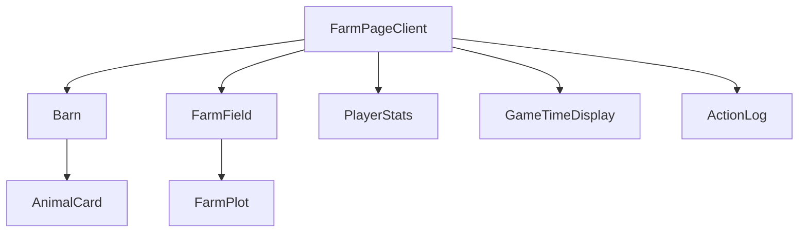

### **【改訂版 v4.0】第5章: 実践・農場ページ構築 〜知識を組み合わせ、機能を作り上げる〜**

#### **この章で到達するレベル**

この章を読破したあなたは、これまでに学んだ断片的な知識（コンポーネント、型、ルーティング、スタイリング）を組み合わせ、一つの意味のある「機能」として結実させるプロセスを完全に理解します。あなたは以下の問いに自信を持って答えられるようになるでしょう。

*   機能ページのファイルとコンポーネントは、どのような責務分割で構成すべきか？トップダウン設計とコンテナ/プレゼンテーションコンポーネントの原則を実践的に適用する方法は？
*   Next.jsのサーバーコンポーネントとクライアントコンポーネントを、一つのページ内でどのように連携させるのか？初期データの受け渡しとハイドレーションの仕組みは？
*   複雑な状態とロジックを、コンポーネントから「カスタムフック」として抽出し、再利用可能にするメリットと方法は？フックのルールと関心の分離の重要性とは？
*   Propsを介したコンポーネント間のデータフロー（トップダウン）とイベント通知（ボトムアップ）を、実際のコードでどう実装するのか？
*   なぜ「Prop Drilling（プロップのバケツリレー）」が問題となり、それがコードの可読性、保守性、テスト容易性にどう影響するのか？そして、それが次の章で学ぶ「Context API」の必要性を示唆するのか？

この章は、あなたが単なる「部品職人」から、部品を組み上げて一つの製品を作り上げる「プロダクトエンジニア」へと進化するための、極めて重要な実践のステップです。

---

### **【第1部：農場ページの解剖学と設計】**

この部では、まず完成形である「農場ページ」を俯瞰し、それがどのようなコンポーネント部品から成り立っているのかを分析します。優れたアプリケーション開発は、優れた設計から始まります。ここでは、トップダウン設計の原則と、コンポーネントの責務分割について深く掘り下げます。

---

### **5.1 設計思想：トップダウンで考えるコンポーネント分解**

いきなり小さな部品から作り始めるのではなく、まずページ全体という最も大きな視点から考え、徐々に小さな部品へと分解していくアプローチを**トップダウン設計**と呼びます。この方法は、アプリケーションの全体像を把握しやすく、コンポーネント間の依存関係を早期に特定できるというメリットがあります。

**農場ページ（`/farm`）の機能要件の再確認:**
「Nojo Farm」の農場ページは、プレイヤーがゲーム内で最も多くの時間を過ごす場所であり、以下の主要な機能と情報表示が必要です。

1.  **プレイヤー情報表示:** プレイヤー名、所持金、レベルなどの基本情報。
2.  **動物小屋エリア:** プレイヤーが所有する動物たちを一覧表示し、餌やりなどのインタラクションを可能にする。
3.  **畑エリア:** 作物を植えたり収穫したりできる区画をグリッド表示する。各区画はクリック可能で、状態（空き地、生育中、収穫可能）に応じて見た目が変わる。
4.  **ゲーム内時間表示:** ゲームの進行を示す時間表示。
5.  **アクションログ/通知:** プレイヤーが行ったアクションやゲーム内イベントのログ。

**コンポーネントへの分解と責務の割り当て:**
これらの要件から、以下のようなコンポーネント構造を導き出します。ここでは、第1章で学んだ「コンテナコンポーネント」と「プレゼンテーションコンポーネント」の概念も意識します。

```mermaid
graph TD
    A[app/farm/page.tsx<br>(サーバーコンポーネント)] --> B(FarmPageClient<br>components/pages/FarmPageClient.tsx<br><b>クライアントコンポーネント</b>)

    subgraph B
        direction TB
        B1[FarmHeader<br>components/farm/FarmHeader.tsx]
        B2[PlayerStats<br>components/farm/PlayerStats.tsx]
        B3[GameTimeDisplay<br>components/farm/GameTimeDisplay.tsx]
        B4[Barn<br>components/farm/Barn.tsx] --> B4_1[AnimalCard<br>components/farm/AnimalCard.tsx]
        B5[FarmField<br>components/farm/FarmField.tsx] --> B5_1[FarmPlot<br>components/farm/FarmPlot.tsx]
        B6[ActionLog<br>components/farm/ActionLog.tsx]

        B --> B1
        B --> B2
        B --> B3
        B --> B4
        B --> B5
        B --> B6
    end

    style A fill:#fce,stroke:#333,stroke-width:2px
    style B fill:#cde,stroke:#333,stroke-width:2px
    style B1 fill:#e0f7fa,stroke:#333
    style B2 fill:#e0f7fa,stroke:#333
    style B3 fill:#e0f7fa,stroke:#333
    style B4 fill:#e0f7fa,stroke:#333
    style B4_1 fill:#f1f8e9,stroke:#333
    style B5 fill:#e0f7fa,stroke:#333
    style B5_1 fill:#f1f8e9,stroke:#333
    style B6 fill:#e0f7fa,stroke:#333
```
*図5-1: 農場ページのコンポーネント階層と責務分割*

**各コンポーネントの責務の分担:**
*   `app/farm/page.tsx`:
    *   **責務:** ページの入り口。Next.jsのサーバーコンポーネントとして、サーバーサイドでの初期データ取得と準備を担当。クライアントコンポーネントである`FarmPageClient`に初期データをPropsとして渡す。
*   `FarmPageClient` (新設):
    *   **責務:** 農場ページ全体のインタラクションを管理する、最上位の**クライアントコンポーネント**。主要なゲームの状態（プレイヤー情報、動物、畑など）を所有し、それらを操作するロジックを定義。子コンポーネントにデータとコールバック関数をPropsとして渡す。
*   `FarmHeader`:
    *   **責務:** ページのヘッダー部分。タイトルやグローバルなナビゲーションリンクなど。
*   `PlayerStats`:
    *   **責務:** プレイヤー名、所持金、レベルなどの静的な情報を表示するプレゼンテーションコンポーネント。
*   `GameTimeDisplay`:
    *   **責務:** ゲーム内時間の表示と、時間経過に伴う更新ロジックをカプセル化するコンポーネント。
*   `Barn` (コンテナ):
    *   **責務:** 動物小屋エリア全体のレイアウトと、`AnimalCard`のリスト表示を管理するコンテナコンポーネント。
*   `AnimalCard` (プレゼンテーション):
    *   **責務:** 個々の動物の情報（名前、満腹度など）を表示し、「餌をやる」などのアクションをトリガーするプレゼンテーションコンポーネント。
*   `FarmField` (コンテナ):
    *   **責務:** 畑エリア全体のレイアウトと、`FarmPlot`のグリッド表示を管理するコンテナコンポーネント。
*   `FarmPlot` (プレゼンテーション):
    *   **責務:** 個々の畑の区画の状態（空き地、生育中、収穫可能）を表示し、クリックイベントを親に通知するプレゼンテーションコンポーネント。
*   `ActionLog`:
    *   **責務:** プレイヤーが行ったアクションやゲーム内イベントのログを表示するコンポーネント。

この分解により、各コンポーネントは単一の責務に集中でき、コードの可読性、保守性、再利用性が向上します。

---

### **5.2 ページの入り口：`app/farm/page.tsx` - サーバーコンポーネントの役割**

Next.jsのApp Routerの規約通り、`/farm`というURLの入り口は`app/farm/page.tsx`です。このファイルの最も重要な役割は、**サーバーサイドでできる準備を済ませ、メインのクライアントコンポーネーントにバトンを渡すこと**です。

```tsx
// app/farm/page.tsx
import FarmPageClient from "@/components/pages/FarmPageClient";
import { getInitialGameData } from "@/lib/server/game-data"; // サーバーサイドで初期データを取得する関数

// このファイルはデフォルトでサーバーコンポーネント
export default async function FarmPage() {
  // サーバーサイドで、このページの表示に必要な初期データを取得する
  // データベースアクセスや外部API呼び出しなど、機密情報を含む処理も安全に行える
  const initialGameData = await getInitialGameData();

  // サーバーコンポーネントで静的なUI要素をレンダリングすることも可能
  // 例: ページのタイトル、静的な説明文など

  return (
    <div className="container mx-auto p-4">
      <h1 className="text-3xl font-bold mb-6 text-gray-800 dark:text-gray-100">
        わたしの農場
      </h1>
      
      {/* 実際のインタラクションはクライアントコンポーネントに委譲 */}
      {/* サーバーで取得した初期データをPropsとして渡す */}
      <FarmPageClient initialData={initialGameData} />
    </div>
  );
}
```
**ポイント:**
*   **`async`関数としての定義:** `page.tsx`は`async`関数として定義できるため、`await`を使って非同期処理（データフェッチなど）を直接記述できます。
*   **サーバーサイドでのデータ取得:** `getInitialGameData()`のような関数を通じて、データベースアクセスやファイルシステムへのアクセスなど、サーバーサイドでしか行えない処理を安全に実行できます。これにより、APIキーなどの機密情報がクライアントに漏れる心配がありません。
*   **初期データのPropsとしての受け渡し:** 取得したデータは、クライアントコンポーネントである`FarmPageClient`にPropsとして渡されます。このPropsはシリアライズ可能である必要があります（関数やDateオブジェクトなどは直接渡せません）。
*   **高速な初期ロード:** サーバーでHTMLが生成されるため、ユーザーはJavaScriptのダウンロード・実行を待つことなく、コンテンツをすぐに閲覧できます。これにより、LCP（Largest Contentful Paint）などのCore Web Vitalsが改善されます。
*   **SEOの改善:** 検索エンジンのクローラーは、JavaScriptの実行を待つことなく、完全なHTMLコンテンツを直接取得できます。

**ローディングUIとエラーハンドリング:**
Next.jsのApp Routerでは、`loading.tsx`と`error.tsx`という特別なファイルを使って、サーバーコンポーネントでのデータフェッチ中にローディングUIを表示したり、エラーが発生した場合に代替UIを表示したりできます。

```tsx
// app/farm/loading.tsx
export default function FarmLoading() {
  return (
    <div className="flex justify-center items-center h-screen">
      <p className="text-xl text-gray-600">農場データを読み込み中...</p>
    </div>
  );
}

// app/farm/error.tsx
"use client"; // error.tsxはクライアントコンポーネントである必要がある

import { useEffect } from 'react';

export default function FarmError({ error, reset }: { error: Error; reset: () => void; }) {
  useEffect(() => {
    // エラーをログサービスに送信するなど
    console.error(error);
  }, [error]);

  return (
    <div className="flex flex-col justify-center items-center h-screen text-red-600">
      <h2 className="text-2xl font-bold">農場データの読み込みに失敗しました！</h2>
      <p className="mt-2">{error.message}</p>
      <button
        onClick={() => reset()} // エラー境界をリセットして再試行
        className="mt-4 bg-red-500 text-white px-4 py-2 rounded"
      >
        再試行
      </button>
    </div>
  );
}
```
これらのファイルは、ユーザー体験を向上させ、アプリケーションの堅牢性を高める上で非常に重要です。

**思考実験:**
「Nojo Farm」の`app/farm/page.tsx`で、`getInitialGameData()`関数がデータベースへの接続に失敗し、エラーをスローしたとします。このとき、ユーザーにはどのようなUIが表示されるべきでしょうか？`app/farm/error.tsx`がどのようにこのエラーをキャッチし、ユーザーに「再試行」ボタンを提供することで、どのようなユーザー体験を提供できますか？また、`loading.tsx`はどのようなタイミングで表示されますか？

---

### **【第2部：農場コンポーネントの組み立てとデータフロー】**

この部では、設計図に基づいて、各コンポーネントを実際に構築していきます。Reactの基本原則である「データは親から子へPropsで流れ、子のイベントは親から渡されたコールバック関数を呼び出すことで親に通知される」というデータフローに注目してください。

---

### **5.3 親玉クライアントコンポーネント：`FarmPageClient.tsx`**

このコンポーネントが、農場ページにおけるすべてのインタラクティブな機能の司令塔となります。`"use client";`ディレクティブにより、このコンポーネントとその子孫はブラウザで実行され、Reactのフック（`useState`, `useEffect`など）を使用できます。

```tsx
// components/pages/FarmPageClient.tsx (新規作成)
"use client";

import React, { useState, useEffect } from "react";
import type { Animal, Plot, Player } from "@/types/game.types"; // 型定義をインポート
import { Barn } from "@/components/farm/Barn";
import { FarmField } from "@/components/farm/FarmField";
import { PlayerStats } from "@/components/farm/PlayerStats";
import { GameTimeDisplay } from "@/components/farm/GameTimeDisplay";
import { ActionLog } from "@/components/farm/ActionLog";

// page.tsxから渡される初期データの型
interface InitialGameData {
  player: Player;
  animals: Animal[];
  plots: Plot[];
  gameTime: number; // 初期ゲーム時間
}

interface FarmPageClientProps {
  initialData: InitialGameData;
}

export default function FarmPageClient({ initialData }: FarmPageClientProps) {
  // 親から受け取った初期データを、クライアントサイドのStateとして保持
  const [player, setPlayer] = useState<Player>(initialData.player);
  const [animals, setAnimals] = useState<Animal[]>(initialData.animals);
  const [plots, setPlots] = useState<Plot[]>(initialData.plots);
  const [gameTime, setGameTime] = useState<number>(initialData.gameTime);
  const [actionLog, setActionLog] = useState<string[]>([]);

  // ゲーム内時間の経過ロジック (例: 1秒ごとにゲーム時間を1分進める)
  useEffect(() => {
    const timer = setInterval(() => {
      setGameTime(prevTime => prevTime + 60); // 1秒で60秒(1分)進む
      // 時間経過に伴う作物の成長や動物の空腹度変化などのロジックをここに記述
      // 例: 作物の成長ステージ更新
      setPlots(currentPlots =>
        currentPlots.map(plot => {
          if (plot.crop && plot.crop.stage === 'seed' && gameTime - plot.crop.plantedAt > 300) { // 5分経過で成長
            return { ...plot, crop: { ...plot.crop, stage: 'growth' } };
          }
          return plot;
        })
      );
    }, 1000); // 1秒ごとに実行

    return () => clearInterval(timer); // クリーンアップ
  }, [gameTime]); // gameTimeが変更されるたびに再実行されるように依存配列に含める

  // 動物に餌をやるロジック
  const handleFeedAnimal = (animalId: string) => {
    setAnimals(currentAnimals =>
      currentAnimals.map(animal =>
        animal.id === animalId ? { ...animal, fed: true, lastFedAt: gameTime } : animal
      )
    );
    setActionLog(prevLog => [`${animalId}の動物に餌をやりました。`, ...prevLog]);
    console.log(`${animalId}の動物に餌をやりました。`);
  };

  // 作物を植えるロジック
  const handlePlantCrop = (plotId: number, cropName: string) => {
    setPlots(currentPlots =>
      currentPlots.map(plot =>
        plot.id === plotId && !plot.crop
          ? { ...plot, crop: { name: cropName, stage: "seed", plantedAt: gameTime } }
          : plot
      )
    );
    setPlayer(prevPlayer => ({ ...prevPlayer, money: prevPlayer.money - 50 })); // 仮で50G消費
    setActionLog(prevLog => [`区画${plotId}に${cropName}を植えました。`, ...prevLog]);
    console.log(`${plotId}の区画に${cropName}の種を植えました。`);
  };

  // 作物を収穫するロジック
  const handleHarvestCrop = (plotId: number) => {
    setPlots(currentPlots =>
      currentPlots.map(plot =>
        plot.id === plotId && plot.crop?.stage === 'harvest'
          ? { ...plot, crop: null } // 収穫後、区画を空にする
          : plot
      )
    );
    setPlayer(prevPlayer => ({ ...prevPlayer, money: prevPlayer.money + 100 })); // 仮で100G獲得
    setActionLog(prevLog => [`区画${plotId}から作物を収穫しました。`, ...prevLog]);
    console.log(`${plotId}の区画から作物を収穫しました。`);
  };

  return (
    <div className="grid grid-cols-1 lg:grid-cols-4 gap-8 p-4">
      {/* 左サイドバー: プレイヤー情報、ゲーム時間、アクションログ */}
      <div className="lg:col-span-1 space-y-6">
        <PlayerStats player={player} />
        <GameTimeDisplay gameTime={gameTime} />
        <ActionLog logs={actionLog} />
      </div>

      {/* メインコンテンツ: 動物小屋と畑 */}
      <div className="lg:col-span-3 space-y-8">
        {/* 動物小屋セクション */}
        <div className="bg-yellow-50 dark:bg-yellow-900/20 p-4 rounded-lg shadow-md">
          <h2 className="text-2xl font-bold mb-4 text-yellow-800 dark:text-yellow-200">動物小屋</h2>
          <Barn animals={animals} onFeed={handleFeedAnimal} />
        </div>

        {/* 畑セクション */}
        <div className="bg-green-50 dark:bg-green-900/20 p-4 rounded-lg shadow-md">
          <h2 className="text-2xl font-bold mb-4 text-green-800 dark:text-green-200">畑</h2>
          <FarmField plots={plots} onPlant={handlePlantCrop} onHarvest={handleHarvestCrop} />
        </div>
      </div>
    </div>
  );
}
```
**このコンポーネントの役割:**
1.  **状態の所有:** 農場ページの主要な状態（`player`, `animals`, `plots`, `gameTime`, `actionLog`）を`useState`で所有します。
2.  **ロジックの定義:** 状態を更新するためのロジック（`handleFeedAnimal`, `handlePlantCrop`, `handleHarvestCrop`）を定義します。`useEffect`を使ってゲーム内時間の経過に伴う自動更新ロジックも実装しています。
3.  **データとロジックの伝達:** 所有している状態（データ）と、定義したロジック（関数）を、子コンポーネント（`PlayerStats`, `GameTimeDisplay`, `Barn`, `FarmField`, `ActionLog`）にPropsとして渡します。

---

### **5.4 表示部品の組み立て：プレゼンテーションコンポーネントの役割**

`FarmPageClient`からデータと関数を受け取る、より小さな「表示用」コンポーネントを見ていきましょう。これらのコンポーネントは、自身のStateをほとんど持たず、Propsとして受け取ったデータを表示し、ユーザーイベントを親に通知する「ダムコンポーネント」または「プレゼンテーションコンポーネント」として機能します。

#### **`PlayerStats.tsx`**
プレイヤーの基本情報を表示します。

```tsx
// components/farm/PlayerStats.tsx
import React from 'react';
import type { Player } from '@/types/game.types';

interface PlayerStatsProps {
  player: Player;
}

export function PlayerStats({ player }: PlayerStatsProps) {
  return (
    <div className="bg-blue-50 dark:bg-blue-900/20 p-4 rounded-lg shadow-md">
      <h2 className="text-2xl font-bold mb-2 text-blue-800 dark:text-blue-200">プレイヤー情報</h2>
      <p className="text-lg">名前: <span className="font-semibold">{player.name}</span></p>
      <p className="text-lg">所持金: <span className="font-semibold">{player.money} G</span></p>
      <p className="text-lg">レベル: <span className="font-semibold">{player.level}</span></p>
    </div>
  );
}
```

#### **`GameTimeDisplay.tsx`**
ゲーム内時間を表示します。

```tsx
// components/farm/GameTimeDisplay.tsx
import React from 'react';

interface GameTimeDisplayProps {
  gameTime: number; // 秒単位
}

export function GameTimeDisplay({ gameTime }: GameTimeDisplayProps) {
  const minutes = Math.floor(gameTime / 60);
  const hours = Math.floor(minutes / 60);
  const displayMinutes = minutes % 60;

  return (
    <div className="bg-purple-50 dark:bg-purple-900/20 p-4 rounded-lg shadow-md">
      <h2 className="text-2xl font-bold mb-2 text-purple-800 dark:text-purple-200">ゲーム内時間</h2>
      <p className="text-lg font-semibold">
        {hours.toString().padStart(2, '0')}:{displayMinutes.toString().padStart(2, '0')}
      </p>
    </div>
  );
}
```

#### **`Barn.tsx` と `AnimalCard.tsx`**
動物小屋と個々の動物カードです。

```tsx
// components/farm/Barn.tsx
import React from 'react';
import type { Animal } from "@/types/game.types";
import { AnimalCard } from "./AnimalCard";

interface BarnProps {
  animals: Animal[];
  onFeed: (animalId: string) => void; // 親から受け取る関数
}

export function Barn({ animals, onFeed }: BarnProps) {
  return (
    <div className="grid grid-cols-1 sm:grid-cols-2 gap-4">
      {animals.map(animal => (
        <AnimalCard key={animal.id} animal={animal} onFeed={onFeed} />
      ))}
    </div>
  );
}
```

```tsx
// components/farm/AnimalCard.tsx
import React from 'react';
import type { Animal } from "@/types/game.types";
import { Button } from "@/components/ui/button"; // shadcn/uiのButton
import { cn } from "@/lib/utils";

interface AnimalCardProps {
  animal: Animal;
  onFeed: (animalId: string) => void;
}

export function AnimalCard({ animal, onFeed }: AnimalCardProps) {
  return (
    <div className="p-3 bg-white dark:bg-gray-800 rounded-md shadow-sm flex justify-between items-center">
      <span className={cn("font-medium", animal.fed ? "text-gray-400" : "text-gray-800 dark:text-gray-200")}>
        {animal.name} {animal.fed ? '(満腹)' : '(空腹)'}
      </span>
      <Button
        size="sm"
        onClick={() => onFeed(animal.id)} // クリック時に親の関数を呼ぶ
        disabled={animal.fed}
        className="bg-yellow-500 hover:bg-yellow-600 text-white"
      >
        餌をやる
      </Button>
    </div>
  );
}
```
**データの流れとイベントの通知の再確認:**
1.  `FarmPageClient`が持つ`animals`配列が、`Barn`に渡され、さらに`AnimalCard`に個々の`animal`オブジェクトとして渡されます（**トップダウンのデータフロー**）。
2.  ユーザーが`AnimalCard`の「餌をやる」ボタンをクリックします。
3.  `AnimalCard`の`onClick`が発火し、Propsで受け取った`onFeed`関数を、自身の`animal.id`を引数にして呼び出します。
4.  この`onFeed`の実体は、`FarmPageClient`で定義された`handleFeedAnimal`です。
5.  `handleFeedAnimal`が実行され、`FarmPageClient`が持つ`animals` Stateが更新されます。
6.  Stateが更新されたことでReactが再レンダリングを行い、変更が画面に反映されます。

このように、**データは親から子へPropsで流れ、子のイベントは親から渡されたコールバック関数を呼び出すことで親に通知されます（ボトムアップのイベント通知）**。この原則は、Reactアプリケーションの予測可能性とデバッグの容易性を保証します。

#### **`FarmField.tsx` と `FarmPlot.tsx`**
畑エリアも全く同じ構造です。

```tsx
// components/farm/FarmField.tsx
import React from 'react';
import type { Plot } from "@/types/game.types";
import { FarmPlot } from "./FarmPlot";

interface FarmFieldProps {
  plots: Plot[];
  onPlant: (plotId: number, cropName: string) => void;
  onHarvest: (plotId: number) => void;
}

export function FarmField({ plots, onPlant, onHarvest }: FarmFieldProps) {
  return (
    <div className="grid grid-cols-3 sm:grid-cols-4 md:grid-cols-5 lg:grid-cols-6 gap-2">
      {plots.map(plot => (
        <FarmPlot key={plot.id} plot={plot} onPlant={onPlant} onHarvest={onHarvest} />
      ))}
    </div>
  );
}
```

```tsx
// components/farm/FarmPlot.tsx
import React from 'react';
import type { Plot } from "@/types/game.types";
import { cn } from '@/lib/utils';

interface FarmPlotProps {
  plot: Plot;
  onPlant: (plotId: number, cropName: string) => void;
  onHarvest: (plotId: number) => void;
}

export function FarmPlot({ plot, onPlant, onHarvest }: FarmPlotProps) {
  // 作物の状態に応じて表示内容を変える
  const getPlotContent = () => {
    if (!plot.crop) return '空き地';
    if (plot.crop.stage === 'seed') return '🌱';
    if (plot.crop.stage === 'growth') return '🌿';
    if (plot.crop.stage === 'harvest') return '🍎';
    return '';
  };

  const handlePlotClick = () => {
    if (!plot.crop) {
      // 空き地なら植えるアクション
      const cropToPlant = prompt('何を植えますか？ (例: トマト)');
      if (cropToPlant) {
        onPlant(plot.id, cropToPlant);
      }
    } else if (plot.crop.stage === 'harvest') {
      // 収穫可能なら収穫アクション
      onHarvest(plot.id);
    } else {
      // 成長中なら何もしないか、情報表示
      alert(`区画${plot.id}の${plot.crop.name}は成長中です。`);
    }
  };

  const plotClasses = cn(
    "aspect-square border-4 flex items-center justify-center cursor-pointer transition-colors duration-150",
    "hover:scale-105",
    {
      "bg-gray-200 border-gray-300": !plot.crop, // 空き地
      "bg-yellow-100 border-yellow-500": plot.crop?.stage === 'seed', // 種
      "bg-green-100 border-green-500": plot.crop?.stage === 'growth', // 成長中
      "bg-red-100 border-red-500": plot.crop?.stage === 'harvest', // 収穫可能
    }
  );

  return (
    <div className={plotClasses} onClick={handlePlotClick}>
      <span className="text-4xl">{getPlotContent()}</span>
      <span className="absolute bottom-1 right-1 text-xs text-gray-500">#{plot.id}</span>
    </div>
  );
}
```
`FarmPlot`をクリックすると、その状態に応じて`onPlant`または`onHarvest`を通じて`FarmPageClient`の対応するハンドラが呼び出され、`plots` Stateが更新される、という流れは動物小屋と全く同じです。

#### **`ActionLog.tsx`**
ゲーム内のアクションログを表示します。

```tsx
// components/farm/ActionLog.tsx
import React from 'react';

interface ActionLogProps {
  logs: string[];
}

export function ActionLog({ logs }: ActionLogProps) {
  return (
    <div className="bg-gray-50 dark:bg-gray-900/20 p-4 rounded-lg shadow-md h-64 overflow-y-auto">
      <h2 className="text-2xl font-bold mb-4 text-gray-800 dark:text-gray-200">アクションログ</h2>
      <ul className="space-y-1 text-sm">
        {logs.map((log, index) => (
          <li key={index} className="text-gray-700 dark:text-gray-300">{log}</li>
        ))}
      )}
      </ul>
    </div>
  );
}
```

**思考実験:**
`FarmPlot`コンポーネントに、作物が植えられてから収穫可能になるまでの残り時間を表示するプログレスバーを追加するとします。このプログレスバーは、`plot.crop.plantedAt`と現在の`gameTime`に基づいて計算されるべきです。この機能を実装するために、`FarmPlot`コンポーネントにどのようなPropsを追加し、どのようにロジックを記述しますか？また、プログレスバーのスタイリングにはTailwind CSSをどのように活用しますか？

---

### **【第3部：ロジックの分離と再利用 - カスタムフック】**

現状の`FarmPageClient`は、プレイヤー情報、動物、畑、ゲーム時間、アクションログといった多くの状態とロジックを抱えており、かなり複雑になってきました。もしここに「天気」や「市場の価格変動」といった概念が加わったら、コンポーネントはさらに肥大化してしまいます。

この問題を解決するのが「**カスタムフック (Custom Hooks)**」です。カスタムフックは、状態を持つロジックをコンポーネントから抽出し、再利用可能にするための強力なメカニズムです。

---

### **5.5 ロジックのカプセル化：`useFarmLogic.ts`**

カスタムフックとは、`use`で始まる名前の、状態を持つロジックをコンポーネントから抽出し、再利用可能にするための関数です。これにより、コンポーネントはUIのレンダリングに集中し、ロジックはカスタムフックにカプセル化されます。

**たとえ話：ロジックのレシピ**
カスタムフックは、特定の機能を実現するための「**ロジックのレシピ**」です。例えば、「カウンター機能レシピ (`useCounter`)」や「API通信レシピ (`useFetch`)」など。コンポーネントは、このレシピを使うだけで、複雑な調理手順（実装の詳細）を知らなくても、目的の機能（状態とそれを操作する関数）を手に入れることができます。

では、`FarmPageClient`から畑に関するロジックを`usePlotsLogic`というカスタムフックに、動物に関するロジックを`useAnimalsLogic`というカスタムフックに抽出してみましょう。

```ts
// hooks/usePlotsLogic.ts (新規作成)
import { useState, useEffect } from 'react';
import type { Plot } from '@/types/game.types';

interface UsePlotsLogicResult {
  plots: Plot[];
  plantCrop: (plotId: number, cropName: string, gameTime: number) => void;
  harvestCrop: (plotId: number) => void;
  updatePlotStages: (currentTime: number) => void; // 時間経過による成長更新
}

export function usePlotsLogic(initialPlots: Plot[]): UsePlotsLogicResult {
  const [plots, setPlots] = useState<Plot[]>(initialPlots);

  const plantCrop = (plotId: number, cropName: string, gameTime: number) => {
    setPlots(currentPlots =>
      currentPlots.map(plot =>
        plot.id === plotId && !plot.crop
          ? { ...plot, crop: { name: cropName, stage: "seed", plantedAt: gameTime } }
          : plot
      )
    );
  };

  const harvestCrop = (plotId: number) => {
    setPlots(currentPlots =>
      currentPlots.map(plot =>
        plot.id === plotId && plot.crop?.stage === 'harvest'
          ? { ...plot, crop: null } // 収穫後、区画を空にする
          : plot
      )
    );
  };

  // 時間経過による作物の成長ステージ更新ロジック
  const updatePlotStages = (currentTime: number) => {
    setPlots(currentPlots =>
      currentPlots.map(plot => {
        if (plot.crop) {
          const timeElapsed = currentTime - plot.crop.plantedAt;
          // 仮の成長ロジック: 5分で成長、10分で収穫可能
          if (plot.crop.stage === 'seed' && timeElapsed >= 300) { // 5分 = 300秒
            return { ...plot, crop: { ...plot.crop, stage: 'growth' } };
          }
          if (plot.crop.stage === 'growth' && timeElapsed >= 600) { // 10分 = 600秒
            return { ...plot, crop: { ...plot.crop, stage: 'harvest' } };
          }
        }
        return plot;
      })
    );
  };

  return { plots, plantCrop, harvestCrop, updatePlotStages };
}

// hooks/useAnimalsLogic.ts (新規作成)
import { useState } from 'react';
import type { Animal } from '@/types/game.types';

interface UseAnimalsLogicResult {
  animals: Animal[];
  feedAnimal: (animalId: string, gameTime: number) => void;
  // 他の動物関連ロジック（例: 空腹度更新）
}

export function useAnimalsLogic(initialAnimals: Animal[]): UseAnimalsLogicResult {
  const [animals, setAnimals] = useState<Animal[]>(initialAnimals);

  const feedAnimal = (animalId: string, gameTime: number) => {
    setAnimals(currentAnimals =>
      currentAnimals.map(animal =>
        animal.id === animalId ? { ...animal, fed: true, lastFedAt: gameTime } : animal
      )
    );
  };

  return { animals, feedAnimal };
}
```
**カスタムフックのルール:**
*   カスタムフックは必ず`use`で始まる名前でなければなりません。
*   カスタムフックは、他のフック（`useState`, `useEffect`など）を呼び出すことができます。
*   カスタムフックは、Reactコンポーネントのトップレベル、または他のカスタムフックのトップレベルでのみ呼び出すことができます。条件分岐やループの中で呼び出すことはできません。

---

### **5.6 カスタムフックでコンポーネントをスリム化する**

作成した`usePlotsLogic`と`useAnimalsLogic`フックを使って、`FarmPageClient`をリファクタリングします。これにより、`FarmPageClient`はUIの構成と、各ロジックフックからの値の受け渡しに集中できるようになります。

```tsx
// components/pages/FarmPageClient.tsx (リファクタリング後)
"use client";

import React, { useState, useEffect } from "react";
import type { Player } from "@/types/game.types";
import { Barn } from "@/components/farm/Barn";
import { FarmField } from "@/components/farm/FarmField";
import { PlayerStats } from "@/components/farm/PlayerStats";
import { GameTimeDisplay } from "@/components/farm/GameTimeDisplay";
import { ActionLog } from "@/components/farm/ActionLog";
import { usePlotsLogic } from "@/hooks/usePlotsLogic"; // カスタムフックをインポート
import { useAnimalsLogic } from "@/hooks/useAnimalsLogic"; // カスタムフックをインポート

interface InitialGameData { /* ... */ }
interface FarmPageClientProps { /* ... */ }

export default function FarmPageClient({ initialData }: FarmPageClientProps) {
  const [player, setPlayer] = useState<Player>(initialData.player);
  const [gameTime, setGameTime] = useState<number>(initialData.gameTime);
  const [actionLog, setActionLog] = useState<string[]>([]);

  // usePlotsLogicフックを呼び出し、畑関連の状態とロジックを取得
  const { plots, plantCrop, harvestCrop, updatePlotStages } = usePlotsLogic(initialData.plots);
  // useAnimalsLogicフックを呼び出し、動物関連の状態とロジックを取得
  const { animals, feedAnimal } = useAnimalsLogic(initialData.animals);

  // ゲーム内時間の経過ロジック
  useEffect(() => {
    const timer = setInterval(() => {
      setGameTime(prevTime => prevTime + 60); // 1秒で60秒(1分)進む
    }, 1000);

    return () => clearInterval(timer);
  }, []); // 依存配列を空にして、コンポーネトマウント時に一度だけ設定

  // gameTimeが変更されるたびに、作物の成長ステージを更新
  useEffect(() => {
    updatePlotStages(gameTime);
    // 他の時間経過ロジック（動物の空腹度など）もここにトリガーできる
  }, [gameTime, updatePlotStages]); // updatePlotStagesも依存配列に含める

  // 動物に餌をやるロジック (カスタムフックからの関数をラップ)
  const handleFeedAnimal = (animalId: string) => {
    feedAnimal(animalId, gameTime); // カスタムフックの関数を呼び出す
    setActionLog(prevLog => [`動物 ${animalId} に餌をやりました。`, ...prevLog]);
    setPlayer(prevPlayer => ({ ...prevPlayer, money: prevPlayer.money - 10 })); // 仮で10G消費
  };

  // 作物を植えるロジック (カスタムフックからの関数をラップ)
  const handlePlantCrop = (plotId: number, cropName: string) => {
    plantCrop(plotId, cropName, gameTime); // カスタムフックの関数を呼び出す
    setPlayer(prevPlayer => ({ ...prevPlayer, money: prevPlayer.money - 50 })); // 仮で50G消費
    setActionLog(prevLog => [`区画${plotId}に${cropName}を植えました。`, ...prevLog]);
  };

  // 作物を収穫するロジック (カスタムフックからの関数をラップ)
  const handleHarvestCrop = (plotId: number) => {
    harvestCrop(plotId); // カスタムフックの関数を呼び出す
    setPlayer(prevPlayer => ({ ...prevPlayer, money: prevPlayer.money + 100 })); // 仮で100G獲得
    setActionLog(prevLog => [`区画${plotId}から作物を収穫しました。`, ...prevLog]);
  };

  return (
    <div className="grid grid-cols-1 lg:grid-cols-4 gap-8 p-4">
      <div className="lg:col-span-1 space-y-6">
        <PlayerStats player={player} />
        <GameTimeDisplay gameTime={gameTime} />
        <ActionLog logs={actionLog} />
      </div>

      <div className="lg:col-span-3 space-y-8">
        <div className="bg-yellow-50 dark:bg-yellow-900/20 p-4 rounded-lg shadow-md">
          <h2 className="text-2xl font-bold mb-4 text-yellow-800 dark:text-yellow-200">動物小屋</h2>
          <Barn animals={animals} onFeed={handleFeedAnimal} />
        </div>

        <div className="bg-green-50 dark:bg-green-900/20 p-4 rounded-lg shadow-md">
          <h2 className="text-2xl font-bold mb-4 text-green-800 dark:text-green-200">畑</h2>
          <FarmField plots={plots} onPlant={handlePlantCrop} onHarvest={handleHarvestCrop} />
        </div>
      </div>
    </div>
  );
}
```
**リファクタリングの効果:**
*   `FarmPageClient`から、畑や動物に関する`useState`の宣言と、それらを操作する具体的なロジックが消え、`usePlotsLogic`と`useAnimalsLogic`フックの呼び出しに置き換わりました。
*   コンポーネントは「何をするか（`usePlotsLogic`や`useAnimalsLogic`を呼び出す）」だけを知っていればよく、「どうやるか（フックの内部実装）」を知る必要がなくなりました。
*   `usePlotsLogic`や`useAnimalsLogic`フックは、将来的に他のコンポーネント（例: 「第二の農場ページ」や「動物管理画面」）でも再利用できます。
*   `FarmPageClient`は、各ロジックフックから提供される状態と関数を統合し、UIコンポーネントに渡すという、より高レベルな調整役としての責務に集中できるようになりました。

このように、カスタムフックは**関心の分離**を促進し、コンポーネントをクリーンでテスタブルな状態に保つための、React開発における極めて重要なパターンです。

**思考実験:**
「Nojo Farm」に「天気システム」を追加するとします。天気はゲーム内時間に応じて変化し、作物の成長速度や動物の幸福度に影響を与えます。この天気システムのロジック（現在の天気の状態、天気予報、天気変化のロジック）を`useWeatherLogic`というカスタムフックとしてどのようにカプセル化しますか？また、`FarmPageClient`はこの`useWeatherLogic`フックをどのように統合し、`WeatherDisplay`コンポーネントに天気情報を渡しますか？

---

### **5.7 新たな課題：Prop Drilling (プロップのバケツリレー)**

現状の設計では、`FarmPageClient`がすべての状態を管理し、それを子や孫コンポーネントにPropsで手渡ししています。


*図5-2: Prop Drillingの概念図*

この「**Propsのバケツリレー**」は、コンポーネント階層が深くなると非常に面倒になります。途中のコンポーネントは、自身では使わないPropsを、ただ下へ渡すためだけに受け取る必要があります。この問題を**Prop Drilling**と呼びます。

**Prop Drillingが引き起こす問題点:**
1.  **コードの可読性の低下:** どのPropsがどこで使われているのか、追跡が困難になります。
2.  **リファクタリングの困難さ:** 階層の深い場所にあるコンポーネントが必要とするPropsが変更された場合、そのPropsを渡しているすべての中間コンポーネントのPropsの型定義と呼び出し箇所を変更しなければなりません。
3.  **コンポーネントの再利用性の低下:** 特定のPropsに依存するコンポーネントは、そのPropsが利用可能な特定のコンテキストでしか再利用できません。
4.  **不要な再レンダリング:** 中間コンポーネントがPropsをただ通過させるだけでも、Propsが変更されると再レンダリングのトリガーとなる可能性があります（`React.memo`などで回避可能ですが、根本的な解決にはなりません）。

**具体的なシナリオ (Nojo Farm):**
もし、プレイヤーの所持金（`player.money`）を`AnimalCard`で表示し、`FarmPlot`で種を買うときに消費したい場合、`FarmPageClient`から`player`オブジェクトと`setPlayer`関数を、`Barn`と`FarmField`を経由して`AnimalCard`と`FarmPlot`まで延々と手渡ししなければなりません。

```
FarmPageClient (player, setPlayer)
  ↓
  Barn (player, setPlayer)  <-- Barn自身はplayerを使わない
    ↓
    AnimalCard (player, setPlayer) <-- AnimalCardはplayer.moneyを表示し、setPlayerで更新したい
  ↓
  FarmField (player, setPlayer) <-- FarmField自身はplayerを使わない
    ↓
    FarmPlot (player, setPlayer) <-- FarmPlotはplayer.moneyを使って種を購入し、setPlayerで更新したい
```
これは明らかに非効率で、メンテナンス性も悪化させます。

このProp Drilling問題をエレガントに解決するのが、次の章で学ぶ「**Context API**」です。Contextを使えば、コンポーネントツリーの深い場所にあるコンポーネントへ、途中のコンポーネントを介さずに直接データを届けることができます。これにより、コンポーネントのAPIがシンプルになり、再利用性が向上します。

**思考実験:**
「Nojo Farm」で、プレイヤーがゲーム内で達成した実績のリストを管理する`AchievementsList`コンポーネントがあるとします。このリストは、`FarmPageClient`で管理されている`player.achievements`Stateから表示されます。もし、`AnimalCard`で特定の条件を満たしたときに新しい実績がアンロックされる場合、`AnimalCard`から`player.achievements`を更新するための関数を呼び出す必要があります。このとき、`FarmPageClient`から`AnimalCard`まで`player`オブジェクトと`setPlayer`関数をPropsで渡すことのProp Drillingの問題点を具体的に説明してください。

---
### **第5章のまとめ**

この章では、農場ページという具体的な題材を通して、これまでに学んだ知識を一つの機能として統合するプロセスを体験しました。

*   **トップダウン設計とコンポーネント分解**: まずページ全体を俯瞰し、責務に応じてコンポーネントに分解するトップダウン設計の重要性を学びました。コンテナ/プレゼンテーションコンポーネントの原則を実践的に適用し、各コンポーネントの責務を明確にしました。
*   **サーバーとクライアントの連携**: Next.jsのApp Routerにおけるサーバーコンポーネント（`app/farm/page.tsx`）の役割を深く理解しました。初期データの準備、ローディングUI（`loading.tsx`）、エラーハンドリング（`error.tsx`）を通じて、インタラクティブな処理を行うクライアントコンポーネント（`FarmPageClient`）にPropsでデータを渡す、というモダンなNext.jsの基本パターンを実装しました。
*   **データフローとイベント通知**: 「データは親から子へPropsで流れ、子のイベントは親から渡されたコールバック関数を呼び出すことで親に通知される」というReactの基本原則を、親子コンポーネント間の連携を通して再確認しました。この単方向データフローがアプリケーションの予測可能性とデバッグの容易性を保証することを理解しました。
*   **カスタムフックによるロジックの抽象化**: `useState`や`useEffect`、イベントハンドラといった状態ロジックをコンポーネントから`usePlotsLogic`や`useAnimalsLogic`といったカスタムフックとして抽出し、コンポーネントをスリムで再利用可能な状態に保つ方法を学びました。これにより、関心の分離が促進され、コードの保守性とテスト容易性が向上しました。
*   **新たな課題の発見**: アプリケーションが成長するにつれて顕在化する「Prop Drilling」問題を認識し、それがコードの可読性、保守性、テスト容易性に与える悪影響を理解しました。この問題の認識が、次のステップである「Context API」の学習への強力な動機付けとなりました。

あなたは今、単機能のコンポーネントを作るだけでなく、それらを組み合わせて一つの意味のあるユーザー体験を構築する「設計力」を身につけました。

次の章では、アプリケーション全体で状態を共有するための強力な武器、「Context API」を学び、Prop Drilling問題を解決し、よりスケーラブルな状態管理に挑戦します。
