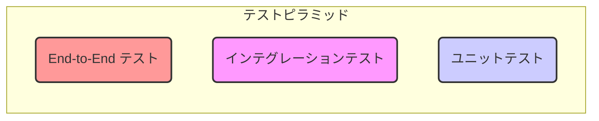
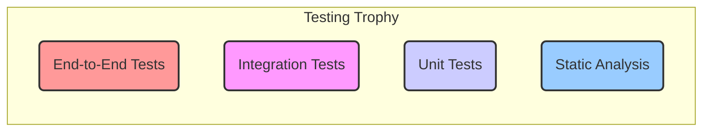

### **【改訂版 v4.0】第7章: テストで品質を保証する 〜自信を持って進むための安全網〜**

#### **この章で到達するレベル**

この章を読破したあなたは、React/Next.jsアプリケーションの品質を保証するための「テスト」の重要性を理解し、その基本的な手法を習得します。あなたは以下の問いに自信を持って答えられるようになるでしょう。

*   なぜ私たちは時間をかけてまでテストを書くのか？その具体的なメリットと、開発ライフサイクルにおけるバグのコストとは？
*   ユニットテスト、インテグレーションテスト、E2Eテストの違いと、それぞれの役割は？「テストピラミッド」と「Testing Trophy」モデルの違いと、現代のフロントエンド開発における最適なテスト戦略は？
*   React Testing Libraryの「ユーザー中心」のテスト哲学とは何か？その哲学が、リファクタリングに強く、アクセシビリティの高いテストコードを書く上でどう役立つのか？
*   JestとReact Testing Libraryを使って、基本的なコンポーネントをどのようにテストするのか？RTLのクエリの優先順位と、`debug()`関数の活用方法は？
*   `user-event`ライブラリを使って、クリックや入力といったユーザー操作をどのようにシミュレートするのか？`fireEvent`との違いと、非同期テストの書き方は？
*   カスタムフックやContextを利用するコンポーネントなど、より複雑なシナリオをどうテストするのか？`renderHook`やカスタム`render`関数の活用方法は？
*   モック（`jest.fn()`, `jest.mock()`, `jest.spyOn()`）を効果的に使って、テストの分離性と信頼性を高める方法は？

この章は、あなたが「動いているように見える」コードから脱却し、「動作を証明できる」コードを書くための、プロフェッショナルとして不可欠なスキルセットを身につけることを目的としています。

---

### **【第1部：なぜ、何をテストするのか？】**

この部では、具体的なテストの書き方を学ぶ前に、テストの背後にある「なぜ？」という動機と、「何を」テストすべきかという戦略について探ります。テストは単なる作業ではなく、開発プロセス全体の品質と効率を向上させるための投資です。

---

### **7.1 なぜテストを書くのか？〜開発者のための安全網とバグのコスト〜**

テストコードを書くことは、一見すると開発の速度を落とす余計な作業に思えるかもしれません。しかし、長期的に見れば、テストは開発者にとって最も強力な「**安全網**」となり、多くの時間と精神的な負担を節約してくれます。

**たとえ話：命綱なしの綱渡り vs 安全網付きの綱渡り**
*   **テストなしの開発:** 地上100mで**命綱なしに綱渡り**をするようなもの。一歩一歩は非常に慎重で、少しでもバランスを崩せば大惨事（本番環境でのバグ）につながる。過去に渡った部分を修正（リファクタリング）するために後ろを振り返るのは、恐怖以外の何物でもない。
*   **テストありの開発:** 同じ綱渡りでも、下に広大で頑丈な**安全網**が張られている状態。自信を持って大胆な一歩を踏み出せるし、新しい技（新機能）にも挑戦できる。もし足を滑らせても、安全網が受け止めてくれる（テストが失敗してバグを教えてくれる）ので、すぐに体勢を立て直して挑戦を続けられる。

**テストがもたらす具体的なメリット:**
1.  **自信と心理的安全性:** テストが通っている限り、「少なくとも既存の機能は壊れていない」という強い自信が得られます。これにより、恐れることなくコードのリファクタリングや機能追加に臨めます。
2.  **リグレッション（退行）の防止:** 新しい変更によって、以前は正しく動いていた機能が壊れてしまう「リグレッションバグ」を自動的に検出できます。これは、特に大規模なアプリケーションや長期プロジェクトにおいて不可欠です。
3.  **生きたドキュメント:** テストコードは、そのコンポーネントや関数が「どのように使われるべきか」「どのような振る舞いを期待されているか」を示す、常に最新で正確な仕様書（ドキュメント）として機能します。新しい開発者がプロジェクトに参加した際の学習コストを大幅に削減します。
4.  **より良い設計への促進:** テストしやすいコードは、必然的に責務が明確で、依存関係が疎な、よく設計されたコードになる傾向があります。テストを書く過程で、コンポーネントのAPIや関数のインターフェースが洗練されます。
5.  **バグの早期発見と修正コストの削減:** ソフトウェア開発ライフサイクルにおいて、バグは発見が遅れるほど修正コストが指数関数的に増大します。テストは、開発の早い段階でバグを発見し、修正コストを最小限に抑えるのに役立ちます。

**テスト駆動開発 (TDD - Test-Driven Development):**
TDDは、テストを先に書く開発手法です。
1.  **Red (赤):** 失敗するテストを書く（まだ機能がないため）。
2.  **Green (緑):** そのテストが通るように最小限のコードを書く。
3.  **Refactor (リファクタ):** コードを改善する（テストが通っていることを確認しながら）。
このサイクルを繰り返すことで、堅牢で高品質なコードを効率的に開発できます。

**思考実験:**
「Nojo Farm」で、プレイヤーがアイテムを購入した後、所持金がマイナスになるという致命的なバグが発生したとします。このバグが本番環境で発見された場合、どのようなビジネス上の影響（例：ユーザーの信頼喪失、収益の損失）が考えられますか？もし、このバグを開発の初期段階で発見できていれば、修正コストはどの程度削減できたでしょうか？包括的なテストスイートは、このバグをどのように防ぐことができたでしょうか？

---

### **7.2 テストのピラミッドとTesting Trophy：バランスの取れたテスト戦略**

テストにはいくつかの種類があり、それぞれに目的とトレードオフがあります。有名なモデルとして「テストピラミッド」と、その進化形である「Testing Trophy」があります。

#### **テストピラミッド (Test Pyramid)**


*図7-1: テストピラミッド*

1.  **ユニットテスト (Unit Tests):**
    *   **対象:** 単一の関数、クラス、またはコンポーネントなど、アプリケーションの最小単位の「ユニット」。
    *   **特徴:** 実行が非常に速く、書きやすい。問題の特定が容易。しかし、ユニット単体が正しくても、それらを組み合わせたときに問題が起きる可能性はカバーできない。
    *   **例 (Nojo Farm):** `calculateCropGrowth(plantedAt, currentTime)`が正しい成長ステージを返すことを確認する純粋関数。
2.  **インテグレーションテスト (Integration Tests):**
    *   **対象:** 複数のユニットが連携して動作する様子。例えば、コンポーネントとカスタムフック、または複数のコンポーネントが組み合わさって一つの機能として動作する部分。
    *   **特徴:** ユニットテストよりは遅いが、ユーザーの実際の操作に近いシナリオを検証でき、費用対効果が最も高い。**Reactアプリケーションのテストでは、この層が最も重要になります。**
    *   **例 (Nojo Farm):** `FarmPlot`コンポーネントをクリックすると、`usePlotsLogic`の`plantCrop`関数が呼ばれ、画面上の作物の表示が変化することを確認する。
3.  **エンドツーエンドテスト (End-to-End / E2E Tests):**
    *   **対象:** アプリケーション全体。実際のブラウザを自動で操作し、ユーザーの操作フロー全体をシミュレートする。
    *   **特徴:** 最も高い信頼性を提供するが、実行が非常に遅く、環境の構築やメンテナンスが大変（不安定になりやすい）。
    *   **例 (Nojo Farm):** ユーザーがログインし、市場で種を購入し、農地に植え、収穫して所持金が増えるまでの一連の流れをテストする。

**戦略:** ピラミッドの形が示すように、高速で安価なユニットテストを土台として数多く書き、中間のインテグレーションテストを重点的に、そして高コストなE2Eテストは重要なクリティカルパスに絞って書くのが、バランスの取れた戦略です。

#### **Testing Trophy (テストトロフィー)**

Kent C. Doddsが提唱した「Testing Trophy」は、現代のフロントエンド開発、特にReactアプリケーションのテスト戦略として、テストピラミッドをさらに進化させたモデルです。


*図7-2: Testing Trophy*

Testing Trophyでは、以下の点が強調されます。
1.  **静的解析 (Static Analysis) が土台:** TypeScriptによる型チェックやESLintによるコード規約チェックが、最も安価で効果的なバグ検出手段であり、テスト戦略の最も広い土台となるべきです。
2.  **インテグレーションテストが最も重要:** ユーザーの視点に近いインテグレーションテストが、最も費用対効果が高く、多くのテストコードを割くべき層とされます。
3.  **ユニットテストは補完的:** 純粋な関数や複雑なロジックを持つカスタムフックなど、UIに依存しない部分に限定して書く。
4.  **E2Eテストは最小限に:** 実行コストとメンテナンスコストが高いため、クリティカルなユーザーフローに絞って書く。

このTesting Trophyモデルは、Reactアプリケーションのテスト戦略を考える上で非常に有用な指針となります。

**思考実験:**
「Nojo Farm」の`GameContext`の`gameReducer`関数をテストするとします。このReducerは、`PLANT`、`HARVEST`、`FEED_ANIMAL`などのアクションを処理します。この`gameReducer`関数は、ユニットテスト、インテグレーションテスト、E2Eテストのどの層でテストするのが最も適切でしょうか？その理由を、各テスト層の特性と`gameReducer`の性質（純粋関数であることなど）に基づいて説明してください。

---

### **7.3 私たちの道具箱：Jest + React Testing Library**

このプロジェクトでは、Reactテストのデファクトスタンダードとなっている2つのツールを組み合わせて使います。

*   **Jest:** Facebook社が開発した、オールインワンのテストフレームワーク。
    *   **テストランナー:** テストファイルを見つけて実行する。
    *   **アサーションライブラリ:** `expect(A).toBe(B)` のように、期待する結果を検証する機能を提供。
    *   **モック機能:** 依存関係を偽物（モック）に置き換える機能（`jest.fn()`, `jest.mock()`, `jest.spyOn()`）。
    *   **スナップショットテスト:** コンポーネントのレンダリング結果（DOM構造）をファイルとして保存し、変更があった場合に差分を検出する機能。
*   **React Testing Library (RTL):**
    *   Reactコンポーネントをテストするためのライブラリ。Jestのようなテストランナーと組み合わせて使います。
    *   **最大の特徴（哲学）:** **「あなたのコンポーネントを、ユーザーが使うのと同じようにテストする」。**
    *   RTLは、コンポーネントの内部実装（stateの値やpropsの中身、インスタンスメソッドなど）をテストすることを意図的に困難にしています。代わりに、ユーザーが画面上で知覚し、操作するもの（テキスト、ロール、ラベルなど）をクエリの中心に据えることで、実装の詳細から切り離された、リファクタリングに強く、アクセシビリティの高いテストを書くことを推奨します。

---

### **【第2部：最初のテストを書く】**

この部では、実際にテスト環境をセットアップし、基本的なコンポーネントのテストを書いていきます。テストの基本構造である「AAAパターン」を意識しながら、ユーザーの視点に立ったテストコードの書き方を習得します。

---

### **7.4 テスト環境のセットアップ**

この教科書の冒頭で、`npm install`コマンドを使ってテストに必要なライブラリをインストールし、`jest.config.ts`と`jest.setup.ts`という2つの設定ファイルを作成しました。

*   `jest.config.ts`: Jestの設定ファイル。Next.jsの環境（エイリアスパスなど）をJestに教えるための設定が含まれています。`next/jest`プリセットを使用することで、Next.jsプロジェクトに最適化されたJest設定を簡単に適用できます。
    ```typescript
    // jest.config.ts
    import type { Config } from 'jest';
    import nextJest from 'next/jest';

    const createJestConfig = nextJest({
      // Provide the path to your Next.js app to load next.config.js and .env files in your test environment
      dir: './',
    });

    // Add any custom config to be passed to Jest
    const customJestConfig: Config = {
      setupFilesAfterEnv: ['<rootDir>/jest.setup.ts'], // 各テストファイル実行後に実行されるセットアップファイル
      moduleNameMapper: {
        // Handle module aliases (this will be automatically configured for you by Next.js)
        '^@/(.*)$': '<rootDir>/$1',
      },
      testEnvironment: 'jest-environment-jsdom', // DOM環境をシミュレート
      // ...その他の設定
    };

    // createJestConfig is exported this way to ensure that next/jest can load the Next.js config which is async
    export default createJestConfig(customJestConfig);
    ```
*   `jest.setup.ts`: 各テストの実行前に読み込まれるファイル。`@testing-library/jest-dom`をインポートすることで、`expect(...).toBeInTheDocument()`のような便利なカスタムマッチャーを使えるようにしています。
    ```typescript
    // jest.setup.ts
    import '@testing-library/jest-dom';
    ```

また、`package.json`に`"test": "jest"`というスクリプトを追加しました。これにより、ターミナルで`npm test`と実行するだけで、プロジェクト内のテストが実行されるようになります。

---

### **7.5 シンプルなコンポーネントのテスト：AAAパターンとRTLクエリ**

テストの基本構造は「**AAAパターン**」として知られています。

*   **Arrange (準備):** テスト対象のコンポーネントをレンダリングし、必要なPropsを渡す。モック関数やダミーデータを用意する。
*   **Act (実行):** ユーザーのアクション（クリック、入力など）をシミュレートする。または、テスト対象の関数を呼び出す。
*   **Assert (検証):** 実行の結果、画面が期待通りに変化したか、関数が期待通りの値を返したか、モック関数が期待通りに呼ばれたかなどを確認する。

では、第5章で作成した`AnimalCard`コンポーネントをテストしてみましょう。テストファイルは、コンポーネントと同じディレクトリに置くか、専用の`__tests__`フォルダに置くのが一般的です。

```tsx
// components/farm/AnimalCard.test.tsx (新規作成)

import { render, screen } from '@testing-library/react';
import { AnimalCard } from './AnimalCard';
import type { Animal } from '@/types/game.types';

// `describe`で、関連するテストをグループ化
describe('AnimalCard', () => {
  // `test`または`it`で、個別のテストケースを定義
  test('動物の名前と「餌をやる」ボタンが表示されること', () => {
    // Arrange (準備)
    const mockAnimal: Animal = { id: 'cow-001', name: 'モーさん', species: 'cow', fed: false, lastFedAt: null };
    const mockOnFeed = jest.fn(); // jest.fn()でモック関数を作成

    // Act (実行) - コンポーネントをレンダリング
    render(<AnimalCard animal={mockAnimal} onFeed={mockOnFeed} />);

    // Assert (検証)
    // "モーさん"というテキストを持つ要素がドキュメント内に存在することを確認
    expect(screen.getByText('モーさん')).toBeInTheDocument();
    
    // "button"というロール（役割）を持ち、アクセシブルネームが"餌をやる"である要素が存在することを確認
    const button = screen.getByRole('button', { name: '餌をやる' });
    expect(button).toBeInTheDocument();
    
    // ボタンが無効化されていないことを確認
    expect(button).not.toBeDisabled();

    // 画面の現在の状態をコンソールに出力して確認 (デバッグに便利)
    // screen.debug();
  });

  test('動物が満腹の場合、「満腹」と表示されボタンが無効化されること', () => {
    // Arrange
    const mockAnimal: Animal = { id: 'cow-001', name: 'モーさん', species: 'cow', fed: true, lastFedAt: 1000 };
    const mockOnFeed = jest.fn();

    // Act
    render(<AnimalCard animal={mockAnimal} onFeed={mockOnFeed} />);

    // Assert
    // 正規表現を使って、"満腹"を含むテキストを検索
    expect(screen.getByText(/満腹/)).toBeInTheDocument();
    
    const button = screen.getByRole('button', { name: '餌をやる' });
    // ボタンが無効化されていることを確認
    expect(button).toBeDisabled();
  });

  test('PlayerStatsコンポーネントがプレイヤー情報を正しく表示すること', () => {
    // Arrange
    const mockPlayer = { name: '農場太郎', money: 1500, level: 10 };
    render(<PlayerStats player={mockPlayer} />);

    // Assert
    expect(screen.getByText('農場太郎')).toBeInTheDocument();
    expect(screen.getByText(/所持金: 1500 G/)).toBeInTheDocument();
    expect(screen.getByText(/レベル: 10/)).toBeInTheDocument();
  });
});
```
**RTLのクエリの優先順位:**
RTLは、ユーザーが要素を認識する方法に近い、アクセシビリティを意識したクエリを推奨しています。優先順位は以下の通りです。

1.  **`getByRole`**: 最も推奨されるクエリ。要素のARIAロール（`button`, `link`, `heading`など）とアクセシブルネーム（テキストコンテンツや`aria-label`など）で要素を検索します。
2.  **`getByLabelText`**: フォーム要素のラベルテキストで検索します。
3.  **`getByPlaceholderText`**: プレースホルダーテキストで検索します。
4.  **`getByText`**: 要素のテキストコンテンツで検索します。
5.  **`getByDisplayValue`**: フォーム要素の現在の値で検索します。
6.  **`getByAltText`**: `img`要素の`alt`属性で検索します。
7.  **`getByTitle`**: `title`属性で検索します。
8.  **`getByTestId`**: `data-testid`属性で検索します。これは最終手段として使用し、ユーザーには見えない内部的な実装の詳細に依存するため、リファクタリングに弱いテストになりがちです。

**`screen.debug()`の活用:**
テストが失敗した際や、DOMの構造を確認したい場合に`screen.debug()`を呼び出すと、現在のレンダリング結果がコンソールに出力されます。これはデバッグに非常に役立ちます。

---

### **7.6 ユーザーイベントのシミュレーション：`user-event`の力**

静的な表示だけでなく、ユーザーの操作をシミュレートして、コンポーネントが正しく応答するかをテストします。そのためには`@testing-library/user-event`ライブラリが非常に強力です。

`user-event`は、単にイベントを発火させる`fireEvent`とは異なり、実際のユーザー操作（ホバー、フォーカス、キー入力の順序、入力中のカーソル移動など）をより忠実に再現します。これにより、より信頼性の高いテストを書くことができます。

**実践例：`AnimalCard`のボタンクリックをテストする**

```tsx
// components/farm/AnimalCard.test.tsx (追記)
import userEvent from '@testing-library/user-event';

// ... describeブロックの中 ...
test('「餌をやる」ボタンをクリックすると、onFeed関数が正しいIDで呼ばれること', async () => {
  // userEventを使うテストはasyncにするのが定石
  const user = userEvent.setup(); // userEventのインスタンスを作成

  // Arrange
  const mockAnimal: Animal = { id: 'cow-001', name: 'モーさん', species: 'cow', fed: false, lastFedAt: null };
  const mockOnFeed = jest.fn(); // 呼び出しを監視できるモック関数

  render(<AnimalCard animal={mockAnimal} onFeed={mockOnFeed} />);

  // Act
  const button = screen.getByRole('button', { name: '餌をやる' });
  await user.click(button); // ユーザーがボタンをクリックするのをシミュレート

  // Assert
  // mockOnFeedが1回だけ呼ばれたことを確認
  expect(mockOnFeed).toHaveBeenCalledTimes(1);
  // mockOnFeedが、引数 'cow-001' で呼ばれたことを確認
  expect(mockOnFeed).toHaveBeenCalledWith('cow-001');
});

test('FarmPlotコンポーネントで空き地をクリックすると、onPlantが呼ばれること', async () => {
  const user = userEvent.setup();

  // Arrange
  const mockPlot: Plot = { id: 1, crop: null };
  const mockOnPlant = jest.fn();
  const mockOnHarvest = jest.fn();

  render(<FarmPlot plot={mockPlot} onPlant={mockOnPlant} onHarvest={mockOnHarvest} />);

  // Act
  const plotElement = screen.getByText('空き地'); // 空き地のテキストで区画要素を取得
  await user.click(plotElement); // クリックをシミュレート

  // promptのモック (window.promptを一時的に置き換える)
  window.prompt = jest.fn(() => 'トマト');

  // onPlantが呼ばれたことを確認
  expect(mockOnPlant).toHaveBeenCalledTimes(1);
  expect(mockOnPlant).toHaveBeenCalledWith(1, 'トマト'); // plotIdと作物名が渡される
  expect(mockOnHarvest).not.toHaveBeenCalled(); // onHarvestは呼ばれない
});

test('FarmPlotコンポーネントで収穫可能な区画をクリックすると、onHarvestが呼ばれること', async () => {
  const user = userEvent.setup();

  // Arrange
  const mockPlot: Plot = { id: 2, crop: { id: 'tomato', name: 'トマト', stage: 'harvest', plantedAt: 0 } };
  const mockOnPlant = jest.fn();
  const mockOnHarvest = jest.fn();

  render(<FarmPlot plot={mockPlot} onPlant={mockOnPlant} onHarvest={mockOnHarvest} />);

  // Act
  const plotElement = screen.getByText('🍎'); // 収穫可能な作物の絵文字で区画要素を取得
  await user.click(plotElement);

  // Assert
  expect(mockOnHarvest).toHaveBeenCalledTimes(1);
  expect(mockOnHarvest).toHaveBeenCalledWith(2); // plotIdが渡される
  expect(mockOnPlant).not.toHaveBeenCalled(); // onPlantは呼ばれない
});
```
`jest.fn()`で作ったモック関数は、それがどのように呼び出されたか（呼び出し回数、引数など）を記録しており、`toHaveBeenCalled...`のようなマッチャーで検証できます。これにより、「ボタンがクリックされたら、正しいデータで親に通知できているか」というコンポーネント間の連携をテストできます。

**非同期テストと`await screen.findBy...`:**
API呼び出しやタイマーなど、非同期処理を含むコンポーネントをテストする場合、RTLの`findBy...`クエリが非常に便利です。これらはPromiseを返し、要素がDOMに表示されるまで待機します。

```tsx
test('APIからデータをフェッチして表示するコンポーネント', async () => {
  // APIのモック (jest.mockまたはjest.spyOnで)
  jest.spyOn(global, 'fetch').mockImplementationOnce(() =>
    Promise.resolve({
      json: () => Promise.resolve({ name: 'テスト作物', stage: 'growth' }),
      ok: true,
    } as Response)
  );

  render(<CropDetailsFetcher cropId="test-crop" />);

  // "Loading..."が表示されていることを確認
  expect(screen.getByText('Loading...')).toBeInTheDocument();

  // 非同期でデータがフェッチされ、"テスト作物"が表示されるのを待つ
  expect(await screen.findByText('テスト作物')).toBeInTheDocument();
  expect(screen.getByText('Stage: growth')).toBeInTheDocument();

  // fetchが呼ばれたことを確認
  expect(global.fetch).toHaveBeenCalledWith('/api/crops/test-crop');
});
```

---

### **【第3部：発展的なテストシナリオ】**

この部では、カスタムフックやContextを利用するコンポーネントなど、より現実のアプリケーションに近い、複雑なシナリオのテスト方法を学びます。これらのテストは、アプリケーションのロジックとUIの連携を保証するために不可欠です。

---

### **7.7 カスタムフックのテスト**

カスタムフックはUIを持たないため、そのままではテストできません。フックをテストするには、テスト用のコンポーネント内でそのフックを呼び出し、その振る舞いを検証する必要があります。この作業を簡単にしてくれるのが、`@testing-library/react-hooks`（現在は`@testing-library/react`に統合された`renderHook`）ユーティリティです。

**実践例：`usePlotsLogic`フックをテストする**

```tsx
// hooks/usePlotsLogic.test.ts (新規作成)
import { renderHook, act } from '@testing-library/react';
import { usePlotsLogic } from './usePlotsLogic';
import type { Plot } from '@/types/game.types';

const initialPlots: Plot[] = [
  { id: 1, crop: null },
  { id: 2, crop: { id: 'tomato', name: 'トマト', stage: 'seed', plantedAt: 0 } },
  { id: 3, crop: { id: 'carrot', name: 'ニンジン', stage: 'harvest', plantedAt: 0 } },
];

describe('usePlotsLogic', () => {
  test('初期状態で正しい区画データが返されること', () => {
    // Arrange & Act
    const { result } = renderHook(() => usePlotsLogic(initialPlots));

    // Assert
    expect(result.current.plots).toEqual(initialPlots);
  });

  test('plantCropを呼ぶと、指定した空き区画に作物が植えられること', () => {
    // Arrange
    const { result } = renderHook(() => usePlotsLogic(initialPlots));
    const gameTime = 100;

    // Act
    // 状態を更新する処理は`act()`でラップする
    act(() => {
      result.current.plantCrop(1, 'tomato-seed', 'トマト', 50, gameTime);
    });

    // Assert
    // result.currentはフックの最新の戻り値を指す
    expect(result.current.plots[0].crop).not.toBeNull();
    expect(result.current.plots[0].crop?.name).toBe('トマト');
    expect(result.current.plots[0].crop?.stage).toBe('seed');
    expect(result.current.plots[0].crop?.plantedAt).toBe(gameTime);
    expect(result.current.plots[1].crop?.name).toBe('トマト'); // 他の区画は変更されない
  });

  test('harvestCropを呼ぶと、収穫可能な区画が空き地になること', () => {
    // Arrange
    const { result } = renderHook(() => usePlotsLogic(initialPlots));

    // Act
    act(() => {
      result.current.harvestCrop(3, 'carrot', 'ニンジン', 60);
    });

    // Assert
    expect(result.current.plots[2].crop).toBeNull(); // 3番目の区画が空き地になった
    expect(result.current.plots[0].crop).toBeNull(); // 他の区画は変更されない
  });

  test('updatePlotStagesを呼ぶと、時間経過で作物のステージが更新されること', () => {
    // Arrange
    const { result } = renderHook(() => usePlotsLogic([
      { id: 1, crop: { id: 'tomato', name: 'トマト', stage: 'seed', plantedAt: 0 } }
    ]));

    // Act: 5分経過 (300秒)
    act(() => {
      result.current.updatePlotStages(300);
    });

    // Assert: stageが'growth'に変わったことを確認
    expect(result.current.plots[0].crop?.stage).toBe('growth');

    // Act: さらに5分経過 (合計600秒)
    act(() => {
      result.current.updatePlotStages(600);
    });

    // Assert: stageが'harvest'に変わったことを確認
    expect(result.current.plots[0].crop?.stage).toBe('harvest');
  });
});
```
**ポイント:**
*   `renderHook`は、フックの戻り値を持つ`result`オブジェクトを返します。
*   フックの現在の戻り値には`result.current`でアクセスします。
*   フック内で`useState`や`useReducer`などの状態更新が行われる処理を呼び出す場合は、その呼び出しを`act()`でラップすることが推奨されます。これにより、Reactが状態更新を正しく処理し、テストが安定します。
*   `waitFor`ユーティリティ: 非同期処理の結果を待ってアサーションを行いたい場合に便利です。

---

### **7.8 Contextを利用するコンポーネントのテスト**

`useGameContext`のようにContextを利用するコンポーネントは、テスト時に対応する`Provider`でラップしないとエラーになります。

**問題点:**
```tsx
// このままではエラーになる！
// Error: useGameContext must be used within a GameProvider
render(<Header />); 
```

**解決策1：テスト用のカスタム`render`関数を作る**
テストのたびに`Provider`でラップするのは面倒なので、RTLの`render`をラップしたカスタム`render`関数を用意するのが一般的です。これにより、テストコードが簡潔になります。

```tsx
// utils/test-utils.tsx (新規作成)
import React, { ReactElement } from 'react';
import { render, RenderOptions } from '@testing-library/react';
import { GameProvider } from '@/contexts/game-context'; // GameProviderをインポート

// すべてのProviderをラップするコンポーネント
const AllTheProviders = ({ children }: { children: React.ReactNode }) => {
  return <GameProvider>{children}</GameProvider>;
};

// カスタムrender関数
const customRender = (
  ui: ReactElement,
  options?: Omit<RenderOptions, 'wrapper'>
) => render(ui, { wrapper: AllTheProviders, ...options });

// renderメソッドを再エクスポート
export * from '@testing-library/react';
// カスタムrenderをデフォルトエクスポート
export { customRender as render };
```

**カスタム`render`を使ったテスト:**
```tsx
// components/common/Header.test.tsx (新規作成)

// 作成したカスタムrenderをインポート
import { render, screen } from '@/utils/test-utils';
import { Header } from './Header';
import { GameState } from '@/types/game.types'; // GameStateの型をインポート

// GameContextのモックデータ
const mockGameState: GameState = {
  username: 'TestPlayer',
  money: 2500,
  gameTime: 1200,
  plots: [],
  animals: [],
  inventory: [],
  achievements: [],
};

// GameContextをモックする (jest.mock)
// これにより、GameProviderが提供する値やuseGameContextの戻り値を制御できる
jest.mock('@/contexts/game-context', () => ({
  useGameContext: () => ({
    state: mockGameState,
    dispatch: jest.fn(), // dispatch関数もモック
  }),
  GameProvider: ({ children }: { children: React.ReactNode }) => <div>{children}</div>, // Provider自体もシンプルにモック
}));

describe('Header', () => {
  test('初期状態で所持金が正しく表示されること', () => {
    // Arrange & Act
    // カスタムrenderを使えば、自動的にGameProviderでラップされる
    render(<Header />);

    // Assert
    expect(screen.getByText(/所持金: 2500 G/)).toBeInTheDocument();
    expect(screen.getByText('Nojo Farm')).toBeInTheDocument();
  });
});
```
このヘルパー関数を用意することで、Contextに依存したコンポーネントのテストを、通常のコンポーネントと同じように簡潔に記述できます。

**解決策2：`jest.mock`によるContextのモック**
より複雑なシナリオや、Contextの`dispatch`関数が呼ばれたことを検証したい場合などには、`jest.mock`を使って`useGameContext`フック自体をモックするのが効果的です。

```tsx
// components/farm/AnimalCard.test.tsx (GameContextを利用する場合)
import { render, screen } from '@testing-library/react';
import userEvent from '@testing-library/user-event';
import { AnimalCard } from './AnimalCard';
import type { Animal, GameState } from '@/types/game.types';

// GameContextのモック
const mockDispatch = jest.fn();
const mockGameState: GameState = {
  username: 'TestPlayer',
  money: 1000,
  gameTime: 0,
  plots: [],
  animals: [{ id: 'cow-001', name: 'モーさん', species: 'cow', fed: false, lastFedAt: null }],
  inventory: [],
  achievements: [],
};

jest.mock('@/contexts/game-context', () => ({
  useGameContext: () => ({
    state: mockGameState,
    dispatch: mockDispatch,
  }),
  GameProvider: ({ children }: { children: React.ReactNode }) => <div>{children}</div>,
}));

describe('AnimalCard with GameContext', () => {
  test('「餌をやる」ボタンをクリックすると、FEED_ANIMALアクションがdispatchされること', async () => {
    const user = userEvent.setup();

    // Arrange
    const animal: Animal = { id: 'cow-001', name: 'モーさん', species: 'cow', fed: false, lastFedAt: null };
    render(<AnimalCard animal={animal} onFeed={() => {}} />); // onFeedはモックされたdispatchを使うのでダミーでOK

    // Act
    const button = screen.getByRole('button', { name: '餌をやる' });
    await user.click(button);

    // Assert
    expect(mockDispatch).toHaveBeenCalledTimes(1);
    expect(mockDispatch).toHaveBeenCalledWith({
      type: 'FEED_ANIMAL',
      payload: { animalId: 'cow-001', foodId: 'cow-food', foodQuantity: 1 }, // 仮のfoodIdとfoodQuantity
    });
  });
});
```
`jest.mock`を使うことで、`useGameContext`が返す`state`と`dispatch`を完全に制御できます。これにより、`AnimalCard`コンポーネントが`GameContext`の`dispatch`関数を正しく呼び出しているかを検証できます。

**`jest.spyOn`によるモック:**
特定のモジュール全体をモックするのではなく、既存のオブジェクトの特定のメソッドだけを一時的に置き換えたい場合は、`jest.spyOn`が便利です。

```typescript
// 例えば、console.errorが呼ばれないことをテストしたい場合
test('エラーが発生しないこと', () => {
  const spy = jest.spyOn(console, 'error').mockImplementation(() => {}); // console.errorをモック
  // ... テスト対象のコードを実行 ...
  expect(spy).not.toHaveBeenCalled();
  spy.mockRestore(); // モックを元に戻す
});
```

**思考実験:**
「Nojo Farm」の市場ページにある`MarketItemCard`コンポーネントをテストするとします。このコンポーネントは、`useGameContext`から`state.money`と`dispatch`を取得し、購入ボタンがクリックされたら`BUY_ITEM`アクションをディスパッチします。
1.  `MarketItemCard`コンポーネントが、所持金が足りない場合に購入ボタンを無効化することをテストしてください。
2.  `MarketItemCard`コンポーネントの購入ボタンをクリックしたときに、`dispatch`関数が正しい`BUY_ITEM`アクションで呼ばれることをテストしてください。この際、`jest.mock`を使って`useGameContext`をモックし、`mockDispatch`が呼ばれたことを検証してください。

---
### **第7章のまとめ**

この章では、アプリケーションの品質と開発者の自信を支える「テスト」の基本を学びました。

*   **テストの価値**: テストが、リファクタリングの恐怖を取り除き、バグを未然に防ぐ「安全網」として機能することを理解しました。開発ライフサイクルにおけるバグのコストを削減し、コードの品質と保守性を向上させるための不可欠な投資であることを深く掘り下げました。
*   **テスト戦略**: ユニット、インテグレーション、E2Eテストの役割とトレードオフを学びました。「テストピラミッド」と「Testing Trophy」モデルを比較し、現代のReact開発では静的解析とインテグレーションテストが中心的な役割を果たすことを確認しました。
*   **基本ツールの習得**: JestとReact Testing Libraryを使い、AAAパターンに沿ってコンポーネントをテストする基本的な流れをマスターしました。`jest.config.ts`と`jest.setup.ts`によるテスト環境のセットアップ方法も理解しました。
*   **ユーザー中心のテスト**: RTLの哲学に従い、実装の詳細ではなく、ユーザーの視点からコンポーネントの振る舞いを検証する方法を学びました。RTLのクエリの優先順位と`screen.debug()`の活用方法も習得しました。
*   **ユーザーイベントのシミュレーション**: `user-event`ライブラリを使って、クリックや入力といったユーザー操作をより忠実にシミュレートする方法を学びました。`fireEvent`との違いと、非同期テストにおける`await screen.findBy...`の重要性も理解しました。
*   **発展的なテスト**: `renderHook`ユーティリティによるカスタムフックのテスト、そしてContextを利用するコンポーネントのテストといった、より実践的なシナリオに対応する方法を習得しました。カスタム`render`関数や`jest.mock`、`jest.spyOn`を効果的に使って、テストの分離性と信頼性を高める方法も学びました。

テストを書く習慣は、あなたをよりプロフェッショナルなエンジニアへと成長させてくれます。最初は時間がかかるように感じても、その投資は必ず、将来のバグ修正にかかる時間を削減し、より堅牢で保守性の高いアプリケーションという形で報われます。

次の章では、Reactのパフォーマンスを最適化するための高度なフックやテクニックについて探求していきます。
